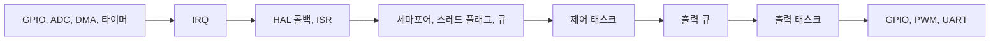
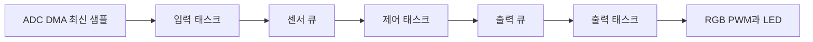

# FreeRTOS 기반 RTOS 실습 강의 노트

이 문서는 NUCLEO-G0B1RE와 Easy Module Shield를 사용하는 3일, 총 24시간의 실습 중심 강의 노트이다. 학습자는 `임베디드 시스템 인터페이스 회로` 교재에서 GPIO, UART, ADC, DMA, PWM 및 CubeMX 생성 코드의 기본 동작을 먼저 학습한다. 본 문서에서는 HAL 기반 제어 절차를 반복하지 않고, 검증된 주변장치를 RTOS 환경에서 태스크 단위로 구성하고 연계하는 방법을 다룬다.

이 문서에서는 CubeMX의 사용자 레이블을 사용하지 않는다. 실습 단계에서는 `PA6`, `PA10`, `PC7`과 같은 실제 핀과 주변장치 연결 관계를 먼저 익히는 것이 적합하다. 코드에서는 `GPIOA`, `GPIO_PIN_6`, `htim2`, `hadc1` 등 CubeMX가 생성하는 기본 식별자를 사용한다.

## 강의 목표

이 과정을 마친 학습자는 다음을 수행할 수 있어야 한다.

- 주 반복문에서 여러 기능을 순차적으로 처리할 때 발생하는 지연을 설명한다.
- CMSIS-RTOS v2 태스크를 생성하고 `osDelay`와 `osDelayUntil`의 용도를 구분하여 사용한다.
- 큐, 이진 세마포어, 뮤텍스, 소프트웨어 타이머의 적용 범위를 구분한다.
- EXTI 인터럽트에서 사건만 전달하고 태스크에서 실제 제어를 수행하는 구조를 설계한다.
- ADC DMA의 최신 값을 읽어 PWM 기반 RGB LED 밝기 제어에 적용한다.
- 버튼, 조도센서, 가변저항, LED, 부저, UART를 소규모 BCM 구조로 구성한다.
- 큐 상태와 스레드 스택 여유를 근거로 실행 문제를 분석한다.

## HAL 선행 조건과 핀 배치 요약

다음 기능은 `임베디드 시스템 인터페이스 회로` 교재에서 보드 동작을 확인한 상태여야 한다. 이 문서에서는 CubeMX의 상세 설정 절차나 HAL API의 전기적 동작을 반복하여 설명하지 않는다.

| 용도 | 실제 핀 또는 핸들 | RTOS 실습에서 확인할 역할 |
| --- | --- | --- |
| `LED1`, `LED2` | `PA5`, `PA6` | 태스크와 출력 태스크의 동작 확인 |
| `SW1`, `SW2` | `PA10`, `PB3` | 폴링, EXTI, 세마포어 기반 사건 발생 |
| `UART` | `USART2`, `huart2`, `PA2`, `PA3` | 태스크 실행 순서와 진단 정보 기록 |
| 센서 | `ADC1`, `hadc1`, `PA0`, `PA1` | 입력 태스크에 제공하는 최신 측정값 |
| `RGB PWM` | `htim2`, `htim1`, `htim14` | 출력 태스크의 밝기 제어 |
| 부저 PWM | `htim3`, `PB4` | 시간 제한 또는 경고음 출력 |

`SW1`과 `SW2`는 액티브 로우 방식으로 동작한다. 버튼을 누르지 않았을 때에는 `GPIO_PIN_SET`, 누른 때에는 `GPIO_PIN_RESET`이 읽힌다. ADC 입력 전압 제한, PWM 시작 API, UART 입출력 재지정, DMA 설정은 `임베디드 시스템 인터페이스 회로` 교재의 검증된 구성을 재사용한다.

## 코드 작성 위치와 역할

CubeMX가 생성한 `main()`과 `MX_xxx_Init()` 함수의 자동 생성 영역은 유지한다. 주변장치 초기화 후 한 번만 실행하는 시작 코드는 모든 `MX_xxx_Init()` 호출 뒤와 `osKernelStart()` 호출 앞에 둔다. 태스크, 큐, 세마포어, 뮤텍스, 소프트웨어 타이머 관련 코드는 `main.c`의 `USER CODE` 영역과 CubeMX가 생성한 태스크 진입 함수에 작성한다. HAL 콜백은 하나만 구현하며, CubeMX가 생성한 `stm32g0xx_it.c`의 IRQ 처리기 전체를 직접 수정하지 않는다.

하나의 프로젝트에는 `main()` 함수가 하나만 존재해야 한다. 여러 예제를 통합할 때에는 하나의 핀을 여러 태스크가 직접 제어하지 않도록 하고, 같은 HAL 콜백을 중복 구현하지 않는다. `main.c`에서 `bool`을 사용하려면 `USER CODE BEGIN Includes` 영역에 `#include <stdbool.h>`를 추가한다.

HAL 함수는 선행 과정에서 검증한 입출력 수단으로 간주한다. 스케줄러가 시작된 후의 태스크 대기는 `HAL_Delay()`가 아니라 `osDelay()`, `osDelayUntil()`, 큐 수신, 세마포어 획득처럼 커널이 관리하는 대기 방식으로 구성한다. UART 출력은 초기에는 실행 흐름 확인에 한정하고, 여러 태스크가 동시에 출력할 때에는 뮤텍스 또는 로그 태스크를 사용한다.

다음 표는 선언들을 역할별로 정리한 것이다.

약어	| 풀네임 (Full Name)	| 의미 및 작성할 코드 내용
-------|----------------------|-----------------------
Includes	| Includes	      | 사용자 추가 헤더 파일 (\#include <stdio.h>, \#include "my_lib.h")
PTD	        | Private Typedef	| 사용자 정의 구조체, 열거형 (typedef struct { ... } MyData_t;)
PD         	| Private Define	| 상수 매크로 정의 (\#define LED_DELAY_MS 500)
PM      	| Private Macro	    | 함수형 매크로 정의 (\#define MIN(a,b) ((a)<(b)?(a):(b)))
PV      	| Private Variables	| 파일 전역 변수 선언 (static uint32_t my_counter;)
PFP     	| Private Function Prototypes	| 사용자 정의 함수의 원형 선언 (static void ProcessData(void);)

숫자 섹션 (0, 1, 2, 3 = 실행 순서 단계)은  하드웨어 초기화 및 실행 흐름 단계에 따라 순서대로 번호가 매겨져 있다.

번호	| 위치 및 시점	| 주 용도
-------|--------------|----------------
0	| main() 함수 바깥 (시작 전)	| static 보조 함수를 main()보다 위쪽에 구현할 때 사용
1	| main() 함수 진입 직후, HAL_Init() 이전	| main() 내부 지역 변수 선언, 극초기 상태 설정
2	| 모든 주변장치 초기화(MX_..._Init()) 완료 후	| (가장 많이 사용됨) 센서 초기화, printf 리디렉션 초기화(UART_Retarget_Init()), 인터럽트 활성화 등
3	| while(1) 루프 내부	| 일반 Bare-metal(No-RTOS) 환경에서 반복 실행할 메인 로직 코드 작성

## 3일 과정 구성

| 일차 | 핵심 질문 | 실습 결과 |
| --- | --- | --- |
| 1일 차 | 대기 중인 태스크가 CPU 사용권을 어떻게 양보하는가 | 두 LED 태스크, 주기 태스크, 우선순위 관찰 |
| 2일 차 | 데이터와 사건을 태스크 사이에 어떻게 전달하는가 | 큐, EXTI 세마포어, 뮤텍스, 소프트웨어 타이머 |
| 3일 차 | 실제 센서와 출력을 RTOS 구조에 어떻게 연결하는가 | ADC DMA, RGB PWM, 간단한 BCM 통합 제어 |

## STM32CubeIDE for VSCode
본 교재는 STM32CubeMX와 VSCode를 함께 사용하여 실습을 진행한다. VSCode는 AI 에이전트를 추가하기 용이하며, 다양한 확장 기능을 제공하여 개발 생산성을 높일 수 있다. VSCode의 Extentions에서 STM32CubeIDE를 검색해 "STM32CubeIDE for Visual Studio Code" 확장 팩을 설치하면, 빌드, 디버그(DAP), `clangd` 등 필수 도구들이 함께 자동으로 설치된다. 

**프로젝트 열기**
'File > Open Folder...'로 STM32CubeMX가 생성한 프로젝트 폴더를 열면, 자동으로 `CMakeLists.txt`를 인식하고 빌드 및 디버그가 구성된다.

- 알림에 'Device deteced: STM32 STLink (STMicroelectronics)'가 뜨면 'Open Devices and Boards view'를 선택하면 ST-Link 인식
- 알림에 'Configure discovered CMake project(s) as STM32Cube project(s)?'가 뜨면 'Yes' 선택

**프로젝트 빌드**
하단 상태 표시줄 좌측의 Build 아이콘을 클릭하거나 단축키 `F7`을 누른다.

> **팁: 링크 오류** - undefined reference to pvPortMalloc, undefined reference to vPortFree
> FreeRTOS에서 태스크를 생성(`xTaskCreate`)하려면 힙 메모리를 관리하는 `heap_4.c` 소스 파일이 함께 컴파일되어야 한다. 실제로 파일은 `Middlewares/Third_Party/FreeRTOS/Source/portable/MemMang/heap_4.c`에 이미 잘 복사되어 있지만, CubeMX가 CMake 소스 목록에 `heap_4.c`를 누락시키는 버그가 있어 링크 단계에서 이 함수들을 찾지 못해 빌드가 실패한다.  
> 프로젝트 루트의 `CMakeLists.txt`에 다음과 같이 `heap_4.c` 경로를 추가한다.
> ```cmake
> # Add sources to executable
> target_sources(${CMAKE_PROJECT_NAME} PRIVATE
>     # Add user sources here
>     Middlewares/Third_Party/FreeRTOS/Source/portable/MemMang/heap_4.c
> )
> ```

**디버깅 및 실행**
Run and Debug 패널(Ctrl+Shift+D)에서 'create a launch.json file'을 선택하고 `STM32Cube: STM32 Launch STLink GDB Server`를 선택한다. launch.json이 열리면, 디버깅 준비 시간 단축과 `HAL_Init()`에서 자동 중단 제거 및 RTOS 태스트 뷰어가 표시되도록 전체를 다음 내용으로 교체한다.
```json
{
    "version": "0.2.0",
    "configurations": [
        {
            "name": "STM32Cube: Launch ST-Link GDB Server",
            "type": "stlinkgdbtarget",
            "request": "launch",
            "cwd": "${workspaceFolder}",
            "preBuild": "${command:st-stm32-ide-debug-launch.build}",
            "device": "STM32G0B1RE",
            "interface": "swd",
            "imagesAndSymbols": [
                {
                    "imageFileName": "${command:st-stm32-ide-debug-launch.get-projects-binary-from-context1}"
                }
            ],
            "postLaunchCommands": [
                "monitor reset halt", 
                "continue"
            ]
            "serverRtos": {
                "enabled": true,
                "driver": "freertos"
            }
        }
    ]
}
```

Run and Debug 패널의 STM32 Debug 버튼을 누르거나 메뉴에서 'Run > Start Debugging' 또는 단축키 `F5`를 누른다. 

**STM32CubeMX 경로 설정**
단축키 `Ctrl + ,`를 눌러 설정(Settings)을 열고, 상단 검색창에 `STM32CubeMX path`를 입력한다. 기존 경로가 틀리면 다시 `STM32CubeMX.exe`의 전체 경로를 입력한다.

**표준 입출력 함수에 대한 UART 하드웨어 계층 구현**
다음 코드는 표준 입출력 함수에 대한 UART 하드웨어 계층 구현으로 printf()보다는 스레드 안전한 safe_prinf()를 사용한다.
- uart_retarget.h
```c
// uart_retarget.h
#ifndef UART_RETARGET_H
#define UART_RETARGET_H
#include "main.h"

void UART_Retarget_Init(UART_HandleTypeDef *huart);
int safe_printf(const char *format, ...);

#endif
```

- uart_retarget.c
```c
// uart_retarget.c
#include "uart_retarget.h"
#include <stdio.h>
#include <stdarg.h>
#include "cmsis_os2.h"

#define RX_BUFFER_SIZE 128
#define TX_BUFFER_SIZE 256

typedef struct {
    uint8_t buffer[RX_BUFFER_SIZE];
    volatile uint16_t head;
    volatile uint16_t tail;
} RingBuffer;

static RingBuffer rx_ring = { {0}, 0, 0 };
static uint8_t rx_data;
static UART_HandleTypeDef *target_huart = NULL;

static osMutexId_t tx_mutex = NULL;      
static osSemaphoreId_t rx_sem = NULL;    

void UART_Retarget_Init(UART_HandleTypeDef *huart)
{
    target_huart = huart;
    tx_mutex = osMutexNew(NULL);
    rx_sem = osSemaphoreNew(RX_BUFFER_SIZE, 0, NULL);

    HAL_UART_Receive_IT(target_huart, &rx_data, 1);
}

int __io_putchar(int ch)
{
    if (target_huart != NULL)
    {
        HAL_UART_Transmit(target_huart, (uint8_t *)&ch, 1, HAL_MAX_DELAY);
    }
    return ch;
}

int safe_printf(const char *format, ...)
{
    static char tx_buffer[256]; 
    va_list args;
    int length = 0;

    if (osKernelGetState() == osKernelRunning && tx_mutex != NULL) {
        osMutexAcquire(tx_mutex, osWaitForever);
    }

    va_start(args, format);
    length = vsnprintf(tx_buffer, sizeof(tx_buffer), format, args);
    va_end(args);

    if (length > 0 && target_huart != NULL)
    {
        HAL_UART_Transmit(target_huart, (uint8_t *)tx_buffer, length, HAL_MAX_DELAY);
    }

    if (osKernelGetState() == osKernelRunning && tx_mutex != NULL) {
        osMutexRelease(tx_mutex);
    }

    return length;
}


int _read(int file, char *ptr, int len)
{
    int DataIdx;
    
    if (osKernelGetState() != osKernelRunning || rx_sem == NULL) {
        for (DataIdx = 0; DataIdx < len; DataIdx++) {
            while (rx_ring.head == rx_ring.tail);
            *ptr = rx_ring.buffer[rx_ring.tail];
            rx_ring.tail = (rx_ring.tail + 1) % RX_BUFFER_SIZE;
            if (*ptr == '\n' || *ptr == '\r') { *ptr = '\n'; return DataIdx + 1; }
            ptr++;
        }
        return len;
    }

    for (DataIdx = 0; DataIdx < len; DataIdx++)
    {
        osSemaphoreAcquire(rx_sem, osWaitForever);

        *ptr = rx_ring.buffer[rx_ring.tail];
        rx_ring.tail = (rx_ring.tail + 1) % RX_BUFFER_SIZE;

        if (*ptr == '\n' || *ptr == '\r')
        {
            *ptr = '\n';
            return DataIdx + 1;
        }
        ptr++;
    }
    return len;
}

void HAL_UART_RxCpltCallback(UART_HandleTypeDef *huart)
{
    if (target_huart != NULL && huart->Instance == target_huart->Instance)
    {
        uint16_t next_head = (rx_ring.head + 1) % RX_BUFFER_SIZE;
        
        if (next_head != rx_ring.tail)
        {
            rx_ring.buffer[rx_ring.head] = rx_data;
            rx_ring.head = next_head;
            
            if (osKernelGetState() == osKernelRunning && rx_sem != NULL) {
                osSemaphoreRelease(rx_sem);
            }
        }
        
        HAL_UART_Receive_IT(target_huart, &rx_data, 1);
    }
}
```
또한 PC용 시리얼 프로그램은 Putty와 같은 외부 프로그램보다는 VSCode에서 `Serial Monitor` 확장을 검색한 후 설치해 사용한다.

---

# RTOS 실행 모델

## RTOS는 무엇을 해결하는가

`임베디드 시스템 인터페이스 회로` 교재의 주 반복문에서는 프로그램이 작성된 순서에 따라 입력을 읽고, 판단하며, 출력을 갱신한다. 어떤 기능의 처리 시간이 길어지면 이후 기능의 실행도 그만큼 지연된다. RTOS는 기능을 무분별하게 분리하는 도구가 아니다. 각 기능이 언제 실행되어야 하는지, 무엇을 기다리는지, 어떤 데이터와 사건을 주고받는지를 코드 구조로 명확하게 표현하는 도구이다.

RTOS가 CPU의 처리 성능을 높이는 것은 아니다. Cortex-M0+ 코어는 어느 한 시점에 하나의 명령만 수행한다. RTOS는 대기 중인 작업이 CPU를 계속 점유하지 않도록 하여, 실행 가능한 다른 작업에 CPU를 배분한다.

| 용어 | 의미 | 보드에서 확인하는 예 |
| --- | --- | --- |
| 주기 | 같은 작업이 시작되는 목표 간격 | 입력 태스크가 50ms마다 센서 샘플 생성 |
| 마감 시각 | 결과가 늦으면 의미가 없어지는 시각 | `SW1` 에지 뒤 LED 상태 변경 |
| 응답 시간 | 사건부터 처리 시작 또는 완료까지 걸린 시간 | EXTI 발생부터 비상 점멸 태스크 실행까지 |
| 지터 | 목표 시각에서 벗어난 시간 변동 | 50ms 태스크의 실제 간격이 49ms, 52ms로 달라짐 |
| 처리량 | 일정 시간에 처리한 작업 수 | 1초 동안 처리한 큐 메시지 수 |

## 실시간성은 빠름보다 예측 가능함

실시간 시스템은 평균적으로 빨리 끝나는 시스템이 아니라, 필요한 결과를 정해진 시간 안에 끝낼 수 있는 시스템이다. 같은 평균 실행 시간이라도 한 번씩 매우 늦어지는 프로그램은 제어기에서 문제가 될 수 있다. 이 강의에서는 LED가 켜졌는지만 보지 않고 태스크가 언제 준비 상태가 되었으며 언제 실행되었는지, 큐에 항목이 쌓였는지, 마감 시각을 놓칠 가능성이 있는지를 함께 확인한다.

| 종류 | 마감 시각을 놓쳤을 때 | 이 강의에서 이해할 예 |
| --- | --- | --- |
| 경성 실시간 | 한 번의 지연도 시스템 실패가 될 수 있음 | 보호 동작, 안전 차단처럼 늦은 결과가 의미 없는 기능 |
| 결과 유효 기한형 실시간 | 늦게 끝난 결과는 사용하지 않음 | 오래된 센서 샘플보다 다음 최신 샘플이 나은 입력 처리 |
| 연성 실시간 | 늦으면 품질은 떨어지지만 기능은 계속 가능 | UART 상태 메시지, 진단 로그 |

이 실습의 LED와 UART는 시간 흐름을 관찰하기 위한 수단이다. 실제 제어 설계에서는 각 기능의 주기, 최대 허용 응답 시간, 최악 실행 시간을 먼저 정한 뒤 태스크와 우선순위를 결정한다.

## FreeRTOS, CMSIS-RTOS v2, 응용 프로그램 코드의 경계

이 강의에서 응용 프로그램 코드는 CMSIS-RTOS v2 API를 사용하고, FreeRTOS는 해당 API를 실제로 처리하는 커널이다. CubeMX에서 FreeRTOS와 `CMSIS_V2` 인터페이스를 선택하면 `osThreadNew`, `osDelay`, `osMessageQueuePut`과 같은 호출이 FreeRTOS 커널의 태스크, 큐, 세마포어 기능으로 연결된다.

| 계층 | 책임 | 이 노트에서 직접 작성하는 것 |
| --- | --- | --- |
| 응용 프로그램 코드 | 기능 책임과 상태 전이 | 태스크 함수, 메시지 구조체, 제어 판단 |
| CMSIS-RTOS v2 | 공통 RTOS API | `osThreadNew`, `osDelay`, 큐, 세마포어 호출 |
| FreeRTOS 커널 | 스케줄러와 RTOS 객체 구현 | CubeMX가 포함, 직접 수정하지 않음 |
| HAL | 이미 검증된 주변장치 제어 | 필요한 지점에서 GPIO, ADC, PWM 호출 |

같은 프로젝트에서 CMSIS-RTOS v2의 `osThreadNew`와 FreeRTOS 고유 API인 `xTaskCreate`를 함께 사용하지 않는다. 두 API는 같은 커널을 사용하지만 핸들, 메모리 설정, 오류 처리 방식이 달라 실습 단계에서는 실행 흐름을 추적하기 어렵다.

CubeMX 프로젝트는 대체로 다음 순서로 시작한다.

```c
HAL_Init();
SystemClock_Config();
MX_xxx_Init();
osThreadNew();
osKernelStart();

while (1)
{
}
```

`osKernelStart` 전에 큐, 세마포어, 뮤텍스, 소프트웨어 타이머와 태스크를 생성한다. `osKernelStart` 뒤에는 스케줄러가 태스크에 CPU 사용권을 배분하므로, 정상이라면 `main()`의 마지막 `while (1)`은 실행되지 않는다. RTOS 제어 코드를 이 `while` 문에 넣지 않는다. 태스크 또는 객체의 핸들은 객체 자체가 아니라 커널이 관리하는 객체를 가리키는 식별자이다. 생성 함수가 `NULL`을 반환하면 해당 핸들을 사용하지 않고 즉시 원인을 확인한다.

## 태스크, 스케줄러, 실행 상태

CMSIS-RTOS v2 API는 실행 단위를 스레드라고 부르지만, 이 문서에서는 CubeMX 화면과 FreeRTOS 용어에 맞추어 태스크라고 부른다. 태스크는 중단된 위치부터 다시 실행할 수 있도록 커널이 관리하는 실행 단위이다. 일반 함수처럼 호출 지점으로 돌아가 종료되는 구조와는 다르다.

| 상태 | 의미 | 이 상태가 되는 대표 API 또는 사건 |
| --- | --- | --- |
| 실행 상태 | 현재 CPU를 사용 중인 태스크 | 스케줄러가 선택 |
| 준비 상태 | 실행할 수 있으나 CPU 사용권을 기다리는 태스크 | 생성 직후, 지연 종료, 메시지 도착 |
| 대기 상태 | 시간 또는 사건을 기다리는 태스크 | `osDelay`, `osDelayUntil`, 큐 수신, 세마포어 획득 |
| 중지 상태 | 명시적으로 실행 대상에서 제외된 태스크 | `osThreadSuspend` |

스케줄러는 준비 상태의 태스크 가운데 우선순위가 가장 높은 태스크를 선택한다. 우선순위는 대기 상태의 태스크에 영향을 주지 않는다. 높은 우선순위의 태스크도 `osDelay` 또는 큐 수신에서 대기 중이면 CPU를 사용하지 않으므로, 그동안 낮은 우선순위의 태스크가 실행될 수 있다.

## 태스크 분할 기준과 스케줄러의 선택

함수마다 태스크를 만들 필요는 없다. 태스크는 독립된 실행 문맥과 스택을 가지며 스케줄러의 관리 대상이 된다. 실행 시각, 대기 대상, 공유 자원의 소유권이 서로 다른 기능을 태스크로 분할한다.

| 태스크로 분할하기 적합한 경우 | 하나의 태스크에 두기 적합한 경우 |
| --- | --- |
| 서로 다른 주기 또는 마감 시각을 가짐 | 항상 정해진 순서로 짧게 실행됨 |
| 큐, 세마포어, UART 수신 사건처럼 서로 다른 사건을 기다림 | 보조 함수 호출 뒤 결과를 즉시 사용함 |
| 다른 태스크와 독립된 책임 및 오류 처리가 필요함 | 같은 하드웨어 레지스터를 연속하여 갱신해야 함 |
| 특정 자원의 소유 태스크를 하나로 정해야 함 | 태스크로 분할하면 큐와 상태 관리가 불필요하게 복잡해짐 |

FreeRTOS는 선점형 스케줄러를 사용한다. 낮은 우선순위의 태스크가 실행 중일 때 더 높은 우선순위의 태스크가 준비 상태가 되면, 낮은 우선순위의 태스크는 문맥을 저장하고 높은 우선순위의 태스크가 먼저 실행될 수 있다. 반대로 같은 우선순위 태스크의 정확한 교대 실행 순서와 시간 분할 방식은 커널 설정에 따라 달라진다. 같은 우선순위의 태스크가 반드시 한 틱씩 교대한다고 가정하지 말고, 각 태스크가 `osDelay` 또는 태스크 간 통신 객체의 대기로 CPU를 명시적으로 양보하도록 설계한다.

실행 가능한 사용자 태스크가 없을 때에는 유휴 태스크가 실행된다. 유휴 태스크가 실행된다고 시스템이 멈춘 것은 아니다. 다음 틱, 인터럽트, 큐 메시지, 세마포어 토큰이 발생하면 대기 상태의 태스크가 다시 준비 상태가 될 수 있다. 응용 기능을 유휴 태스크에 넣어 실행 순서를 기대하지 않는다.

문맥 교환에는 CPU 레지스터를 저장하고 복원하는 비용이 따른다. 이 비용은 일반적으로 짧지만, 매우 짧은 작업을 하는 태스크를 과도하게 만들거나 지나치게 자주 깨우면 실제 제어 작업보다 스케줄러의 관리 비용이 커질 수 있다. 따라서 GPIO 핀마다 태스크를 만들기보다 입력, 판단, 출력처럼 책임이 분명한 단위로 분할한다.

## 틱, 스케줄링, 문맥 교환

커널 틱은 스케줄러가 시간을 판단하는 기준 인터럽트이다. 이 프로젝트에서는 일반적으로 1 kHz이므로 1틱은 약 1 ms이다. `osDelay(100U)`는 현재 태스크를 최소 100틱 동안 대기 상태로 옮긴다. 틱 경계 직전에 호출했는지, 더 높은 우선순위의 태스크가 준비 상태가 되었는지에 따라 실제 실행 재개 시각은 달라질 수 있다.

문맥 교환은 현재 태스크의 실행을 중단하고 다른 태스크를 시작하거나 이어서 실행하는 과정이다. 커널은 현재 태스크의 프로그램 카운터, 스택 포인터, 필요한 CPU 레지스터를 저장하고 다음 태스크의 저장값을 복원한다. Cortex-M에서는 `SysTick`과 `PendSV` 예외가 이 과정을 돕는다. 응용 프로그램 코드가 레지스터를 직접 저장하지는 않지만, 각 태스크에 독립된 스택이 필요한 이유는 이 과정에 있다.

문맥 교환은 매 C 문장마다 무작위로 일어나지 않는다. 대표적인 계기는 다음과 같다.

1. 실행 상태의 태스크가 `osDelay`, 큐 수신, 세마포어 획득으로 대기 상태가 된다.
2. 틱이 진행되어 지연 시간 제한이 만료된다.
3. ISR이 세마포어, 큐, 스레드 플래그를 통해 대기 중이던 태스크를 준비 상태로 만든다.
4. 더 높은 우선순위의 태스크가 준비 상태가 되어 스케줄러가 선점한다.

## 우선순위와 기아 상태

우선순위는 코드의 실행 시간을 줄이는 숫자가 아니다. 준비 상태일 때 CPU를 먼저 받을 순서를 정하는 기준이다. 마감 시각이 가장 짧은 태스크가 준비 상태가 되었을 때 먼저 실행되도록 정하되, 실제 실행 시간과 다른 태스크에 미치는 영향을 함께 고려한다.

| 잘못된 생각 | 실제 동작 |
| --- | --- |
| 높은 우선순위의 태스크는 항상 실행된다. | 높은 우선순위이면서 준비 상태인 태스크가 먼저 실행된다. |
| 모든 태스크를 높은 우선순위로 만들면 안전하다. | 마감 시각을 기준으로 한 우선순위 판단이 사라지고 같은 우선순위 태스크의 경쟁만 남는다. |
| 우선순위를 높이면 계산이 빨라진다. | 계산량은 같고 CPU를 먼저 얻을 가능성만 커진다. |
| 낮은 우선순위 태스크는 중요하지 않다. | 높은 우선순위 태스크가 대기 상태인 동안에는 정상적으로 실행된다. |

높은 우선순위의 태스크가 `osDelay`, 큐, 세마포어와 같은 양보 지점 없이 계속 준비 상태로 남으면 낮은 우선순위 태스크가 실행 기회를 잃을 수 있다. 이를 기아 상태라고 한다. 해결 방법은 우선순위를 임의로 낮추는 것이 아니라, 긴 계산을 작은 단위로 나누고 사건 또는 주기를 기다리도록 구조를 바꾸는 것이다.

FreeRTOS의 우선순위는 0부터 MAX_PRIORITIES - 1까지이며, 0이 가장 낮다. 사용자 태스크는 특별한 이유가 없다면 보통 1 이상의 우선순위를 권장한다.

## 스택, 힙, 태스크 수명

각 태스크는 독립된 스택을 가진다. 스택에는 지역 변수, 함수 호출의 반환 위치, 저장된 레지스터, 문맥 교환 정보가 쌓인다. 두 태스크가 같은 이름의 지역 계수 변수를 사용해도 값이 섞이지 않는 이유가 여기에 있다. 반면 전역 변수는 모든 태스크와 ISR이 함께 보므로 별도의 동기화 규칙이 필요하다.

| 메모리 영역 또는 값 | 주로 쓰는 곳 | 부족하거나 잘못 다루면 보이는 현상 |
| --- | --- | --- |
| 태스크 스택 | 지역 변수, 호출 깊이, `printf` 서식화, 저장된 문맥 | 특정 태스크에서 오류 발생, 비정상 지역 변수 값 |
| 커널 힙 | 태스크, 큐, 세마포어, 타이머와 같은 동적 객체 생성 | `osThreadNew`, `osMessageQueueNew` 등이 `NULL` 반환 |
| 정적 또는 전역 데이터 | 태스크와 ISR 사이에 공유하는 상태 | 데이터 경쟁, 이전 값과 새 값이 혼합됨 |

CubeMX 태스크 설정 화면의 `Stack Size`는 이 Cortex-M 프로젝트에서 워드 단위이다. `256` 워드는 1024 바이트이다. CMSIS-RTOS v2의 `osThreadAttr_t.stack_size` 멤버는 바이트 단위를 사용한다. 스택 크기는 추측으로 크게 정하는 값이 아니라, 가장 깊은 함수 경로와 `printf`를 실제로 실행한 뒤 `osThreadGetStackSpace()`로 최소 여유를 확인하여 정한다.

태스크와 RTOS 객체는 스케줄러가 시작되기 전에 생성한다. 각 생성 API가 `NULL`을 반환하는지 확인하고, `NULL` 핸들을 큐나 뮤텍스 API에 전달하지 않는다. ISR 안에서는 태스크나 큐를 새로 만들거나 동적 메모리를 할당하지 않는다.

## 시간 대기와 시간 제한의 의미

RTOS API의 시간 제한 값은 데이터나 CPU 사용권을 얻지 못했을 때 현재 태스크가 얼마나 기다릴지를 정한다.

| 시간 제한 값 | 의미 | 적합한 예 |
| --- | --- | --- |
| `0U` | 기다리지 않고 즉시 성공 또는 실패 | ISR의 큐 전송, 주기 입력 태스크의 유실 횟수 기록 |
| 유한한 틱 수 | 정한 시간까지만 대기 | UART 뮤텍스를 최대 20ms 동안 기다림 |
| `osWaitForever` | 사건이 올 때까지 대기 | 출력 태스크가 유효한 명령을 기다림 |

`0U`로 실패한 호출을 반복문에서 계속 재시도하면 태스크가 준비 상태로 남아 CPU를 계속 사용한다. 사건이 올 때까지 기다려도 되는 태스크라면 `osWaitForever`가 적합하다. 반대로 주기를 지켜야 하는 태스크는 큐가 가득 찼을 때 오래 기다리지 않고 유실 횟수를 남긴 뒤 다음 주기로 넘어가는 정책이 필요할 수 있다.

## 공유 데이터와 데이터 경쟁

두 태스크 또는 태스크와 ISR이 같은 전역 변수를 읽고 쓸 때에는 코드가 짧아도 결과의 순서가 보장되지 않는다. `volatile`은 컴파일러가 값을 레지스터에만 보관하지 않도록 할 뿐, 여러 단계의 연산을 원자적으로 만들거나 태스크 사이의 실행 순서를 보장하지 않는다.

공유 상태를 만들기 전에 다음 순서로 설계한다.

1. 데이터의 소유 태스크를 하나 정한다.
2. 다른 태스크에는 데이터의 복사본을 큐로 보내는 방법을 먼저 고려한다.
3. 데이터가 아니라 사건만 필요하면 세마포어 또는 스레드 플래그를 사용한다.
4. UART처럼 하나의 주변장치에 하나의 태스크만 접근해야 하면 뮤텍스 또는 전용 로그 태스크를 사용한다.
5. 매우 짧은 단일 데이터 복사만 필요한 경우에만 임계 구역을 고려한다.

임계 구역은 매우 짧은 보호 구간에만 사용한다. 인터럽트를 막은 구간에는 `HAL_Delay`, `osDelay`, 큐 대기, UART 전송을 넣지 않는다. DMA는 CPU 인터럽트 마스크와 독립적으로 동작할 수 있으므로, DMA가 갱신하는 여러 값을 단순히 인터럽트를 막아 읽는다고 프레임 일관성이 자동으로 보장되지는 않는다.

## 하드웨어 사건에서 RTOS 태스크까지의 경로

`임베디드 시스템 인터페이스 회로` 교재를 통해 GPIO, ADC, DMA, 타이머는 이미 동작을 확인한 주변장치로 가정한다. RTOS에서는 주변장치가 만든 사건을 어느 태스크가 처리할지를 정한다. ISR과 태스크의 역할을 분리하는 것이 핵심이다.



ISR은 사건이 유실되지 않도록 최소한의 정보를 전달한다. 제어 태스크는 상태와 제어 규칙을 판단한다. 출력 태스크는 하나의 핀이나 PWM 레지스터를 여러 태스크가 경쟁하지 않도록 실제 출력을 담당한다. 이 구조는 2일 차와 3일 차 실습을 관통하는 기본 설계이다.


# 1일 차: 태스크와 스케줄러

## 학습 초점

1일 차에서는 태스크가 대기 상태, 준비 상태, 실행 상태를 오가며 스케줄러가 CPU 사용권을 배분하는 과정을 관찰한다. 앞의 RTOS 실행 모델을 참고하면서 각 실습에서 태스크가 어떤 조건에서 대기 상태가 되는지 확인한다.

## 실습 1. RTOS 기준 프로젝트 만들기

**실습 장비와 핀 배치**

실드 기능	| 	NUCLEO-G0B1RE GPIO | 권장 용도
--------|--------------------|---------
`SW1` 		| `PA10`| GPIO input, `EXTI10`
`SW2` 		| `PB3` | GPIO input, `EXTI3`
`DHT11` 		| `PB5` | GPIO
Piezo buzzer 	| `PB4` | `TIM3_CH1` PWM
IR receiver 	| `PB14`| GPIO input, `EXTI14` 가능
Digital expansion | `PA8` | GPIO
Digital expansion | `PA9` | GPIO
RGB red		| `PC7` | `TIM2_CH4` PWM
RGB green 	| `PB0` | `TIM1_CH2N` PWM
RGB blue 	| `PA7` | `TIM14_CH1` PWM
`LED1` 		| `PA5` | GPIO output
`LED2` 		| `PA6` | GPIO output, NUCLEO 내장 LED도 함께 영향 가능
Potentiometer 	| `PA0` | `ADC1_IN0`
CdS sensor 	| `PA1` | `ADC1_IN1`
`LM35` 		| `PA4` | `ADC1_IN4`
Analog expansion | `PB1` | `ADC1_IN9`


### RTOS 관련 CubeMX 설정

1. STM32CubeMX로 프로젝트를 생성한다. 1일 차에는 `PA5`, `PA6`, `PA10`, `USART2`만 정상 동작하면 충분하다.
2. FreeRTOS는 tick을 계산하기 위해 가장 낮은 우선수위로 `SysTick`를 사용하므로 System Core에서 SYS를 선택하고 Timebase Source를 `TIM7`로 설정해 `HAL_GetTick()`, `HAL_Delay()` 등이 `TIM7`을 사용하도록 한다.  
3. Middleware and Software Packs에서 FreeRTOS를 선택하고 Interface를 `CMSIS_V2`로 설정한다.
4. Config parameters에서 `TOTAL_HEAP_SIZE`를 `16384`로 설정한다. 태스크가 증가할 수록 더 많은 힙이 필요한데, 실습장비인 NUCLEO-G0B1RE 보드는 SRAM이 144 KB이므로 힙을 넉넉하게 설정해도 문제가 없다.
5. Tasks and Queues에서 `defaultTask`를 더블클릭해 Edit Task 창이 표시되면, 우선순위는 `osPriorityNormal`로 설정하고, Stack Size 항목에는 `256`을 입력한다. 이 값은 워드 단위이므로 Cortex-M0+에서는 1024바이트에 해당한다. 이보다 훨씬 큰 값을 설정해도 당장 문제가 없지만, 너무 큰 값을 설정하는 것은 메모리 낭비이고, 1024바이트는 최소로 설정되는 값이다.
6. Advanced Settings에서 USE_NEWLIB_REENTRANT를 Enabled로 설정한다. 이 설정은 여러 태스크에서 printf, snprintf와 같은 C 표준 라이브러리 함수를 보호하지만, UART 출력 순서까지 보호하지는 않는다.
7. Project Manager에서 Toolchain / IDE는 코드를 VSCode에서 편집 및 디버깅할 수 있도록 CMake를 선택한다.
8. 코드 생성 후 main.c에서 osKernelInitialize(), osKernelStart() 호출과 StartDefaultTask() 구현을 확인한다. 

### 확인할 점

- main()의 모든 MX_xxx_Init() 호출 뒤에 osThreadNew()과 osKernelStart()가 있어야 한다.
- StartDefaultTask는 CubeMX가 생성한 main.c의 태스크 진입 함수여야 한다.
- GPIO와 UART의 기본 동작이 확인되지 않았다면 RTOS 문제로 판단하지 말고 `임베디드 시스템 인터페이스 회로` 교재의 해당 실습을 먼저 점검한다.

## 실습 2. 첫 주기 태스크

StartDefaultTask를 다음과 같이 수정한다. 이 예제에서는 PA6의 LED2가 약 500ms마다 상태를 반전한다. 켜짐 상태에서 다음 켜짐 상태까지의 전체 점멸 주기는 약 1초이다.

```c
void StartDefaultTask(void *argument)
{
    (void)argument;

    printf("scheduler started\r\n");

    for (;;)
    {
        HAL_GPIO_TogglePin(GPIOA, GPIO_PIN_6);
        printf("tick=%lu\r\n", (unsigned long)osKernelGetTickCount());
        osDelay(500U);
    }
}
```

### 코드 해설

osDelay(500U)는 CPU 전체의 실행을 중단하지 않는다. 현재 태스크만 500틱 동안 대기 상태가 된다. 커널 틱이 1kHz라면 500틱은 약 500ms이다. 준비 상태인 다른 태스크가 있으면 해당 태스크가 실행되고, 없으면 유휴 태스크가 실행된다.

### 확인할 점

- UART의 틱 값이 약 500씩 증가한다.
- LED2가 약 500ms 간격으로 반전한다.
- 태스크 함수는 반환하지 않으며 for (;;) 안에서 실행과 대기를 반복한다.

```

## 실습 3. 두 태스크의 CPU 사용 분배

CubeMX에서 태스크 두 개를 추가한다. 이후 스택 크기를 비롯해 태스크 이름과 진입 함수 이름 규칙은 동일하므로 앞으로는 태스크 이름만 언급한다.

| 태스크 이름 | 진입 함수 | 우선순위 | 스택 크기 | 동작 |
| --- | --- | --- | --- | --- |
| blinkLed1 | StartBlinkLed1Task | Low | 256워드 | PA5의 LED1을 700ms마다 반전 |
| blinkLed2 | StartBlinkLed2Task | Low | 256워드 | PA6의 LED2를 300ms마다 반전 |

```c
void StartBlinkLed1Task(void *argument)
{
    (void)argument;

    for (;;)
    {
        HAL_GPIO_TogglePin(GPIOA, GPIO_PIN_5);
        osDelay(700U);
    }
}

void StartBlinkLed2Task(void *argument)
{
    (void)argument;

    for (;;)
    {
        HAL_GPIO_TogglePin(GPIOA, GPIO_PIN_6);
        osDelay(300U);
    }
}
```

### 확인할 점

- 두 LED가 서로 다른 주기로 독립적으로 반전한다.
- 한 태스크의 지연 시간을 바꾸어도 다른 태스크의 지연 시간은 유지된다.
- 두 태스크가 동시에 CPU 명령을 실행하는 것이 아니라, 짧게 실행한 뒤 CPU 사용권을 양보한다는 점을 Disassamply View와 Memory Inspector를 통해 확인한다.
  - Disassamply View: 명령어 팔레트(Ctrl+Shift+P)에서 Show Disassembly View 선택해 실행
  - Memory Inspector: 명령어 팔레트에서 Show Memory Inspector 검색해 실행 

## 실습 3-1. 문맥 교환과 태스크별 지역 상태 관찰

CubeMX에서 counterA와 counterB 태스크를 추가한다. 두 태스크의 우선순위는 Normal, 스택 크기는 256워드로 설정한다. 이 실습에서는 앞선 LED 태스크를 일시적으로 비활성화하거나 생성하지 않아도 된다.

```c
static volatile uint32_t counter_a_observed;
static volatile uint32_t counter_b_observed;
static volatile uint32_t counter_a_stack_free;
static volatile uint32_t counter_b_stack_free;

void StartCounterATask(void *argument)
{
    (void)argument;
    uint32_t local_count = 0U;

    for (;;)
    {
        ++local_count;
        counter_a_observed = local_count;
        counter_a_stack_free = osThreadGetStackSpace(osThreadGetId());
        osDelay(200U);
    }
}

void StartCounterBTask(void *argument)
{
    (void)argument;
    uint32_t local_count = 1000U;

    for (;;)
    {
        ++local_count;
        counter_b_observed = local_count;
        counter_b_stack_free = osThreadGetStackSpace(osThreadGetId());
        osDelay(300U);
    }
}
```

### 코드 해설

`local_count`는 태스크마다 독립적으로 존재한다. 컴파일러가 이 값을 레지스터 또는 스택에 배치할 수 있으나, 문맥 교환 시 레지스터와 스택 포인터가 함께 보존되므로 각 태스크는 다음 실행에서 자신의 이전 값부터 이어간다. `counter_a_observed`와 `counter_b_observed`는 디버거 또는 STM32CubeMonitor에서 관찰하기 위한 전역 복사본일 뿐이며, 두 태스크를 동기화하는 수단으로 사용하지 않는다.

`osThreadGetStackSpace`는 현재까지 실행한 경로에서 기록된 최소 스택 여유를 바이트 단위로 반환한다. 두 계수값과 스택 여유를 함께 관찰하면 태스크가 독립된 실행 문맥과 독립된 스택을 가진다는 점을 확인할 수 있다.

### 확인할 점

- `FreeRTOSConfig.h`에 `traceTASK_SWITCHED_IN()` 훅으로 `context_switch_count`를 증가시키면 STM32Cube Live Watch에서 문맥 교환 횟수를 실시간으로 확인할 수 있다.
  ```c
  /* USER CODE BEGIN Defines */
  extern volatile uint32_t context_switch_count;
  #define traceTASK_SWITCHED_IN()  (++context_switch_count)
  /* USER CODE END Defines */
  ```
- `++local_count` 한 곳에 중단점을 설정한 후 Watch에 전역 변수를 추가하면 중단될 때마다 변수들의 값을 확인할 수 있다.
- `counterA`는 1부터, `counterB`는 1001부터 각각 증가한다.
- 한 태스크의 계수값이 다른 태스크의 계수값을 바꾸지 않는다.
- `counter_a_stack_free`와 `counter_b_stack_free`가 0 또는 매우 작은 값이면 스택 크기를 늘리기 전에 큰 지역 배열, 긴 문자열 서식화, 깊은 함수 호출이 있는지 확인한다.
- Middlewares/Third_Party/FreeRTOS/Source/portable/GCC/ARM_CM0/port.c의 `xPortPendSVHandler()`에는 어셈블러로 구현한 문맥 교환 코드가 있다. Disassamply View를 통해 디버깅해 본다.
- 이 예제는 공유 전역 계수를 동시에 증가시키는 예제가 아니다. 공유 계수의 경쟁 문제는 2일 차에서 다룬다.

## 실습 4. 상대 지연과 기준 시각 유지

`ReadSensor()`와 같은 함수 처리 시간까지 더해지면 `osDelay(10U)`만으로는 태스크가 정확히 10 ms마다 시작되지 않는다.

```c
for (;;)
{
    ReadSensor();  // 이 함수의 실행 시간까지 더해짐
    osDelay(10U);
}
```

`ReadSensor` 함수의 실행 시간이 2 ms이면 다음 시작 시각은 약 12 ms 뒤가 된다. 처리 시간이 달라지면 주기 오차도 누적된다.

다음 보조 함수와 periodic 태스크로 기준 시각을 유지한다.

```c
static uint32_t MillisecondsToKernelTicks(uint32_t milliseconds)
{
    uint32_t tick_frequency = osKernelGetTickFreq();

    return (uint32_t)(((uint64_t)milliseconds * tick_frequency + 999U) / 1000U);
}

void StartPeriodicTask(void *argument)
{
    (void)argument;

    const uint32_t period_ticks = MillisecondsToKernelTicks(100U);
    uint32_t next_tick = osKernelGetTickCount();

    for (;;)
    {
        HAL_GPIO_TogglePin(GPIOA, GPIO_PIN_5);

        next_tick += period_ticks;
        (void)osDelayUntil(next_tick);
    }
}
```

### 실습 4-1. 주기의 오버런 방지
작업 처리 시간이 설정한 주기(period_ticks)보다 길어져서 이미 목표 시간(next_tick)을 지나쳐 버렸을 때(오버런/Overrun 발생) osDelayUntil()이 의도치 않게 동작하거나 응답이 지연되는 문제가 발생한다.

```c
static uint32_t MillisecondsToKernelTicks(uint32_t milliseconds)
{
    uint32_t tick_frequency = osKernelGetTickFreq();

    return (uint32_t)(((uint64_t)milliseconds * tick_frequency + 999U) / 1000U);
}

void StartPeriodicTask(void *argument)
{
    (void)argument;

    const uint32_t period_ticks = MillisecondsToKernelTicks(100U);
    uint32_t next_tick = osKernelGetTickCount();

    for (;;)
    {
        HAL_GPIO_TogglePin(GPIOA, GPIO_PIN_5);

        next_tick += period_ticks;
        uint32_t current_tick = osKernelGetTickCount();

        // 오버런 여부 검사 - 32비트 틱 오버플로우 고려해 (current_tick - next_tick)이 부호 있는 정수로 0 이상인지 확인
        if ((int32_t)(current_tick - next_tick) >= 0)
        {
            /* [해결 방안 A] Catch-up 방식 (지연 없이 즉시 다음 루프 실행)
             * 이미 시간을 초과했으므로 osDelayUntil을 호출하지 않고
             * 밀린 실행을 빠르게 복구하기 위해 즉시 루프를 진행합니다.
             continue;
             */
             
            /* [해결 방안 B] Drift-reset 방식 (필요 시 선택)
             * 주기가 밀렸을 때 누적된 기준 시간을 버리고 현재 시점 기준으로 재설정합니다.
              next_tick = current_tick;
            */
        }
        else
        {
            // 목표 시간이 아직 오지 않은 정상적인 경우에만 지연 수행
            (void)osDelayUntil(next_tick);
        }
    }
}
```

### 확인할 점

- 커널 틱 주파수가 1 kHz인지 `osKernelGetTickFreq`로 확인한다.
- `osDelayUntil`은 마감 시각 준수를 자동으로 보장하지 않는다. 처리 시간이 10 ms를 넘으면 이미 다음 기준 시각을 놓친 상태이다.
- `next_tick`이 현재 틱보다 과거 시각을 가리키면 `osDelayUntil`은 기다리지 않고 반환한다. 태스크 본문을 건너뛰지는 않으므로 부하가 계속되면 다음 반복도 즉시 실행되어 여러 주기를 연달아 놓칠 수 있다. `next_tick`에 매번 `period_ticks`를 더하는 이유는 실제 완료 시각이 아니라 원래 기준 시각을 유지하고 지연을 측정하기 위해서이다.
- `osDelayUntil`을 사용하더라도 긴 `printf`, 긴 임계 구역, 높은 우선순위의 바쁜 태스크는 지터를 만들 수 있다.

## 실습 5. 기아 상태 관찰과 복구

busy 태스크를 추가하고 periodic 태스크보다 높은 우선순위를 설정한다.

```c
void StartBusyTask(void *argument)
{
    (void)argument;

    for (;;)
    {
        volatile uint32_t sum = 0U;

        for (uint32_t index = 0U; index < 50000U; ++index)
        {
            sum += index;
        }

        (void)sum;
    }
}
```

### 확인할 점

- 높은 우선순위의 `BusyTask`가 계속 준비 상태이면 낮은 우선순위의 periodic 태스크가 거의 실행되지 않을 수 있다.
- 다음과 같이 작업을 작은 단위로 나누고 `osDelay`를 넣으면 다른 태스크가 다시 실행된다.

```c
for (;;)
{
    DoOneSmallWorkUnit();
    osDelay(1U);
}
```

- 우선순위는 중요해 보이는 기능에 임의로 높은 값을 주는 기능이 아니다. 마감 시각이 더 짧은 태스크가 준비 상태가 되었을 때 먼저 실행되도록 정한다.

### 1일 차 종료 기준

- `PA5`와 `PA6`의 LED가 각 태스크의 지연 시간에 따라 독립적으로 반전한다.
- UART에서 `osKernelGetTickCount` 값을 관찰한다.
- `osDelay`와 `HAL_Delay`의 차이를 태스크의 실행 상태로 설명한다.
- `BusyTask`를 추가했을 때 발생하는 기아 상태를 재현하고 `osDelay`로 복구한다.

---

# 2일 차: 큐, 세마포어, 뮤텍스, 타이머

## 학습 초점

| 필요한 정보 | 적합한 객체 | 예 |
| --- | --- | --- |
| 순서대로 보관할 데이터 | 메시지 큐 | 센서 구조체, UART 명령 |
| 발생 여부만 필요한 사건 | 이진 세마포어 | 버튼 에지, 작업 시작 |
| 발생 횟수 | 계수 세마포어 | 펄스 수, 사용 가능한 버퍼 수 |
| 특정 태스크 하나에 비트 전달 | 스레드 플래그 | ADC 완료, 내부 상태 변화 |
| 공유 주변장치의 소유권 | 뮤텍스 | UART, I2C |
| 일정 시간이 지난 사건 | 소프트웨어 타이머 | 비상등 점멸, 시간 제한 |

큐는 데이터를 복사한다. 구조체를 큐에 저장하면 송신 태스크의 지역 변수가 다음 반복에서 바뀌어도 이미 큐에 저장된 항목은 바뀌지 않는다. 반대로 포인터만 큐에 저장하면 실제 데이터의 수명과 동기화 방법을 별도로 설계해야 한다.

## 태스크 사이에 전달할 정보

태스크 간 통신을 설계할 때에는 API 이름부터 고르지 않는다. 먼저 전달하려는 정보가 데이터인지, 사건인지, 자원의 소유권인지 구분한다.

| 전달하려는 것 | 의미 | 가장 먼저 고려할 객체 | 예 |
| --- | --- | --- | --- |
| 데이터 | 값과 순서가 필요함 | 메시지 큐 | ADC 샘플, UART 명령 |
| 사건 | 어떤 일이 일어났다는 사실만 필요함 | 이진 세마포어 또는 스레드 플래그 | SW1 누름, DMA 완료 |
| 사건 횟수 | 몇 번 발생했는지 필요함 | 계수 세마포어 또는 큐 | 인코더 펄스, 처리 대기 횟수 |
| 상태 비트 | 여러 조건이 모두 만족되어야 함 | 이벤트 플래그 | ADC, UART, PWM 준비 완료 |
| 소유권 | 하나의 태스크만 주변장치를 사용해야 함 | 뮤텍스 또는 전용 태스크 | UART, I2C |

큐는 선입선출 방식으로 동작한다. 송신 태스크가 저장한 순서대로 수신 태스크가 꺼내며, 항목 크기만큼 값을 복사한다. 따라서 모든 명령과 샘플을 순서대로 처리해야 할 때 적합하다. 다만 수신 태스크보다 송신 태스크가 계속 빠르면 큐 길이를 늘려도 언젠가는 가득 찬다.

$$R_{\text{송신}} > R_{\text{수신}} \quad \Rightarrow \quad \text{큐 적체 증가}$$

큐가 가득 찬 상태에서 `osMessageQueuePut`의 시간 제한 값을 `0U`로 두면 송신 태스크는 기다리지 않고 실패를 확인한다. 이 문서의 실습에서는 `button_queue_drop_count` 또는 `sensor_queue_drop_count`가 증가하고 큐의 항목 수가 용량에 가까워지는 것이 처리량 부족의 관찰 근거이다. 실습 6에서 큐 길이를 1로 줄이고 `StartLedOutputTask`에 실험용 `osDelay(200U)`를 넣으면 이 현상을 재현할 수 있다.

조도처럼 최신값만 의미 있는 데이터와 버튼 누름처럼 모든 사건을 보존해야 하는 데이터를 구분한다. 최신 조도값을 오래된 선입선출 메시지 뒤에서 기다리게 하면 제어가 늦어질 수 있다. 반대로 버튼 누름을 스레드 플래그 하나로 보내면 여러 번의 누름이 하나로 합쳐질 수 있다.

## 세마포어와 뮤텍스의 구분

세마포어는 토큰을 주고받아 사건 또는 개수를 표현한다. 뮤텍스는 공유 자원의 소유권을 표현한다. 이름이 비슷해도 서로 대신 사용하지 않는다.

| 객체 | 보관하는 것 | 누가 해제하는가 | 중요한 한계 |
| --- | --- | --- | --- |
| 이진 세마포어 | 0 또는 1개의 사건 | 송신 태스크 또는 ISR | 이미 토큰이 1이면 다음 사건은 합쳐지거나 해제가 실패함 |
| 계수 세마포어 | 0부터 최대 개수까지의 사건 수 | 송신 태스크 또는 ISR | 최대 개수를 넘으면 사건이 유실될 수 있음 |
| 뮤텍스 | 하나의 태스크가 가진 자원 소유권 | 획득한 태스크 | ISR에서 획득하거나 해제하지 않음 |

뮤텍스는 낮은 우선순위 태스크가 UART를 사용 중일 때 높은 우선순위 태스크가 오래 기다리는 우선순위 역전을 줄이기 위해 우선순위 상속을 지원할 수 있다. 그렇다고 뮤텍스를 오래 보유해도 되는 것은 아니다. 문자열 서식화는 뮤텍스 밖에서 수행하고, 실제 UART 전송처럼 공유 자원을 사용하는 짧은 구간만 보호한다.

## 이벤트 플래그와 스레드 플래그

이벤트 플래그는 여러 태스크가 공유하는 비트 집합이다. 예를 들어 ADC, PWM, UART 초기화가 모두 끝난 뒤 제어 태스크를 시작하려면 세 비트를 `osFlagsWaitAll`로 기다릴 수 있다. 비트는 상태 또는 사건을 나타낼 뿐 데이터와 발생 횟수를 보관하지 않는다.

스레드 플래그는 특정 태스크 하나의 비트 집합이다. 수신 태스크가 하나이고 신속히 알려야 할 작은 사건에 적합하다. DMA 완료처럼 최신값만 필요할 때에는 ISR이 최신 스냅샷을 저장하고 스레드 플래그를 설정한다. 완료가 여러 번 발생해도 플래그 비트 하나는 1로 유지되므로, 태스크가 처리한 횟수보다 실제 완료 횟수가 많을 수 있다.

| 질문 | 이벤트 플래그 | 스레드 플래그 |
| --- | --- | --- |
| 비트를 누가 기다리는가 | 여러 태스크가 공유하는 이벤트 객체 | 지정된 태스크 하나 |
| 적합한 상황 | 여러 준비 조건, 시스템 상태 | 하나의 태스크에 직접 완료 통지 |
| 여러 발생을 세는가 | 아니다 | 아니다 |
| 데이터를 함께 보관하는가 | 아니다 | 아니다 |

## ISR에서 태스크로 사건 전달하기

하드웨어 인터럽트는 정해지지 않은 시점에 실행된다. ISR의 목적은 제어를 모두 끝내는 것이 아니라, 필요한 최소 정보를 확보하고 적절한 태스크를 준비 상태로 만드는 것이다.

1. HAL 콜백에서 어떤 핀 또는 주변장치가 인터럽트를 발생시켰는지 확인한다.
2. 핀 번호, 발생 시각, DMA 버퍼 위치와 같은 작은 정보만 저장한다.
3. ISR 호출이 허용된 CMSIS-RTOS v2 API를 시간 제한 값 0U로 호출한다.
4. 즉시 반환하고, 긴 판단과 출력은 깨어난 태스크가 수행하도록 한다.

이 과정에서는 `osSemaphoreRelease`, `osThreadFlagsSet`, `osMessageQueuePut`의 시간 제한 값 `0U`를 사용할 수 있다. 그러나 선택한 CMSIS-RTOS v2 구현과 FreeRTOS 인터럽트 우선순위 조건을 먼저 확인해야 한다. CubeMX가 생성한 EXTI와 DMA 인터럽트 우선순위를 임의로 더 높게 바꾸지 않는다. 대상 태스크 ID와 세마포어, 큐 핸들은 인터럽트를 활성화하기 전에 생성되어 있어야 한다.

ISR 안에는 `HAL_Delay`, `osDelay`, `osMutexAcquire`, `printf`, 긴 반복문, 동적 메모리 할당을 넣지 않는다. 큐가 가득 찼거나 이진 세마포어 토큰이 이미 남아 있어 전달에 실패하면 ISR은 기다리지 않고 유실 횟수 또는 가득 참 횟수를 증가시켜 원인을 기록한다.

## 태스크 우선순위와 NVIC 인터럽트 우선순위의 차이

태스크 우선순위는 스케줄러가 준비 상태의 태스크 중 어느 태스크에 CPU를 먼저 배분할지 정하는 기준이다. NVIC 인터럽트 우선순위는 여러 하드웨어 인터럽트가 동시에 대기할 때 어느 인터럽트 처리기를 먼저 실행할지 정하는 기준이다. 두 우선순위는 대상과 숫자의 방향이 다르므로, 높은 태스크 우선순위와 높은 NVIC 인터럽트 우선순위를 같은 의미로 비교하지 않는다.

| 구분 | 태스크 우선순위 | NVIC 인터럽트 우선순위 |
| --- | --- | --- |
| 누가 선택하는가 | FreeRTOS 스케줄러 | Cortex-M NVIC |
| 무엇을 선택하는가 | 준비 상태의 태스크 | 발생한 하드웨어 인터럽트 |
| 영향을 받는 시점 | 태스크가 준비 상태일 때 | IRQ가 대기 상태일 때 |
| 이 문서의 예 | 제어 태스크를 통신 태스크보다 먼저 실행 | EXTI, DMA IRQ 처리기 실행 순서 |

FreeRTOS와 CMSIS-RTOS v2 API를 ISR에서 호출할 수 있는지는 NVIC 우선순위 설정에도 영향을 받는다. 이 제약은 선택한 FreeRTOS 이식 계층과 `FreeRTOSConfig.h`의 시스템 호출 인터럽트 우선순위 설정에 따라 결정된다. EXTI 우선순위를 임의로 더 높게 바꾼 뒤 ISR에서 RTOS API를 호출하면 `configASSERT`가 중단되거나 스케줄러 상태가 불안정해질 수 있다. 실습에서는 CubeMX가 생성한 EXTI와 DMA IRQ 우선순위를 유지하고, ISR에서는 시간 제한 값이 `0U`인 허용 API만 사용한다. 태스크 우선순위를 바꾼다고 ISR API 호출 조건이 바뀌지는 않는다.

## ISR, 소프트웨어 타이머 콜백, 일반 태스크의 차이

세 실행 문맥은 비슷해 보이지만 적용 규칙이 서로 다르다.

| 실행 문맥 | 호출 주체 | 대기 호출 가능 여부 | 반드시 피할 일 |
| --- | --- | --- | --- |
| ISR, HAL GPIO/ADC 콜백 | 하드웨어 인터럽트 | 불가 | 지연, 뮤텍스, 대기 API, printf |
| 소프트웨어 타이머 콜백 | 타이머 서비스 태스크 | 가능하나 장시간 대기는 피함 | 긴 계산, 긴 대기, 긴 UART 전송 |
| 일반 태스크 | 스케줄러 | 설계에 따라 가능 | 뮤텍스 보유 중 장시간 대기 |

소프트웨어 타이머 콜백은 ISR이 아니다. 그러나 여러 소프트웨어 타이머가 같은 타이머 서비스 태스크를 공유하므로 콜백의 실행 시간이 길어지면 다른 타이머도 지연된다. 이 문서에서는 타이머 콜백도 큐 또는 스레드 플래그로 사건만 전달하고, 실제 GPIO와 PWM 제어는 출력 태스크에서 수행한다.

## 동기화와 공유 데이터의 기본 원칙

`volatile`은 컴파일러 최적화를 제한할 뿐 동기화 객체가 아니다. 예를 들어 공유 계수의 증가 연산은 읽기, 더하기, 쓰기의 여러 단계로 이루어지므로 ISR과 태스크가 동시에 수행하면 갱신 결과가 사라질 수 있다. 이러한 문제를 데이터 경쟁이라고 한다.

실습에서는 다음 규칙을 지킨다.

1. 태스크 사이의 데이터는 가능한 한 큐로 복사한다.
2. ISR과 태스크 사이의 사건은 세마포어 또는 스레드 플래그로 전달한다.
3. 여러 태스크가 UART를 사용하면 뮤텍스 또는 로그 전용 태스크 하나로 소유권을 정한다.
4. 공유 횟수 변수는 증가시키는 문맥을 하나로 제한하거나 매우 짧은 임계 구역을 사용한다.
5. DMA 버퍼의 여러 값을 같은 프레임으로 읽어야 하면 완료 콜백 메일함을 사용한다.

임계 구역은 매우 짧은 보호 구간에만 사용한다. 인터럽트를 막은 구간에는 지연, 큐 대기, UART 전송을 넣지 않는다. CPU 인터럽트를 잠시 막아도 DMA는 계속 동작할 수 있으므로 DMA 프레임 일관성 문제를 일반 임계 구역 하나로 해결했다고 가정하지 않는다. 예를 들어 DMA가 다음 스캔의 `adc_values[0]`을 먼저 갱신한 뒤 태스크가 `[0]`을 읽고, `[1]`을 읽기 전 DMA가 이전 스캔 값을 유지하면 두 값은 서로 다른 시각의 샘플이 된다. CPU 인터럽트 마스크는 태스크의 읽기 순서만 막을 뿐 DMA 전송을 멈추지 않는다. 두 채널이 반드시 같은 프레임이어야 하면 DMA 완료 콜백이 완성된 프레임을 메일함에 복사하고 태스크는 그 메일함을 읽는다.

## 실습 6. 큐로 폴링 태스크와 LED 제어 태스크 분리하기

CubeMX에서 태스크 두 개를 생성한다.

| 태스크 | 진입 함수 | 우선순위 | 역할 |
| --- | --- | --- | --- |
| buttonPoll | StartButtonPollTask | Normal | SW1을 10ms마다 읽고 명령 생성 |
| ledOutput | StartLedOutputTask | Normal | 명령을 받아 PA5의 LED1 제어 |

`main.c`의 사용자 선언 영역에 다음을 추가한다. `button_queue`는 태스크가 실행되기 전에 생성한다.

```c
#include <stdbool.h>

typedef enum
{
    BUTTON_COMMAND_TOGGLE_LED1
} ButtonCommand;

static osMessageQueueId_t button_queue;
static volatile uint32_t button_queue_drop_count;

static void CreateDay2Objects(void)
{
    button_queue = osMessageQueueNew(4U, sizeof(ButtonCommand), NULL);

    if (button_queue == NULL)
    {
        Error_Handler();
    }
}
```

`osKernelStart()` 호출 전에 `CreateDay2Objects`를 한 번 호출한다.

```c
void StartButtonPollTask(void *argument)
{
    (void)argument;
    bool previous_pressed = false;

    for (;;)
    {
        bool pressed = HAL_GPIO_ReadPin(GPIOA, GPIO_PIN_10) == GPIO_PIN_RESET;

        if (pressed && !previous_pressed)
        {
            ButtonCommand command = BUTTON_COMMAND_TOGGLE_LED1;

            if (osMessageQueuePut(button_queue, &command, 0U, 0U) != osOK)
            {
                ++button_queue_drop_count;
            }
        }

        previous_pressed = pressed;
        osDelay(10U);
    }
}

void StartLedOutputTask(void *argument)
{
    (void)argument;

    for (;;)
    {
        ButtonCommand command;

        if (osMessageQueueGet(button_queue,
                              &command,
                              NULL,
                              osWaitForever) == osOK)
        {
            if (command == BUTTON_COMMAND_TOGGLE_LED1)
            {
                HAL_GPIO_TogglePin(GPIOA, GPIO_PIN_5);
            }
        }
    }
}
```

### 코드 해설

`StartButtonPollTask`는 GPIO를 읽고 명령을 생성한다. `StartLedOutputTask`만 GPIO 출력 핀을 변경한다. 이후 UART 명령이나 타이머도 같은 큐에 명령을 저장할 수 있으므로, LED를 제어하는 코드가 여러 태스크로 분산되지 않는다.

### 확인할 점

- `SW1`을 길게 눌러도 `LED1`은 한 번만 반전한다.
- 큐 길이를 1로 줄이고 `StartLedOutputTask`에 실험용 `osDelay(200U)`를 넣어 큐가 가득 차는 현상을 관찰한다.
- 큐 길이를 늘려도 수신 태스크의 처리 속도가 빨라지는 것은 아니다.
- UART로부터 명령을 수신하는 uartRx 태스트를 추가한 후 큐를 이용해 `LED1`를 반전해 본다. PC에서 데이터를 전송할 때 반드시 Line ending을 'LF'로 설정해야 한다.

```c
void StartUartRxTask(void *argument)
{
  (void)argument;
  char buf[128];
  
  for(;;)
  {
    if (fgets(buf, sizeof(buf), stdin) != NULL)
    {
        buf[strcspn(buf, "\r\n")] = '\0';
        if (strcmp(buf, "led1") == 0)
        {
          ButtonCommand command = BUTTON_COMMAND_TOGGLE_LED1;
          if (osMessageQueuePut(button_queue, &command, 0U, 0U) != osOK)
          {
              ++button_queue_drop_count;
          }
        }
    }
    osDelay(1);
  }
}

## 실습 7. EXTI와 이진 세마포어

### CubeMX 설정

1. PA10을 GPIO_EXTI10으로 변경한다.
2. 풀업 설정을 유지하고 하강 에지 트리거를 선택한다.
3. NVIC에서 EXTI4_15 인터럽트를 활성화한다.
4. FreeRTOS가 사용하는 시스템 호출 인터럽트 우선순위 조건을 지킨다. 실습 중 EXTI 우선순위를 임의로 더 높게 설정하지 않는다.

HAL이 생성한 `EXTI4_15_IRQHandler`는 유지한다. `HAL_GPIO_EXTI_IRQHandler(GPIO_PIN_10)`가 HAL 콜백까지 연결한다.

### 코드

```c
static osSemaphoreId_t sw1_semaphore;
static volatile uint32_t sw1_semaphore_full_count;

static void CreateSwitchSemaphore(void)
{
    sw1_semaphore = osSemaphoreNew(1U, 0U, NULL);

    if (sw1_semaphore == NULL)
    {
        Error_Handler();
    }
}

void HAL_GPIO_EXTI_Falling_Callback(uint16_t gpio_pin)
{
    if (gpio_pin == GPIO_PIN_10 && sw1_semaphore != NULL)
    {
        if (osSemaphoreRelease(sw1_semaphore) != osOK)
        {
            ++sw1_semaphore_full_count;
        }
    }
}

void StartHazardTask(void *argument)
{
    (void)argument;
    bool hazard_enabled = false;
    uint32_t last_handled_tick = 0U;

    for (;;)
    {
        if (osSemaphoreAcquire(sw1_semaphore, osWaitForever) == osOK)
        {
            uint32_t now = osKernelGetTickCount();

            if ((now - last_handled_tick) >= 50U)
            {
                hazard_enabled = !hazard_enabled;

                HAL_GPIO_WritePin(GPIOA,
                                  GPIO_PIN_5,
                                  hazard_enabled ? GPIO_PIN_SET : GPIO_PIN_RESET);
                HAL_GPIO_WritePin(GPIOA,
                                  GPIO_PIN_6,
                                  hazard_enabled ? GPIO_PIN_SET : GPIO_PIN_RESET);

                last_handled_tick = now;
            }
        }
    }
}
```

`osKernelStart()` 호출 전에 `CreateSwitchSemaphore()`를 한 번 호출한다. 이 실습을 앞의 큐 실습과 같은 프로젝트에 통합한다면 `CreateDay2Objects()`와 `CreateSwitchSemaphore()`를 각각 한 번씩 호출한다.

### 코드 해설

`HAL_GPIO_EXTI_Falling_Callback`은 인터럽트 문맥에서 실행된다. 이 함수에서는 세마포어 토큰 하나만 전달하고 즉시 반환한다. `HAL_Delay`, `osDelay`, 뮤텍스 획득, `printf`, 긴 계산은 ISR에 넣지 않는다.

`StartHazardTask`는 세마포어를 기다리다가 `SW1`의 에지가 발생했을 때만 준비 상태가 된다. 디바운싱은 ISR이 아니라 태스크에서 시각 차이로 처리한다. 이진 세마포어는 토큰 하나만 보관하므로 접점 떨림으로 여러 에지가 발생하면 가득 참 횟수가 증가할 수 있다.

### 확인할 점

- 버튼을 누르지 않을 때 `StartHazardTask`는 대기 상태이다.
- `SW1`을 누르면 `PA5`와 `PA6`이 함께 켜지고, 다음 유효한 누름에서 함께 꺼진다.
- HAL 콜백에 `printf`를 추가하지 않는다.

## 실습 7-1. 계수 세마포어로 사건 횟수 보관하기

이진 세마포어는 사건이 하나 이상 발생했는지만 보관한다. 이 실습에서는 StartPulseProducerTask가 빠르게 토큰을 만들고 StartPulseConsumerTask가 느리게 처리하도록 하여, 계수 세마포어가 사건 횟수를 어떻게 보관하며 최대 개수를 넘었을 때 무엇을 알려 주는지 관찰한다.

CubeMX에서 `pulseProducer`와 `pulseConsumer` 태스크를 추가한다. 두 태스크의 우선순위는 `Normal`, 스택 크기는 256 워드로 설정한다. 다음 코드는 `main.c`의 `USER CODE` 영역에 작성한다.

```c
static osSemaphoreId_t pulse_semaphore;
static volatile uint32_t pulse_produced_count;
static volatile uint32_t pulse_consumed_count;
static volatile uint32_t pulse_overflow_count;

static void CreatePulseSemaphore(void)
{
    pulse_semaphore = osSemaphoreNew(8U, 0U, NULL);

    if (pulse_semaphore == NULL)
    {
        Error_Handler();
    }
}

void StartPulseProducerTask(void *argument)
{
    (void)argument;

    for (;;)
    {
        ++pulse_produced_count;

        if (osSemaphoreRelease(pulse_semaphore) != osOK)
        {
            ++pulse_overflow_count;
        }

        osDelay(100U);
    }
}

void StartPulseConsumerTask(void *argument)
{
    (void)argument;

    for (;;)
    {
        if (osSemaphoreAcquire(pulse_semaphore, osWaitForever) == osOK)
        {
            ++pulse_consumed_count;
            osDelay(250U);
        }
    }
}
```

`osKernelStart()` 호출 전에 `CreatePulseSemaphore()`를 한 번 호출한다. 실행 중에는 디버거의 감시 창에서 `pulse_produced_count`, `pulse_consumed_count`, `pulse_overflow_count`, `osSemaphoreGetCount(pulse_semaphore)`를 관찰한다.

### 코드 해설

`StartPulseProducerTask`는 초당 약 10개의 토큰을 만들고 `StartPulseConsumerTask`는 초당 약 4개를 처리한다. 평균 생성률이 처리율보다 크므로 세마포어의 토큰 수는 증가하다가 최대 8에 도달한다. 그 뒤 `osSemaphoreRelease`가 실패하면 `pulse_overflow_count`가 증가한다. 최대 개수를 크게 하면 순간적인 입력 집중은 더 오래 흡수할 수 있지만, 장기적인 처리량 부족을 해결하지는 못한다.

실습을 마친 뒤에는 `StartPulseProducerTask`와 `StartPulseConsumerTask`를 비활성화하거나 송신 태스크의 주기를 300 ms 이상으로 변경한다. 실제 인코더 펄스처럼 발생 시각이나 값도 함께 보관해야 하면 계수 세마포어 대신 큐로 구조체를 전달한다.

### 확인할 점

- `pulse_produced_count`가 `pulse_consumed_count`보다 빠르게 증가한다.
- 세마포어의 토큰 수가 8에 가까워진 뒤 `pulse_overflow_count`가 증가한다.
- `StartPulseProducerTask`의 주기를 300 ms로 바꾸면 오버플로가 사라지거나 크게 줄어든다.
- 이진 세마포어로 바꾸어 여러 사건이 어떻게 합쳐지는지 비교한다.

## 실습 8. 뮤텍스로 UART 보호하기

여러 태스크가 UART를 함께 사용할 때에는 문자열 서식화는 뮤텍스 밖에서 수행하고, 실제 전송 구간만 보호한다.

```c
static osMutexId_t uart_mutex;
static volatile uint32_t uart_log_drop_count;

static void CreateUartMutex(void)
{
    uart_mutex = osMutexNew(NULL);

    if (uart_mutex == NULL)
    {
        Error_Handler();
    }
}

static void PrintWithMutex(const char *text, uint16_t length)
{
    if (osMutexAcquire(uart_mutex, 20U) == osOK)
    {
        (void)HAL_UART_Transmit(&huart2,
                                (uint8_t *)text,
                                length,
                                20U);
        (void)osMutexRelease(uart_mutex);
    }
    else
    {
        ++uart_log_drop_count;
    }
}
```

`osKernelStart()` 호출 전에 `CreateUartMutex()`를 한 번 호출한다. UART를 사용하는 태스크가 실행되기 전에 뮤텍스가 생성되어 있어야 한다.

### 우선순위 역전과 교착 상태

낮은 우선순위의 태스크가 UART 뮤텍스를 획득한 뒤 높은 우선순위의 태스크가 그 뮤텍스를 기다릴 수 있다. 이때 중간 우선순위의 태스크가 계속 준비 상태라면 낮은 우선순위의 태스크는 CPU 사용권을 얻지 못해 뮤텍스를 반납할 기회를 잃는다. 높은 우선순위의 태스크가 낮은 우선순위의 태스크 때문에 대기하는 상황을 우선순위 역전이라고 한다.

CMSIS-RTOS v2의 뮤텍스는 구현이 지원하면 우선순위 상속을 사용할 수 있다. 높은 우선순위의 태스크가 뮤텍스를 기다리는 동안 낮은 우선순위의 소유 태스크의 우선순위를 일시적으로 높여 뮤텍스를 반납할 기회를 주는 방식이다. 그러나 긴 UART 전송이나 뮤텍스를 획득한 상태의 osDelay를 안전하게 만드는 기능은 아니다.

교착 상태는 두 태스크가 서로 상대가 가진 뮤텍스를 기다려 모두 진행하지 못하는 상태이다. 예를 들어 태스크 A가 uart_mutex를 획득한 뒤 status_mutex를 기다리고, 태스크 B가 status_mutex를 획득한 뒤 uart_mutex를 기다리면 교착 상태가 발생한다. 여러 뮤텍스가 필요할 때에는 모든 태스크가 같은 순서로 획득하거나, 첫 번째 뮤텍스를 짧게 사용한 뒤 반납하고 다음 작업을 수행한다.

### 확인할 점

- 뮤텍스를 획득한 상태에서 `osDelay`를 호출하지 않는다.
- ISR에서 뮤텍스를 획득하거나 UART를 직접 전송하지 않는다.
- 로그가 많으면 뮤텍스의 시간 제한 값만 늘리지 말고, 문자열 길이와 출력 주기를 먼저 줄인다.
- 규모가 큰 프로젝트에서는 모든 태스크가 UART를 직접 사용하는 대신 로그 전용 태스크 하나에 출력 책임을 모은다.

## 실습 9. 소프트웨어 타이머로 비상 점멸 사건 만들기

소프트웨어 타이머 콜백은 ISR이 아니라 타이머 서비스 태스크 문맥에서 실행된다. 그러나 모든 소프트웨어 타이머가 같은 서비스 태스크를 공유하므로 콜백은 짧게 유지해야 한다.

소프트웨어 타이머는 커널 틱을 기준으로 만료 사건을 만드는 RTOS 객체이다. TIM3, TIM6과 같은 하드웨어 타이머 주변장치와 다르며, 콜백은 더 높은 우선순위의 태스크나 긴 타이머 콜백 때문에 지연될 수 있다. 따라서 소프트웨어 타이머는 500ms 점멸, 버튼 디바운싱 시간 제한, 통신 시간 제한처럼 수 ms 수준의 지터를 허용하는 사건에 사용한다. PWM 파형 생성이나 정확한 ADC 샘플링 트리거처럼 하드웨어가 정해진 시각에 동작해야 하는 기능은 `임베디드 시스템 인터페이스 회로` 교재에서 설정한 하드웨어 타이머와 DMA가 담당한다.

CubeMX에서 태스크 하나를 추가한다. 태스크 이름은 `hazardTimerTask`, 진입 함수는 `StartHazardTimerTask`, 우선순위는 `Normal`, 스택 크기는 256 워드로 설정한다. 다음 선언과 함수는 `main.c`의 `USER CODE` 영역에 작성한다.

```c
#define HAZARD_TICK_FLAG (1U << 0)

static osTimerId_t hazard_timer;
static osThreadId_t hazard_timer_task_id;

static void HazardTimerCallback(void *argument)
{
    (void)argument;

    if (hazard_timer_task_id != NULL)
    {
        (void)osThreadFlagsSet(hazard_timer_task_id, HAZARD_TICK_FLAG);
    }
}

static void CreateHazardTimer(void)
{
    hazard_timer = osTimerNew(HazardTimerCallback,
                              osTimerPeriodic,
                              NULL,
                              NULL);

    if (hazard_timer == NULL)
    {
        Error_Handler();
    }
}

void StartHazardTimerTask(void *argument)
{
    (void)argument;
    hazard_timer_task_id = osThreadGetId();

    if (osTimerStart(hazard_timer,
                     MillisecondsToKernelTicks(500U)) != osOK)
    {
        Error_Handler();
    }

    for (;;)
    {
        uint32_t flags = osThreadFlagsWait(HAZARD_TICK_FLAG,
                                            osFlagsWaitAny,
                                            osWaitForever);

        if ((int32_t)flags < 0)
        {
            Error_Handler();
        }

        if ((flags & HAZARD_TICK_FLAG) != 0U)
        {
            HAL_GPIO_TogglePin(GPIOA, GPIO_PIN_5);
            HAL_GPIO_TogglePin(GPIOA, GPIO_PIN_6);
        }
    }
}
```

`osKernelStart()` 호출 전에 `CreateHazardTimer()`를 한 번 호출한다. `StartHazardTimerTask`는 자신의 ID를 저장한 뒤 주기 타이머를 시작한다. 타이머 콜백은 스레드 플래그만 전달하고, 태스크가 `PA5`와 `PA6`을 함께 반전한다. 이 독립 실습을 마친 뒤 `SW1`으로 타이머를 시작하고 정지하는 기능을 통합할 때에는 `PA5`와 `PA6`을 직접 제어하는 태스크를 하나만 남긴다.

### 2일 차 종료 기준

- `StartButtonPollTask`와 `StartLedOutputTask`가 큐로 분리되어 있다.
- `SW1` EXTI 콜백은 이진 세마포어만 해제하고 즉시 반환한다.
- 디바운싱은 태스크 문맥에서 수행된다.
- 소프트웨어 타이머 콜백과 ISR의 차이를 설명한다.
- 여러 태스크가 UART를 사용할 때 뮤텍스 또는 로그 전용 태스크가 필요한 이유를 설명한다.

---

# 3일 차: ADC DMA, PWM, BCM 통합 제어

3일 차는 HAL 설정 자체를 다시 학습하는 시간이 아니다. `임베디드 시스템 인터페이스 회로` 교재에서 확인한 ADC DMA와 RGB PWM을 입력 태스크, 제어 태스크, 출력 태스크로 나누어 연결하고, 데이터의 최신성, 큐 적체, 출력 소유권을 관찰하는 시간이다.



입력 태스크는 센서 값을 복사하여 전달하고, 제어 태스크는 상태 전이와 히스테리시스를 판단하며, 출력 태스크는 GPIO와 PWM을 갱신한다. 세 책임을 분리하면 UART 상태 전송이나 버튼 사건이 추가되어도 여러 태스크가 PWM 레지스터를 경쟁적으로 변경하지 않게 할 수 있다.

## 실습 10. ADC 스캔과 원형 DMA

이 과정에서는 `임베디드 시스템 인터페이스 회로` 교재에서 확인한 연속 ADC 스캔 DMA 구성을 사용한다. ADC는 최신 값을 DMA 버퍼에 계속 기록하고, StartInputTask는 일정 주기로 최신 값을 읽어 StartControlTask로 전달한다. 두 채널의 정확한 프레임 일관성이 필요한 시스템에서는 교재의 DMA 완료 콜백 메일함 방식을 추가로 적용한다.

### RTOS 연계 전 HAL 확인

ADC1의 PA0, PA1 스캔 DMA 설정과 원시값의 변화 방향은 `임베디드 시스템 인터페이스 회로` 교재의 DMA 실습에서 확인한다. 이 RTOS 실습에서 다시 확인할 항목은 다음 세 가지이다.

1. `hadc1`의 2채널 원형 DMA가 정상 동작하고 `adc_values[0]`과 `adc_values[1]`이 계속 갱신되는가.
2. ADC 보정과 `HAL_ADC_Start_DMA`는 스케줄러 시작 전에 한 번만 수행되는가.
3. 같은 ADC에 `HAL_ADC_Start_IT`를 함께 호출하지 않는가.

main.c의 전역 영역과 모든 초기화 함수 뒤에 다음 시작 함수를 둔다. ADC 샘플링 시간, 순위, DMA 데이터 폭의 세부 설정은 `임베디드 시스템 인터페이스 회로` 교재의 검증된 구성을 사용한다.

```c
static volatile uint16_t adc_values[2];

static void StartAdcDma(void)
{
    if (HAL_ADCEx_Calibration_Start(&hadc1) != HAL_OK)
    {
        Error_Handler();
    }

    if (HAL_ADC_Start_DMA(&hadc1,
                          (uint32_t *)adc_values,
                          2U) != HAL_OK)
    {
        Error_Handler();
    }
}
```

`StartAdcDma()`는 모든 `MX_xxx_Init()` 호출이 끝난 뒤 `osKernelStart()` 전에 한 번 호출한다.

### 입력 태스크 예제

```c
typedef struct
{
    uint16_t dimmer;
    uint16_t light;
    uint32_t tick;
} SensorSample;

typedef struct
{
    bool hazard_enabled;
    bool headlamp_enabled;
    uint16_t dimmer;
    uint32_t source_tick;
} OutputCommand;

static osMessageQueueId_t sensor_queue;
static osMessageQueueId_t output_queue;
static volatile uint32_t sensor_queue_drop_count;
static volatile uint32_t output_queue_drop_count;
static volatile uint32_t max_sensor_to_output_ticks;

static void CreateDay3Objects(void)
{
    sensor_queue = osMessageQueueNew(4U, sizeof(SensorSample), NULL);
    output_queue = osMessageQueueNew(4U, sizeof(OutputCommand), NULL);

    if (sensor_queue == NULL || output_queue == NULL)
    {
        Error_Handler();
    }
}

void StartInputTask(void *argument)
{
    (void)argument;
    const uint32_t period_ticks = MillisecondsToKernelTicks(50U);
    uint32_t next_tick = osKernelGetTickCount();

    for (;;)
    {
        SensorSample sample = {
            .dimmer = adc_values[0],
            .light = adc_values[1],
            .tick = osKernelGetTickCount()
        };

        if (osMessageQueuePut(sensor_queue,
                              &sample,
                              0U,
                              0U) != osOK)
        {
            ++sensor_queue_drop_count;
        }

        next_tick += period_ticks;
        (void)osDelayUntil(next_tick);
    }
}
```

`osKernelStart()` 호출 전에 `CreateDay3Objects()`를 한 번 호출한다. `adc_values[0]`과 `adc_values[1]`은 각각 16비트이므로 Cortex-M0+에서 개별 읽기는 원자적이다. 그러나 DMA가 두 값 사이에 다음 변환 순서를 시작하면 두 값이 서로 이웃한 변환 순서에서 올 수 있다. 이 실습은 최신값 기반의 밝기 제어이므로 단순한 구조를 사용한다. 두 채널이 반드시 같은 ADC 프레임이어야 하는 제어에는 4개 원소 DMA 버퍼와 DMA 완료 콜백 메일함을 사용하는 교재의 확장 구조를 적용한다. 인터럽트를 막아도 DMA 자체는 멈추지 않으므로 태스크에서 단순히 인터럽트를 막아 두 값을 복사하는 방식으로 해결하지 않는다.

### 확인할 점

- UART로 `dimmer`와 `light`의 원시값을 출력하여 값의 범위와 변화 방향을 기록한다.
- 가변저항을 돌릴 때 `adc_values[0]`이 바뀌어야 한다.
- CdS를 가리거나 비출 때 `adc_values[1]`이 어떤 방향으로 바뀌는지 확인한다.
- 입력값의 변화 방향이 예상과 달라도 비교 연산자를 즉시 바꾸지 말고 원시값을 먼저 기록한다.

## 실습 11. 출력 태스크가 RGB PWM을 소유하도록 구성하기

### RTOS 연계 전 HAL 확인

`PC7`/`TIM2_CH4`, `PB0`/`TIM1_CH2N`, `PA7`/`TIM14_CH1`의 PWM 설정과 밝기 변화 방향은 `임베디드 시스템 인터페이스 회로` 교재에서 확인한다. 이 실습에서는 RGB PWM을 스케줄러 시작 전에 한 번만 시작하고, 이후 비교 레지스터를 변경하는 코드는 `StartOutputTask` 하나에만 둔다. `PB0`은 보완 출력이므로 `HAL_TIMEx_PWMN_Start(&htim1, TIM_CHANNEL_2)` 호출로 시작해야 한다.

```c
#define PWM_PERIOD 999U

static void StartRgbPwm(void)
{
    if (HAL_TIM_PWM_Start(&htim2, TIM_CHANNEL_4) != HAL_OK)
    {
        Error_Handler();
    }

    if (HAL_TIMEx_PWMN_Start(&htim1, TIM_CHANNEL_2) != HAL_OK)
    {
        Error_Handler();
    }

    if (HAL_TIM_PWM_Start(&htim14, TIM_CHANNEL_1) != HAL_OK)
    {
        Error_Handler();
    }
}

static uint32_t AdcToPwm(uint16_t adc_value)
{
    return ((uint32_t)adc_value * PWM_PERIOD) / 4095U;
}

static void ApplyRgbBrightness(bool enabled, uint16_t dimmer)
{
    uint32_t compare = enabled ? AdcToPwm(dimmer) : 0U;

    __HAL_TIM_SET_COMPARE(&htim2, TIM_CHANNEL_4, compare);
    __HAL_TIM_SET_COMPARE(&htim1, TIM_CHANNEL_2, compare);
    __HAL_TIM_SET_COMPARE(&htim14, TIM_CHANNEL_1, compare);
}
```

`StartRgbPwm()`도 모든 `MX_TIMx_Init()` 호출이 끝난 뒤 `osKernelStart()` 전에 한 번 호출한다.

### 확인할 점

- 비교값 0과 `PWM_PERIOD`를 번갈아 설정하여 RGB LED의 밝기 변화 방향을 확인한다.
- `PB0`만 반응하지 않으면 `TIM1_CH2N` 설정과 `HAL_TIMEx_PWMN_Start` 호출을 확인한다.
- RGB와 부저는 서로 다른 타이머를 사용한다. RGB PWM 설정이 `TIM3` 부저의 주파수를 바꾸지 않아야 한다.

## 실습 12. 제어 태스크에 히스테리시스 적용하기

CdS 값이 임계값 부근에서 흔들리면 전조등이 빠르게 켜지고 꺼질 수 있다. 점등 기준과 소등 기준을 다르게 두면 이러한 현상을 줄일 수 있다.

```c
#define LIGHT_ON_THRESHOLD  1500U
#define LIGHT_OFF_THRESHOLD 1800U

static bool UpdateHeadlampState(bool previous_state, uint16_t light_value)
{
    if (!previous_state && light_value < LIGHT_ON_THRESHOLD)
    {
        return true;
    }

    if (previous_state && light_value > LIGHT_OFF_THRESHOLD)
    {
        return false;
    }

    return previous_state;
}
```

CdS를 가렸을 때 원시값이 증가하는 보드라면 비교 연산자와 임계값의 방향을 반대로 적용해야 한다. 이 문서의 수치는 출발점일 뿐이므로, 3일 차 첫 원시값 실습에서 기록한 값에 따라 조정한다.

## 실습 13. BCM 태스크 구조 설계하기

마지막 실습에서는 하나의 태스크가 모든 기능을 수행하지 않도록 책임을 분리한다.

| 구성 | 입력 | 출력 | 평소 대기 방식 | 초기 우선순위 | 이유 |
| --- | --- | --- | --- | --- | --- |
| StartInputTask | ADC DMA 최신값 | SensorSample 큐 | osDelayUntil 50ms | Normal | 다음 샘플 전에 최신값을 전달 |
| StartControlTask | SensorSample, SW1 사건 | OutputCommand 큐 | 큐 또는 세마포어 | AboveNormal | 입력을 받은 뒤 상태 전이를 빠르게 판단 |
| StartOutputTask | OutputCommand | PA5, PA6, RGB PWM, TIM3 | 출력 큐 | Normal | StartControlTask의 명령을 짧게 적용 |
| 통신 태스크 | 상태 메시지 | USART2 | 상태 큐 또는 1초 지연 | BelowNormal | 통신 지연이 제어를 막지 않게 함 |
| 진단 태스크 | 계수와 스택 여유 | UART 진단 출력 | 1초 지연 | Low | 진단은 제어보다 늦어도 됨 |

`StartOutputTask`가 GPIO와 PWM을 한 곳에서 변경하면 `StartControlTask`는 상태 판단만 담당한다. 앞의 `StartInputTask` 예제에서 `SensorSample`, `OutputCommand`, `sensor_queue`, `output_queue`를 함께 선언하고 `CreateDay3Objects()`로 생성했다.

표의 우선순위는 완성된 답이 아니라 측정 전의 초기 가설이다. `StartInputTask`와 `StartControlTask`가 요구 시간 안에 처리되는지, 통신 태스크의 UART 출력이 큐를 막지 않는지 측정한 뒤 조정한다. 우선순위를 올리기 전에 긴 `printf` 호출, 바쁜 대기 반복문, 큐 적체가 없는지 먼저 확인한다.

`StartControlTask`는 `SensorSample`을 받으면 `UpdateHeadlampState`로 상태를 갱신하고 `OutputCommand`를 `output_queue`에 넣는다. 이 첫 통합 예제에서는 ADC와 RGB PWM 연결을 먼저 검증하므로 `hazard_enabled`를 `false`로 둔다. 2일 차의 `SW1` 기능을 통합할 때에는 `StartControlTask`가 버튼 사건도 받아 `hazard_enabled`를 바꾸고, 다른 태스크가 `PA5`와 `PA6`을 직접 제어하지 않게 한다.

```c
void StartControlTask(void *argument)
{
    (void)argument;
    bool headlamp_enabled = false;

    for (;;)
    {
        SensorSample sample;

        if (osMessageQueueGet(sensor_queue,
                              &sample,
                              NULL,
                              osWaitForever) == osOK)
        {
            OutputCommand command;
            headlamp_enabled = UpdateHeadlampState(headlamp_enabled,
                                                    sample.light);

            command.hazard_enabled = false;
            command.headlamp_enabled = headlamp_enabled;
            command.dimmer = sample.dimmer;
            command.source_tick = sample.tick;

            if (osMessageQueuePut(output_queue,
                                  &command,
                                  0U,
                                  0U) != osOK)
            {
                ++output_queue_drop_count;
            }
        }
    }
}
```

`StartOutputTask`의 핵심은 다음과 같다.

```c
void StartOutputTask(void *argument)
{
    (void)argument;

    for (;;)
    {
        OutputCommand command;

        if (osMessageQueueGet(output_queue,
                              &command,
                              NULL,
                              osWaitForever) == osOK)
        {
            uint32_t sensor_to_output_ticks =
                osKernelGetTickCount() - command.source_tick;

            if (sensor_to_output_ticks > max_sensor_to_output_ticks)
            {
                max_sensor_to_output_ticks = sensor_to_output_ticks;
            }

            HAL_GPIO_WritePin(GPIOA,
                              GPIO_PIN_5,
                              command.hazard_enabled ? GPIO_PIN_SET : GPIO_PIN_RESET);
            HAL_GPIO_WritePin(GPIOA,
                              GPIO_PIN_6,
                              command.hazard_enabled ? GPIO_PIN_SET : GPIO_PIN_RESET);

            ApplyRgbBrightness(command.headlamp_enabled,
                               command.dimmer);
        }
    }
}
```

`osWaitForever`는 `StartOutputTask`가 유효한 `OutputCommand`가 도착할 때만 실행하면 되는 이 구조에 적합하다. `max_sensor_to_output_ticks`는 `StartInputTask`가 샘플을 만들 때부터 `StartOutputTask`가 출력을 적용하기 시작할 때까지의 최대 지연을 커널 틱 단위로 기록한다. 이 값에는 센서 큐 대기, `StartControlTask`의 실행 대기, 출력 큐 대기가 포함된다. 이 값을 샘플마다 UART로 전송하면 측정 자체가 지연을 만들 수 있으므로, 진단 태스크가 1초마다 요약하여 출력한다.

첫 통합 단계에서는 비상 점멸 기능을 비활성화한 상태로 ADC와 RGB PWM 경로부터 확인한다. 그다음 2일 차의 비상 점멸 타이머와 `SW1` 사건을 `StartControlTask`에 연결하여 `OutputCommand`로 `PA5`와 `PA6` 점멸 기능을 확장한다.

## 실습 14. 출력 태스크에서 부저 명령 적용하기

`PB4`와 `TIM3_CH1` PWM의 설정과 음 생성은 `임베디드 시스템 인터페이스 회로` 교재에서 확인한다. 이 실습의 핵심은 부저 출력을 어느 태스크가 소유하는지이다. `StartControlTask`는 `chime_enabled`와 같은 상태 및 `OutputCommand`만 만들고, `StartOutputTask` 하나가 아래 HAL 출력 함수를 호출한다. 다른 태스크와 ISR은 `TIM3`의 비교 레지스터를 직접 변경하지 않는다.

```c
static void SetChime(bool enabled)
{
    __HAL_TIM_SET_COMPARE(&htim3,
                          TIM_CHANNEL_1,
                          enabled ? 500U : 0U);
}
```

부저 PWM 시작과 주파수 0 Hz에서의 무음 처리 세부 구현은 `임베디드 시스템 인터페이스 회로` 교재를 그대로 사용한다. RTOS 구조에서는 `OutputCommand`를 큐로 전달하여 `StartControlTask`의 상태 판단과 `TIM3` 하드웨어 갱신을 분리하는 것이 핵심이다.

## 실습 15. 진단값으로 시스템 상태 확인하기

LED가 켜졌다는 사실만으로 RTOS 구조가 올바르다고 판단할 수는 없다. 다음 값도 주기적으로 기록한다.

```c
static void PrintDiagnostics(osThreadId_t input_task_id,
                             osThreadId_t control_task_id)
{
    uint32_t input_stack_free = osThreadGetStackSpace(input_task_id);
    uint32_t control_stack_free = osThreadGetStackSpace(control_task_id);
    uint32_t sensor_queue_count = osMessageQueueGetCount(sensor_queue);
    uint32_t sensor_queue_capacity = osMessageQueueGetCapacity(sensor_queue);

    printf("stack=%lu/%lu queue=%lu/%lu drop=%lu\r\n",
           (unsigned long)input_stack_free,
           (unsigned long)control_stack_free,
           (unsigned long)sensor_queue_count,
           (unsigned long)sensor_queue_capacity,
           (unsigned long)sensor_queue_drop_count);
}
```

`osThreadGetStackSpace`는 실행 중 확인된 최소 스택 여유를 바이트 단위로 반환한다. 값이 작으면 스택 크기만 크게 바꾸기 전에 큰 지역 배열, `printf` 호출, 깊은 함수 호출을 먼저 확인한다.

### 3일 차 종료 기준

- `StartInputTask`가 최신 ADC 샘플을 `SensorSample`로 복사하여 `sensor_queue`에 전달한다.
- `StartControlTask`가 히스테리시스를 적용해 `OutputCommand`를 만들고, `StartOutputTask`만 PWM과 GPIO를 갱신한다.
- `max_sensor_to_output_ticks`로 입력부터 출력까지의 최대 지연을 기록한다.
- CdS 임계값 부근에서 히스테리시스 효과를 확인한다.
- 큐 유실 횟수와 스택 여유를 UART에 기록한다.
- ADC와 PWM HAL 설정 오류가 의심될 때는 RTOS 코드를 먼저 고치지 않고 `임베디드 시스템 인터페이스 회로` 교재의 단독 검증 예제로 되돌아간다.

---

# 통합 시험표

| 시험 | 조작 | 기대 결과 | 기록할 값 |
| --- | --- | --- | --- |
| LED 태스크 | PA5, PA6 태스크 지연 시간 변경 | 각 LED가 독립적으로 반전 | 태스크 틱 |
| 큐 | SW1을 짧게 누름 | PA5가 한 번만 반전 | 큐 유실 횟수 |
| EXTI 세마포어 | SW1을 누름 | StartHazardTask가 사건을 처리 | 세마포어 포화 횟수 |
| ADC | 가변저항, CdS 조작 | 원시값이 예상한 방향으로 변경 | dimmer, light |
| PWM | 가변저항 회전 | RGB 밝기 변경 | 비교값 |
| 히스테리시스 | CdS를 임계값 부근에서 천천히 이동 | RGB 출력이 빠르게 흔들리지 않음 | 점등, 소등 임계값 |
| UART 부하 | 상태 출력 주기를 단축 | 제어 지연과 큐 상태 비교 | 유실 횟수, 틱 |
| 스택 | 가장 긴 로그와 모든 태스크 동작 | 스택 여유가 0에 가깝지 않음 | `osThreadGetStackSpace` |

# 문제를 찾는 순서

1. LED와 버튼의 원시 핀 번호, 낮은 전압에서 활성화되는 논리, GPIO 모드를 먼저 확인한다.
2. 태스크 진입 함수가 실제로 CubeMX가 생성한 `main.c`의 함수인지 확인한다.
3. 태스크가 준비 상태인지 대기 상태인지, 무엇을 기다리는지 확인한다.
4. 큐와 세마포어의 생성 결과가 `NULL`이 아닌지 확인한다.
5. 큐 포화, 시간 제한, 유실 횟수를 기록한다.
6. ISR 안에 `printf`, `HAL_Delay`, 뮤텍스 획득, 시간 제한이 있는 대기 API가 없는지 확인한다.
7. ADC는 보정 뒤 DMA를 시작했는지, ADC 인터럽트 방식을 DMA와 함께 사용하지 않았는지 확인한다.
8. PWM은 `PC7`/`TIM2_CH4`, `PB0`/`TIM1_CH2N`, `PA7`/`TIM14_CH1`의 시작 API가 맞는지 확인한다.
9. 마지막으로 우선순위와 스택 여유를 측정한다.

# 핵심 API 선택표

| 상황 | 사용할 API 또는 객체 | 피할 것 |
| --- | --- | --- |
| 현재 태스크를 일정 시간 대기시킴 | osDelay | 태스크 안의 HAL_Delay |
| 기준 시각 주기 유지 | osDelayUntil | 처리 뒤 osDelay만 반복 |
| 구조체 데이터를 순서대로 전달 | osMessageQueuePut, osMessageQueueGet | 지역 변수 주소만 공유 |
| 버튼 에지 하나 전달 | osSemaphoreRelease, osSemaphoreAcquire | ISR 안의 긴 처리 |
| 여러 태스크가 UART 사용 | osMutexAcquire, osMutexRelease 또는 로그 전용 태스크 | ISR의 UART 전송 |
| 특정 태스크에 짧은 완료 신호 전달 | osThreadFlagsSet, osThreadFlagsWait | 모든 샘플을 플래그 하나에 보관 |
| 시간 사건 생성 | osTimerNew, osTimerStart | 타이머 콜백의 긴 작업 |
| ADC 최신값 연속 획득 | HAL_ADC_Start_DMA | HAL_ADC_Start_IT를 동시에 호출 |
| PB0 보완 PWM 시작 | HAL_TIMEx_PWMN_Start | HAL_TIM_PWM_Start만 호출 |

# 강의 마무리

이 과정의 목표는 FreeRTOS API를 많이 나열하는 데 있지 않다. 각 기능이 언제 실행되는지, 무엇을 기다리는지, 어떤 데이터를 누구에게 전달하는지, 실제 보드에서는 어떤 값으로 확인하는지를 설명할 수 있어야 한다.

다음 확장 과제 중 하나를 선택하여 진행한다.

- UART 수신 링 버퍼를 통신 태스크에 연결한다.
- 소프트웨어 타이머로 500ms 비상 점멸 사건을 StartOutputTask에 전달한다.
- ADC DMA 완료 콜백 메일함을 추가하여 두 ADC 채널 프레임의 일관성을 높인다.
- 로그 전용 태스크를 만들어 다른 태스크의 UART 직접 전송을 없앤다.
- 상태 메시지와 시험표를 바탕으로 작은 BCM 통합 프로젝트를 완성한다.
