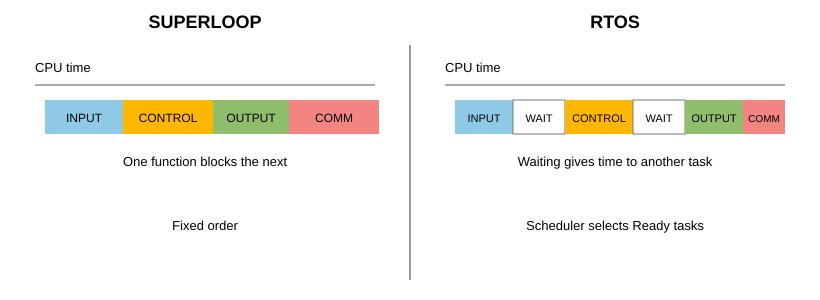
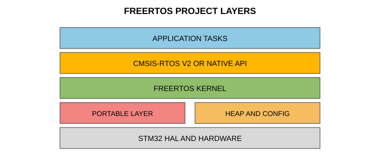
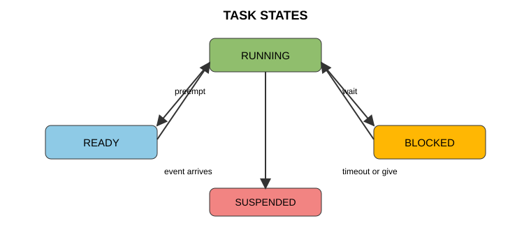
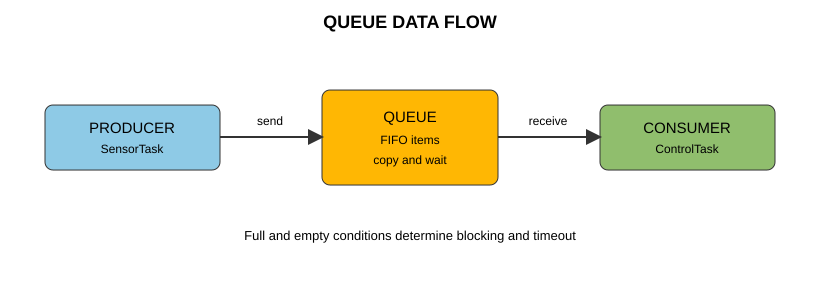
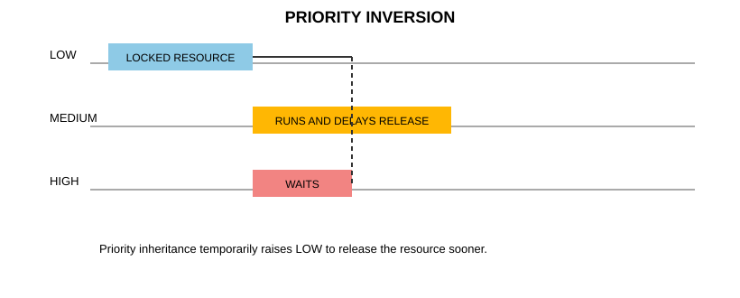
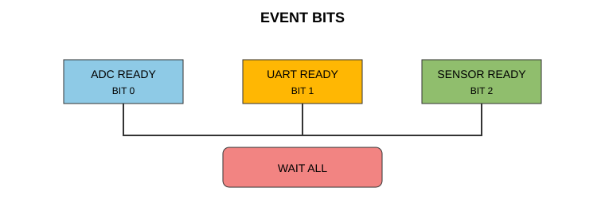
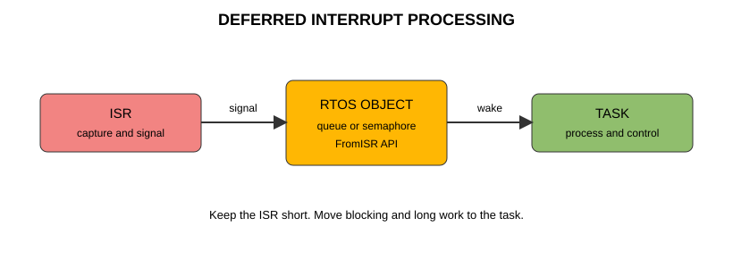
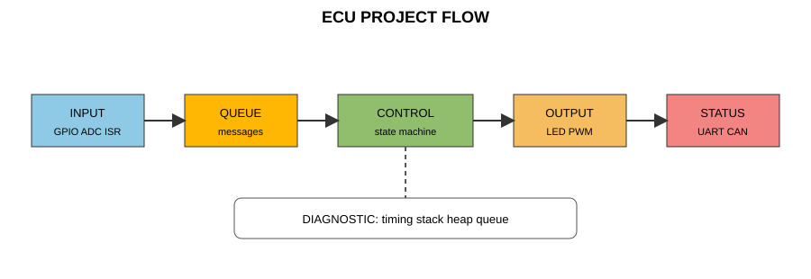
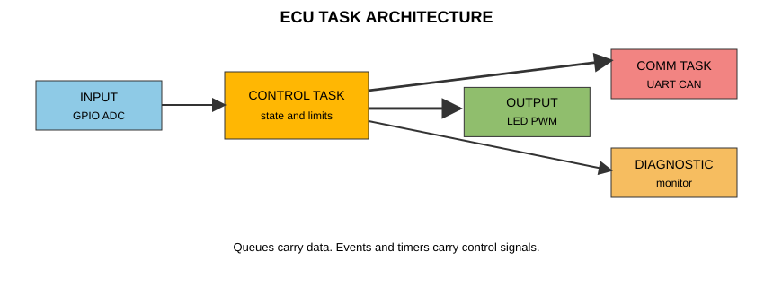

# 실시간 운영체제 기반 전자제어기 프로그래밍

## 머리말

전자제어기는 버튼 하나를 읽고 LED 하나를 켜는 장치가 아니다. 입력이 들어온 시각을 기억하고, 필요한 시간 안에 판단하며, 출력과 통신을 서로 방해하지 않게 갱신해야 하는 장치다. 기능이 적을 때는 `while (1)` 반복문만으로도 동작한다. 그러나 센서 측정, 점멸등, 경고음, 통신, 진단이 한 반복문에 모이면 한 기능의 지연이 다른 기능의 응답을 늦춘다.

RTOS는 이 문제를 해결하기 위한 실행 규칙이다. RTOS를 사용하면 여러 기능을 task라는 실행 단위로 나누고, 기다리는 task는 CPU를 내어 주며, scheduler가 다음 task를 선택한다. Queue, semaphore, mutex, event flag, software timer는 task 사이에 데이터와 사건을 전달하는 도구다.

이 책의 목적은 API 이름을 많이 외우는 데 있지 않다. 다음 네 질문에 근거를 들어 답하는 데 있다.

1. 이 기능은 언제 실행되어야 하는가?
2. 이 기능은 무엇을 기다리는가?
3. 다른 기능과 어떤 데이터 또는 자원을 공유하는가?
4. 실제 보드에서 그 실행 흐름을 어떻게 확인할 수 있는가?

모든 실습은 NUCLEO-G0B1RE와 Easy Module Shield를 사용한다. 회로와 핀 배치는 `임베디드 시스템 인터페이스 회로` 교재의 자동차 전장 부품 매핑을 따른다. 코드에 쓰는 라벨은 CubeMX User Label로 생성된 이름이다. 실습을 시작하기 전에는 실드가 보드에 완전히 장착되었는지, USB 케이블이 데이터 통신을 지원하는지 확인한다.

## 이 책의 실습 규칙

각 실습은 다음 순서로 진행한다.

1. 풀고 싶은 문제를 읽고 실행 결과를 먼저 예측한다.
2. CubeMX에서 필요한 핀과 CMSIS-RTOS v2 객체를 설정한다.
3. 생성된 프로젝트에서 코드가 들어갈 파일과 USER CODE 영역을 확인한다.
4. 코드를 빌드하고 다운로드한다.
5. LED, 버튼, 부저, 시리얼 모니터 또는 STM32CubeMonitor로 결과를 확인한다.
6. 한 걸음 더 과제에서는 제시된 자동차 기능, 수정할 코드나 CubeMX 설정, 보드에서 확인할 결과를 실습 기록에 함께 적는다.

코드의 `HAL_` 함수는 STM32 주변 장치를 제어하는 HAL API다. `os`로 시작하는 함수는 CMSIS-RTOS v2 API다. 이 책의 application code는 HAL과 CMSIS-RTOS v2만 사용한다. FreeRTOS kernel은 CubeMX project에서 CMSIS-RTOS v2 호출을 실제로 처리하는 engine이며, 학습자는 kernel 고유 함수 이름을 외우지 않아도 된다.

> **주의**  
> 이 책의 실습 코드는 CMSIS-RTOS v2 방식만 사용한다. 같은 객체를 CMSIS-RTOS v2와 kernel 고유 API로 섞어 다루지 않는다. CubeMX가 만든 `osKernelInitialize()`와 `osKernelStart()`는 사용자가 다시 호출하지 않는다.

## 차례

1. 실습 환경과 기준 프로젝트
2. RTOS와 FreeRTOS의 실행 모델
3. Task 관리와 Scheduler
4. Task 간 통신과 동기화
5. 시간 사건과 Interrupt 연동
6. ADC, PWM, 통신을 RTOS에 연결하기
7. Memory, Stack, 진단
8. BCM 통합 구현 실습
9. 부록: 객체 선택표와 점검표

---

<!-- 이 태그 뒷부분부터 새 페이지에서 시작됩니다 -->
<div style="page-break-after: always;"></div>

# 1. 실습 환경과 기준 프로젝트

## 개요

> **풀고 싶은 문제**  
> RTOS 예제를 다운로드했는데 LED가 켜지지 않거나 버튼이 반대로 동작한다. 이것이 task 문제인지 하드웨어 설정 문제인지 빠르게 구분하려면 무엇을 먼저 확인해야 할까?

RTOS는 이미 정상인 하드웨어 위에서 동작한다. LED 핀, 버튼 논리, ADC 입력 범위, UART 통신이 먼저 맞아야 task, queue, interrupt의 결과를 믿을 수 있다. 이 장에서는 이후 모든 예제가 공유하는 기준 프로젝트를 만든다.

## 실습 시작 전: 전원과 클럭을 먼저 고정하기

Easy Module Shield는 원래 5V Arduino 보드용이다. PA0과 PA1을 ADC analog mode로 사용할 때에는 디지털 GPIO의 5V tolerance를 기대할 수 없으며, 두 핀의 전압은 항상 VSSA부터 VDDA(이 보드에서는 3.3V) 범위에 있어야 한다. 이 조건을 만족하지 않으면 ADC 값이 틀리는 수준을 넘어 MCU를 손상할 수 있다.

이 책의 ADC 실습은 다음 둘 중 하나가 **이미 검증된 하드웨어 조건**에서만 진행한다.

1. `임베디드 시스템 인터페이스 회로` 교재의 기준처럼 Easy Module Shield의 5V 전원 레일을 기존 5V 공급에서 분리하고 NUCLEO의 3V3에 연결한 개조 실드를 사용한다.
2. 개조하지 않은 실드를 쓸 때는 PA0과 PA1 각각에 5V를 최대 3.0V로 낮추는 분압기를 별도로 둔다. 기준 회로는 신호선에 10kOhm을 직렬로 넣고 ADC 핀과 GND 사이에 15kOhm을 연결하는 방식이다.

전원을 넣기 전에 멀티미터로 DIMMER_SW와 AUTO_LIGHT_SENSOR의 핀 전압을 GND 기준으로 확인한다. 가변저항의 양 끝과 조도센서의 밝음/어두움 조건에서 모두 0V부터 3.3V 안에 있어야 한다. 이 확인이 끝나기 전에는 PA0과 PA1을 ADC로 설정하거나 ADC 예제를 다운로드하지 않는다. 분압기를 사용하면 ADC 입력이 보는 source impedance가 커져 sampling capacitor가 안정될 시간이 달라진다. raw 값이 불안정하면 6장의 지시에 따라 sampling time을 늘린 뒤 같은 조건에서 반복 측정하여 안정성을 다시 확인한다.

PWM 수식과 `PWM_PERIOD = 999U`는 timer clock 64MHz를 전제로 한다. 별도 HSE/MCO 납땜 없이 재현할 수 있도록 기준 프로젝트는 Clock Configuration에서 내부 HSI를 PLL로 올리는 경로를 사용한다.

1. PLL Source Mux를 HSI, PLLM을 `/1`, PLLN을 `x8`, PLLR을 `/2`로 설정한다.
2. System Clock Mux를 PLLCLK로 선택하고 AHB와 APB prescaler를 모두 `/1`로 둔다.
3. Clock Configuration 화면에서 SYSCLK, HCLK, PCLK1과 TIM1, TIM2, TIM3, TIM6, TIM14에 공급되는 timer clock이 모두 64MHz인지 확인한다.

CubeMX 버전에 따라 항목 이름이나 배치가 조금 달라도, 생성된 `SystemClock_Config()`가 위의 64MHz 경로를 만들고 Clock Configuration의 실제 주파수 표시가 일치해야 한다. 다른 clock source를 선택했다면 PWM 설정을 복사하지 말고 먼저 각 timer clock을 확인한 뒤 prescaler와 period를 다시 계산한다.

## 실드 핀과 이름

CubeMX에서 아래 User Label을 입력한다. 코드에서는 가능한 한 `GPIOA`, `GPIO_PIN_6` 같은 원시 핀 이름 대신 라벨을 사용한다. 코드만 읽어도 어떤 장치를 제어하는지 알 수 있기 때문이다.

| 기능 | 실드 부품 | 핀 | CubeMX User Label | 설정 | 확인 방법 |
| ---- | ---- | ---- | ---- | ---- | ---- |
| 우측 점멸등 | LED1 | PA5 | TURN_SIGNAL_R | GPIO Output | LED1 |
| 좌측 점멸등 | LED2 | PA6 | TURN_SIGNAL_L | GPIO Output | LED2 |
| 비상등 버튼 | SW1 | PA10 | HAZARD_SW | GPIO Input, Pull-up | 버튼 누름 |
| 도어 스위치 | SW2 | PB3 | DOOR_SW | GPIO Input, Pull-up | 버튼 누름 |
| 조명 조절 | 가변저항 | PA0 | DIMMER_SW | ADC1_IN0 | 다이얼 |
| 주변 밝기 | CdS | PA1 | AUTO_LIGHT_SENSOR | ADC1_IN1 | 빛 가림 |
| RGB 빨강 | RGB LED | PC7 | HEADLAMP_R | TIM2_CH4 PWM | RGB LED |
| RGB 초록 | RGB LED | PB0 | HEADLAMP_G | TIM1_CH2N PWM | RGB LED |
| RGB 파랑 | RGB LED | PA7 | HEADLAMP_B | TIM14_CH1 PWM | RGB LED |
| 경고음 | 피에조 부저 | PB4 | CHIME_BUZZER | TIM3_CH1 PWM | 부저 |

SW1과 SW2는 누르지 않았을 때 High, 눌렀을 때 Low가 된다. 이 동작을 active-low라고 한다. 버튼을 눌렀는지 검사하는 조건은 다음과 같다.

```c
bool IsHazardPressed(void)
{
    return HAL_GPIO_ReadPin(HAZARD_SW_GPIO_Port,
                            HAZARD_SW_Pin) == GPIO_PIN_RESET;
}
```

`GPIO_PIN_RESET`은 논리 Low를 뜻한다. 버튼이 눌렸을 때 High라고 가정하면 프로그램은 컴파일되지만 실행 결과가 반대가 된다. 이 코드를 먼저 LED와 연결하여 논리를 확인한다.

## CubeMX 기준 프로젝트

프로젝트 이름을 `rtos_base`로 정한다. 이후 실습은 이 프로젝트를 `Save Project As`로 복사해 시작한다. 이전 실습의 코드를 지우고 다시 쓰는 방식보다 설정 오류가 적다.

### CubeMX 설정 순서

1. Board Selector에서 NUCLEO-G0B1RE를 선택한다.
2. PA5, PA6을 GPIO_Output, Push-Pull, No pull로 설정한다.
3. PA10, PB3을 GPIO_Input, Pull-up으로 설정한다.
4. PA0은 ADC1_IN0, PA1은 ADC1_IN1로 설정한 뒤 **Analog > ADC1**에서 regular conversion을 다음처럼 구성한다. ADC 입력 전압은 VDDA인 3.3V를 넘으면 안 된다.
    - Resolution은 12 bits, Data Alignment는 Right로 둔다. 이후 코드의 ADC 범위 `0`부터 `4095`는 이 설정을 전제로 한다.
    - ADC Clock Prescaler는 Synchronous clock mode divided by 2로 둔다. 이 프로젝트에서는 AHB clock이 64MHz이므로 ADC clock은 32MHz가 된다. 이 값과 아래 160.5 cycle sampling time은 실제 Easy Module Shield의 PA0, PA1 입력을 확인한 HAL 실습과 같은 기준이다.
    - Scan Conversion Mode를 Enabled로, Number Of Conversion을 2로 설정한다. CubeMX의 Scan Sequence 또는 Rank 목록에서 PA0/IN0이 rank 1로 먼저, PA1/IN1이 rank 2로 뒤에 표시되는지 확인한다. DMA의 각 2-word frame은 이 순서로 저장된다.
    - Continuous Conversion Mode는 Disabled, DMA Continuous Requests는 Enabled로 둔다. External Trigger Conversion Source는 TIM6 TRGO, External Trigger Conversion Edge는 Rising Edge, Trigger Frequency Mode는 Low Frequency로 둔다. End Of Conversion Selection은 End of sequence를 선택한다.
    - 두 채널의 sampling time은 같은 Common 1을 사용하고 160.5 cycles로 시작한다. ADC clock 32MHz에서 12-bit 한 변환은 $(160.5 + 12.5) / 32\,\text{MHz} \mathrel{\simeq} 5.4\,\mu\text{s}$이고 두 channel sequence는 약 $10.8\,\mu\text{s}$다. 이는 10ms trigger period보다 충분히 짧으면서 높은 임피던스 센서 입력의 sampling 안정 시간을 확보한다.
    - **DMA Settings**에서 ADC1 request를 추가한다. Direction은 Peripheral to Memory, Mode는 Circular, Peripheral/Memory Data Width는 Half Word, Memory Increment는 Enabled로 둔다. CubeMX가 생성하는 DMA channel interrupt와 ADC1 global interrupt를 Enabled 상태로 둔다. DMA channel interrupt는 `HAL_ADC_ConvHalfCpltCallback`과 `HAL_ADC_ConvCpltCallback` 경로에, ADC1 global interrupt는 overrun 오류의 `HAL_ADC_ErrorCallback` 경로에 필요하다.
    - **Timers > TIM6**에서 Clock Source를 Internal Clock, Prescaler를 63, Counter Period를 9999로 둔다. Master Output Trigger, 또는 Trigger Output (TRGO)은 Update Event로 설정한다. 64MHz timer clock에서는 $64\,\text{MHz} / ((63 + 1) \times (9999 + 1)) = 100\,\text{Hz}$이므로 ADC 2채널 sequence가 10ms마다 한 번 시작된다. HSI/PLL, APB prescaler 또는 TIM6 timer clock을 바꿨다면 이 값을 고정으로 쓰지 말고 같은 식으로 Prescaler와 Counter Period를 다시 계산하여 100Hz인지 확인한다. TIM6에는 channel, GPIO pin, NVIC interrupt를 설정하지 않는다.
    - **System Core > SYS**의 Timebase Source는 TIM7으로 둔다. CubeMX가 TIM7을 HAL의 1ms timebase로 초기화하고 필요한 NVIC 설정을 생성한다. TIM6를 HAL timebase로 선택하면 ADC trigger generator와 충돌하므로 선택하지 않는다. TIM7은 HAL timebase 전용으로 남기고 PWM, ADC trigger, application timer에는 사용하지 않는다.
5. PC7은 TIM2_CH4, PB0은 TIM1_CH2N, PA7은 TIM14_CH1, PB4는 TIM3_CH1으로 설정한다. PB0에서는 TIM1의 Channel 2 complementary output을 선택하고, 다른 핀은 해당 channel의 PWM Generation을 선택한다. 각 timer의 **Clock Source**는 Internal Clock으로 설정한다.
    - RGB 출력 timer인 TIM1, TIM2, TIM14는 Counter Mode를 Up, Prescaler를 63, Counter Period를 999, Pulse를 0, PWM Polarity를 High로 둔다. 이 설정은 $f_{PWM} = 64\,\text{MHz} / ((63 + 1) \times (999 + 1)) = 1\,\text{kHz}$ PWM을 만든다.
    - 부저 전용 TIM3도 Prescaler 63, Counter Period 999, PWM Polarity High로 둔다. Pulse는 500으로 설정해 두면 `HAL_TIM_PWM_Start` 뒤 50% duty의 1kHz 경고음이 나온다. 시작 전에는 PWM channel이 정지되어 있으므로 출력은 발생하지 않는다.
    - `Counter Period = 999`는 6장의 `PWM_PERIOD = 999U`와 반드시 일치해야 한다. Clock Configuration에서 timer clock이 64MHz가 아니라면 Prescaler를 조정해 counter clock을 1MHz로 만든 뒤 Counter Period 999를 유지한다. TIM3의 Prescaler와 Counter Period는 부저 PWM 주파수를 기준으로 설정한다. TIM6은 ADC trigger 전용이며 PWM 출력과 공유하지 않는다.
    - `TIM1`은 고급 제어 타이머이므로 `TIM1->BDTR`의 `MOE`(Main Output Enable)가 1이어야 `TIM1_CH2N` 출력이 핀에 전달된다. CubeMX의 **Break and Dead-Time** 설정에서 이 실습은 `Break State`를 Disabled로 두고 `Automatic Output`도 Disabled로 둔다. `Automatic Output`은 `BDTR.AOE`를 설정해 break 이후 출력 재활성화를 자동화하는 항목일 뿐, 정상 PWM 시작에 필요한 `MOE`를 직접 켜는 별도 설정은 아니다.
    - CubeMX는 timer와 alternate-function pin을 초기화한다. 실제 PWM 출력은 6장에서 PC7과 PA7에 `HAL_TIM_PWM_Start()`, PB0의 `TIM1_CH2N`에는 `HAL_TIMEx_PWMN_Start(&htim1, TIM_CHANNEL_2)`를 각각 한 번 호출한 뒤 시작한다. 이 보완 PWM 시작 함수가 `CC2NE`, `BDTR.MOE`, `CEN`을 함께 활성화하므로 HAL 기반 예제에는 별도의 `__HAL_TIM_MOE_ENABLE()` 호출을 추가하지 않는다. 레지스터 또는 LL 코드로 직접 시작할 때만 `MOE`를 별도로 설정해야 한다. RGB LED가 반대로 동작하면 먼저 compare 0과 999를 보드에서 확인하고 output logic을 반전한다.
6. 앞 단계에서 기능을 설정한 모든 핀에 정확히 같은 CubeMX User Label을 입력한다. Pinout view에서 각 핀을 우클릭한 뒤 User Label 입력란에 `TURN_SIGNAL_L`, `HAZARD_SW`, `DIMMER_SW`처럼 표의 이름을 넣는다. 이 과정은 선택 사항이 아니다. 이후 예제는 `TURN_SIGNAL_L_Pin`, `TURN_SIGNAL_L_GPIO_Port`처럼 CubeMX가 생성한 label 매크로를 사용한다.
7. USART2를 Asynchronous, 115200 bit/s, 8-N-1, flow control 없음으로 설정한다. NUCLEO의 ST-LINK Virtual COM Port로 PC에 연결된다.
8. Middleware and Software Packs에서 FreeRTOS를 선택한다. Interface는 CMSIS_V2로 둔다. Advanced Settings에서 USE_NEWLIB_REENTRANT를 Enabled로 설정하고, 생성된 `FreeRTOSConfig.h`에서 `configUSE_NEWLIB_REENTRANT`가 1인지 확인한다.
9. 기본 태스크를 하나 생성한다. CubeMX의 **Tasks and Queues** 항목에서 **Tasks** 그룹을 열고, `Task Name`은 `defaultTask`, `Priority`는 Normal로 둔다.
10. Project Manager에서 Toolchain/IDE를 STM32CubeIDE로 선택하고 코드를 생성한다.

> **RTOS 프로젝트의 두 1ms timebase**  
> CubeMX의 FreeRTOS 기본 설정에서 SysTick은 kernel tick과 scheduler의 시간 기준으로 남긴다. HAL의 `HAL_GetTick`, HAL timeout, `HAL_Delay`는 TIM7 interrupt가 증가시키는 별도 tick을 사용한다. 따라서 SysTick과 TIM7은 같은 1ms 주기를 만들더라도 역할이 다르다. scheduler가 시작된 뒤 태스크의 지연과 주기 제어에는 `HAL_Delay` 대신 `osDelay`와 `osDelayUntil`을 사용한다. TIM7 timebase는 HAL 내부 timeout과 초기화 코드에도 필요하다.

> **Newlib 재진입성과 UART 출력**  
> 이 책의 예제는 여러 태스크 문맥에서 `printf`를 사용할 수 있으므로 USE_NEWLIB_REENTRANT를 켜서 newlib의 태스크별 상태를 분리한다. 이 설정은 태스크마다 RAM을 더 사용하므로 Build Analyzer 또는 map file로 RAM 여유를 확인한다. 이 설정만으로 여러 태스크의 UART 문자열 순서가 보장되지는 않는다. 한 UART를 여러 태스크가 공유하면 이후 장의 mutex 또는 전용 출력 태스크로 전송 순서를 따로 관리한다.

> **용어: 태스크와 스레드(thread)**  
> 이 책의 설명에서는 scheduler가 실행하고 관리하는 독립 실행 단위를 태스크(task)라고 부른다. FreeRTOS의 공식 용어가 task이기 때문이다. CMSIS-RTOS v2는 같은 개념을 thread라고 부르므로 `osThreadNew`, `osThreadFlagsWait`, Thread flag 같은 API와 객체의 이름은 그대로 사용한다. 반면 CubeMX 화면은 **Tasks and Queues** 항목의 **Tasks** 그룹과 `Task Name` 필드로 표시하므로 UI 설명에는 태스크를 사용한다. 이 기준 프로젝트에서는 CMSIS-RTOS v2 thread 하나가 FreeRTOS task 하나에 대응한다.

> **User Label을 유지하는 이유**  
> 이 책은 보드의 원시 핀 번호 대신 자동차 기능 이름을 코드에 남긴다. Label을 생략하면 생성 매크로가 없어져 이후 모든 예제의 핀 이름을 `GPIOA`, `GPIO_PIN_6` 같은 표기로 바꿔야 한다. 따라서 기준 project에서는 표의 Label을 반드시 설정하고, 다른 이름을 썼다면 코드 전체에서 일관되게 같은 이름으로 바꾼다.

코드 생성 후 `Core/Inc/main.h`를 연다. `TURN_SIGNAL_L_Pin`, `TURN_SIGNAL_L_GPIO_Port`, `HAZARD_SW_Pin` 같은 매크로가 생성되어 있어야 한다. 없다면 User Label을 정확히 입력한 뒤 코드를 다시 생성한다.

## UART 출력 준비

LED는 한 가지 상태만 보여 준다. task가 언제 실행되었는지, queue가 가득 찼는지 같은 정보는 UART로 확인한다. `main.c`의 USER CODE 영역에 다음 코드를 추가한다. `huart2`의 이름은 CubeMX 설정에 따라 확인한다.

```c
/* USER CODE BEGIN Includes */
#include <stdio.h>
/* USER CODE END Includes */

/* USER CODE BEGIN PFP */
int __io_putchar(int ch)
{
    uint8_t byte = (uint8_t)ch;

    if (ch == '\n')
    {
        uint8_t cr = '\r';
        HAL_UART_Transmit(&huart2, &cr, 1U, HAL_MAX_DELAY);
    }

    HAL_UART_Transmit(&huart2, &byte, 1U, HAL_MAX_DELAY);
    return ch;
}
/* USER CODE END PFP */
```

Windows 장치 관리자에서 `STMicroelectronics STLink Virtual COM Port`의 COM 번호를 찾는다. Tera Term 또는 PuTTY에서 그 포트를 115200, 8-N-1, flow control 없음으로 연다. 시리얼 모니터를 연 뒤 Reset 버튼을 누르면 처음부터 출력이 보인다.

> **알아두기 - printf의 비용**  
> UART는 CPU보다 느리다. 긴 문자열을 자주 `printf`하면 그 task의 실행 시간이 길어진다. 이 책의 초기 예제에서는 실행을 관찰하기 위해 사용하지만, 짧은 주기의 제어 task에서는 매 cycle마다 출력하지 않는다.

## 첫 실행: LED와 버튼

> **이 예제로 풀 문제**  
> FreeRTOS를 넣기 전에 LED와 버튼의 논리가 맞는지 확인하고 싶다. 버튼을 누르는 동안 LED2가 켜지는 가장 작은 프로그램을 만든다.

FreeRTOS를 선택했더라도 `main()`의 `while (1)`에 아래 코드를 잠시 넣어 하드웨어를 확인할 수 있다. 이 예제는 scheduler 시작 전 확인용이다. RTOS task와 섞어 사용하지 않는다.

```c
while (1)
{
    GPIO_PinState state = HAL_GPIO_ReadPin(HAZARD_SW_GPIO_Port,
                                           HAZARD_SW_Pin);

    HAL_GPIO_WritePin(TURN_SIGNAL_L_GPIO_Port,
                      TURN_SIGNAL_L_Pin,
                      state == GPIO_PIN_RESET ? GPIO_PIN_SET : GPIO_PIN_RESET);

    HAL_Delay(10U);
}
```

**구현 설명**

`HAL_GPIO_ReadPin`은 입력 핀의 현재 전압을 High 또는 Low로 읽는다. 삼항 연산자는 버튼이 Low일 때 LED에는 High를 출력하고, 그렇지 않으면 Low를 출력한다. `HAL_Delay(10U)`는 버튼을 읽는 속도를 적당히 낮춘다. 이 지연은 RTOS의 `osDelay`와 다르다. 아직 scheduler가 시작되지 않은 이 예제에서는 HAL 지연을 사용해도 된다.

**실행 결과와 확인할 점**

- SW1을 누르는 동안 LED2가 켜지고 떼면 꺼져야 한다.
- 결과가 반대라면 `GPIO_PIN_RESET`과 `GPIO_PIN_SET`을 바꾸기 전에 입력 핀을 debugger로 읽어 실제 논리를 확인한다.
- LED가 전혀 변하지 않으면 PA6의 GPIO mode와 User Label을 확인한다.

> **한 걸음 더 - 도어 열림 경고등**  
> SW2를 운전석 도어 스위치로 가정한다. `HAZARD_SW`를 `DOOR_SW`로, `TURN_SIGNAL_L`을 `TURN_SIGNAL_R`로 바꾼 뒤 빌드하고 다운로드한다. SW2를 누르는 동안 LED1만 켜지고 손을 떼면 꺼지는지 확인한다. LED2가 함께 변하거나 LED1이 반대로 동작하면 PB3의 pull-up 설정과 `GPIO_PIN_RESET` 조건을 확인한다.

### 장 정리

이 장의 기준 프로젝트는 이후 모든 RTOS 실습의 출발점이다. 하드웨어 문제를 먼저 분리해 두면, 다음 장부터는 실행 구조 자체에 집중할 수 있다.

---

<!-- 이 태그 뒷부분부터 새 페이지에서 시작됩니다 -->
<div style="page-break-after: always;"></div>

# 2. RTOS와 FreeRTOS의 실행 모델

## 빠른 프로그램과 실시간 프로그램

> **풀고 싶은 문제**  
> 상태 메시지를 UART로 전송하는 동안 버튼 처리와 점멸등 갱신이 늦어진다. CPU가 충분히 빠른데도 왜 이런 문제가 생길까?

빠른 프로그램은 작업을 짧은 시간에 끝낸다. 실시간 프로그램은 필요한 결과를 정해진 시간 안에 끝낸다. 전자제어기에서는 평균 속도보다 가장 늦은 결과가 더 중요할 때가 많다.

| 용어 | 뜻 | 예 |
| ---- | ---- | ---- |
| Deadline | 결과가 유효하려면 끝나야 하는 시각 | 버튼 입력 뒤 20ms 안에 경고 표시 |
| Period | 주기 task의 시작 간격 | ADC를 10ms마다 읽기 |
| Response time | 사건부터 처리 시작 또는 완료까지의 시간 | EXTI 발생부터 ButtonTask 실행까지 |
| Jitter | 목표 시각에서 벗어난 변동 | 10ms task가 9ms, 11ms, 15ms로 실행 |

## Bare metal의 한계

```c
while (1)
{
    ReadAdc();
    UpdateLamp();
    SendStatus();
    CheckButtons();
}
```

이 구조에서 `SendStatus()`가 30ms 걸리면 `CheckButtons()`는 그동안 실행되지 못한다. 전체 반복 주기는 각 함수 실행 시간의 합이다.

$$T_{loop} = T_{adc} + T_{lamp} + T_{uart} + T_{button}$$

</br>

RTOS에서는 기다리는 task가 CPU를 양보한다. ADC task가 다음 10ms 주기를 기다리는 동안 점멸 task나 통신 task가 실행될 수 있다. RTOS가 CPU를 더 빠르게 만드는 것은 아니다. CPU 시간을 누구에게 언제 줄지 예측 가능하게 만든다.

## 일반적인 RTOS와 FreeRTOS

RTOS는 특정 제품 이름이 아니라 실시간 실행 구조를 제공하는 운영체제의 종류다. 일반 RTOS에는 task 관리, scheduler, 시간 관리, 동기화, 통신, interrupt 연동 기능이 있다. FreeRTOS는 이러한 RTOS의 핵심 기능을 작은 MCU에서 사용할 수 있도록 제공하는 대표적인 real-time kernel이다.

| 공통 RTOS 개념 | 이 책에서 쓰는 CMSIS-RTOS v2 API 또는 용어 |
| ---- | ---- |
| 실행 단위 | Thread, `osThreadNew` |
| 실행 선택기 | Scheduler |
| 실행 상태 저장 | thread stack, context |
| 데이터 전달 | Message queue |
| 사건 동기화 | Semaphore, thread flag |
| 공유 자원 보호 | Mutex |
| 여러 조건 대기 | Event flag |
| 시간 사건 | Software timer |
| interrupt 후처리 | ISR 호출이 허용된 CMSIS-RTOS v2 API, deferred interrupt processing |

FreeRTOS는 파일 시스템, 네트워크, GUI 전체를 반드시 포함하는 거대한 운영체제가 아니다. 기본 kernel은 task와 시간, 동기화에 집중한다. 필요한 기능은 별도 library 또는 STM32 HAL과 조합한다. 이 점 때문에 메모리가 제한된 MCU에 적합하다.

## Task 분할 기준

하나의 함수마다 task를 만들지 않는다. 책임과 시간 요구가 다른 기능을 task로 나눈다.

| Task | 책임 | 기다리는 대상 | 예 |
| ---- | ---- | ---- | ---- |
| InputTask | 입력 샘플 수집 | 다음 주기, ADC 완료 | ADC, 버튼 상태 |
| ControlTask | 상태 판단 | input queue, timeout | 오토라이트 결정 |
| OutputTask | 장치 출력 | output queue | LED, PWM, 부저 |
| CommunicationTask | 명령과 상태 통신 | UART event, status queue | UART frame |
| DiagnosticTask | 측정값 기록 | 긴 주기 | stack, queue, 오류 count |

> **한 걸음 더 - 도어 열림 경고 기능 분해**  
> SW2를 운전석 도어 스위치, LED1을 도어 열림 경고등, PB4 부저를 경고음으로 가정한다. 아래 다섯 행을 실습 노트에 채운다: `InputTask`는 SW2를 10ms마다 읽어 queue로 보내고, `ControlTask`는 도어가 열린 상태인지 판단하며, `OutputTask`는 LED1과 부저를 갱신하고, `CommunicationTask`는 1초마다 UART 상태를 보내며, `DiagnosticTask`는 queue full count를 기록한다. 성공 기준은 SW2를 누른 뒤 LED1이 20ms 안에 켜지고 UART에 `door=open` 상태가 1초 안에 한 번 이상 보이는 것이다. 각 task가 기다리는 대상도 함께 적는다.

### 장 정리

RTOS를 사용하는 이유는 기능을 동시에 보이게 하는 것이 아니라, 각 기능의 실행 시각과 관계를 설명하기 위해서다. 다음 장에서는 FreeRTOS가 프로젝트 안에서 어떤 층으로 동작하는지 확인한다.

---

## FreeRTOS와 CMSIS-RTOS v2 이해하기

## 프로젝트 안의 계층

</br>

| 계층 | 역할 | 이 책에서 하는 일 |
| ---- | ---- | ---- |
| Application | task 함수와 제어 로직 | 버튼, 센서, 램프 제어 |
| CMSIS-RTOS v2 | 공통 API wrapper | `osThreadNew`, `osDelay` |
| FreeRTOS kernel | scheduler와 객체 구현 | task, queue, semaphore 동작 |
| Portable layer | Cortex-M context switching | PendSV, SysTick 연동 |
| HAL | STM32 주변 장치 제어 | GPIO, ADC, UART, timer |

## 왜 CMSIS-RTOS v2를 사용하는가

FreeRTOS, ThreadX, Keil RTX처럼 RTOS kernel이 직접 제공하는 API는 thread 생성, semaphore 생성, queue 전송의 함수 이름과 handle type, 인자 형태가 서로 다르다. application code가 각 kernel의 native API를 직접 사용하면 RTOS를 바꿀 때 task 생성과 동기화 코드를 넓은 범위에서 다시 써야 한다.

CMSIS-RTOS v2는 이 문제를 줄이기 위한 공통 API 표준이다. CMSIS-RTOS v2 구현을 제공하는 FreeRTOS, RTX, ThreadX 환경에서는 application code가 RTOS engine과 관계없이 같은 osThreadNew, osMessageQueuePut, osSemaphoreAcquire 호출을 사용한다. RTX5는 CMSIS-RTOS v2를 기본 interface로 제공하므로 같은 application code를 그대로 사용한다.

다음처럼 thread를 만드는 application code는 kernel을 바꾸어도 유지한다. RTOS별 초기화, memory 설정, interrupt priority 조건은 다시 점검해야 하지만, 기능 task를 만들고 기다리고 통신하는 코드를 모두 고쳐 쓰지 않아도 된다.

```c
static const osThreadAttr_t input_task_attributes = {
    .name = "InputTask",
    .priority = osPriorityNormal,
    .stack_size = 256U * 4U  /* CubeMX Stack Size 256 words = 1024 bytes */
};

static osThreadId_t input_task_id;

static void CreateApplicationThreads(void)
{
    input_task_id = osThreadNew(StartInputTask,
                                NULL,
                                &input_task_attributes);

    if (input_task_id == NULL)
    {
        Error_Handler();
    }
}
```

| 바꾸지 않는 application code | RTOS를 바꿀 때 다시 확인할 항목 |
| ---- | ---- |
| osThreadNew, osDelay, osMessageQueuePut, osSemaphoreAcquire, osMutexAcquire | CMSIS-RTOS v2 구현 또는 adapter 제공 여부 |
| task 책임, queue message 구조, 상태 전이 규칙 | priority 수, tick frequency, memory allocation 방식 |
| ISR에서 짧게 사건만 전달하는 구조 | interrupt priority 규칙, startup code, kernel configuration |

CMSIS-RTOS v2는 여러 RTOS에서 같은 형태로 사용할 수 있는 API 표준이며 STM32CubeMX도 이 형식의 코드를 생성한다. 이 책의 application task, queue, semaphore, mutex, event flag, timer, 주기 대기는 모두 CMSIS-RTOS v2 API를 사용한다. 아래 표의 native API 이름은 RTOS를 바꿀 때 무엇이 달라지는지 비교하기 위한 역사적 이름이며, 본문의 application 예제에는 사용하지 않는다.

| 목적 | 이 책의 기본 API | FreeRTOS native 예 | ThreadX native 예 |
| ---- | ---- | ---- | ---- |
| thread 생성 | `osThreadNew` | `xTaskCreate` | `tx_thread_create` |
| 지연 | `osDelay` | `vTaskDelay` | `tx_thread_sleep` |
| 기준 시각 주기 | `osDelayUntil` | `vTaskDelayUntil` | kernel별 시간 비교 코드 |
| queue | `osMessageQueueNew` | `xQueueCreate` | `tx_queue_create` |
| semaphore | `osSemaphoreNew` | `xSemaphoreCreateBinary` | `tx_semaphore_create` |
| mutex | `osMutexNew` | `xSemaphoreCreateMutex` | `tx_mutex_create` |
| event | `osEventFlagsNew` | `xEventGroupCreate` | `tx_event_flags_create` |
| timer | `osTimerNew` | `xTimerCreate` | `tx_timer_create` |

> **주의**  
> 표의 native API는 다른 자료와 engine code를 읽기 위한 이름 비교다. 본문의 application 예제에서는 사용하지 않는다. 같은 객체를 CMSIS-RTOS v2와 native API로 섞어 다루지 않는다. ISR에서는 CMSIS-RTOS v2가 ISR 호출을 허용하는 osSemaphoreRelease, osMessageQueuePut timeout 0, osThreadFlagsSet을 먼저 사용한다.

## 생성 코드의 흐름

CubeMX가 만든 `main.c`는 대체로 다음 순서다.

```c
HAL_Init();
SystemClock_Config();
MX_GPIO_Init();
MX_USART2_UART_Init();
MX_FREERTOS_Init();
osKernelStart();

while (1)
{
}
```

`MX_FREERTOS_Init()`는 task와 queue 같은 kernel 객체를 만든다. `osKernelStart()` 뒤에는 scheduler가 CPU를 task에 넘긴다. 정상이라면 아래 `while (1)`은 실행되지 않는다. 따라서 RTOS 제어 코드를 이 while 문에 넣지 않는다.

## Tick과 context switching

Tick은 scheduler가 시간을 세는 기준 interrupt다. 설정이 1kHz이면 1ms마다 tick이 증가한다. `osDelay(100U)`는 현재 task가 약 100 tick 동안 Blocked 상태가 되도록 요청한다. 정확한 깨어남 시각에는 tick 경계와 다른 높은 priority task의 실행 시간이 영향을 준다.

Context switching은 현재 task의 레지스터와 실행 위치를 저장하고 다음 task의 상태를 복원하는 과정이다. Cortex-M에서는 주로 PendSV 예외가 이 일을 돕는다. 응용 프로그램이 직접 context를 저장하지는 않지만, task마다 독립 stack이 필요한 이유는 이해해야 한다.

## 입문자를 위한 task의 정확한 그림

처음 RTOS를 접하면 task를 "동시에 실행되는 함수"라고 생각하기 쉽다. 이 표현은 결과를 설명하는 데는 편하지만, 내부 동작을 빠뜨린다. Cortex-M0+ 코어는 한 순간에 명령 하나를 실행한다. 두 task가 실제로 같은 순간에 CPU 명령을 실행하는 것은 아니다.

task는 **나중에 다시 이어서 실행할 수 있도록 kernel이 관리하는 함수의 실행본**이다. 일반 함수는 호출한 곳으로 돌아오면 끝난다. 반면 task 함수는 보통 `for (;;)` 안에서 실행과 대기를 반복하며, scheduler가 필요할 때마다 멈춘 위치에서 다시 실행하게 된다.

예를 들어 다음 두 task가 있다고 하자.

```c
void StartLampTask(void *argument)
{
    (void)argument;

    for (;;)
    {
        HAL_GPIO_TogglePin(TURN_SIGNAL_L_GPIO_Port,
                           TURN_SIGNAL_L_Pin);
        osDelay(500U);
    }
}

void StartStatusTask(void *argument)
{
    (void)argument;

    for (;;)
    {
        printf("status tick=%lu\n",
               (unsigned long)osKernelGetTickCount());
        osDelay(1000U);
    }
}
```

다음 시간선은 한 CPU에서 일어나는 일을 단순화한 것이다.

| 시각 | LampTask | StatusTask | scheduler의 선택 |
| ---- | ---- | ---- | ---- |
| 0ms | LED 반전 후 500ms 대기 | 아직 실행 전 | StatusTask 실행 |
| 약 0ms | Blocked | tick 출력 후 1000ms 대기 | idle task 실행 |
| 500ms | Ready | Blocked | LampTask 실행 |
| 1000ms | Blocked | Ready | StatusTask 실행 |

두 task가 대부분 대기하므로, 실행이 번갈아 보인다. 여기서 핵심은 `osDelay`가 CPU를 멈추는 함수가 아니라 **현재 task를 대기 목록으로 옮기는 요청**이라는 점이다. 기다리는 task는 CPU 시간을 쓰지 않는다.

### Task Control Block, stack, context

FreeRTOS는 각 task마다 Task Control Block(TCB)이라는 관리 정보를 가진다. TCB를 직접 수정할 일은 없지만, 어떤 정보가 들어 있는지는 알아야 한다.

| TCB가 관리하는 대표 정보 | 왜 필요한가 |
| ---- | ---- |
| task의 priority와 상태 | scheduler가 다음 실행 대상을 고르기 위해 |
| task stack의 현재 위치 | 멈춘 함수와 local 변수를 다시 이어서 사용하기 위해 |
| task 이름과 handle | debugger와 다른 task가 task를 식별하기 위해 |
| 대기 대상과 timeout | queue, semaphore, delay에서 언제 깨어날지 판단하기 위해 |

각 task에는 **자기만의 stack**이 있다. `StartLampTask`의 local 변수와 `StartStatusTask`의 local 변수는 서로 다른 stack에 저장된다. 두 task가 같은 이름의 local variable을 사용해도 값이 섞이지 않는 이유다. 반대로 전역 변수는 task 모두가 같은 메모리를 보기 때문에 mutex, queue, event 같은 동기화 설계가 필요할 수 있다.

Context는 task가 다음에 실행될 때 복원해야 하는 CPU 상태다. 대표적으로 program counter(다음 명령 위치), stack pointer, 범용 레지스터가 있다. LampTask가 `osDelay(500U)`에서 멈출 때 kernel은 그 task의 context를 stack에 보관한다. 500ms 뒤 LampTask가 선택되면 kernel은 저장한 context를 복원하고, task는 `osDelay` 다음 문장부터 이어서 실행하는 것처럼 보인다.

> **확인 실습 - local 변수는 task마다 독립적인가?**  
> CubeMX의 **Tasks and Queues > Tasks** 그룹에서 `counterA`, `counterB` 태스크를 각각 추가한다. 두 task 모두 `uint32_t count = 0U;`를 지역 변수로 두고 증가시킨다. UART에 task 이름과 count를 1초마다 출력한다. 두 count가 각각 1, 2, 3으로 증가하고 서로의 값에 영향을 주지 않으면 각 task의 stack이 분리되어 동작하는 것이다.

```c
void StartCounterATask(void *argument)
{
    (void)argument;
    uint32_t count = 0U;

    for (;;)
    {
        ++count;
        printf("A count=%lu\n", (unsigned long)count);
        osDelay(1000U);
    }
}
```

`StartCounterBTask`는 문자열의 `A`만 `B`로 바꾸어 같은 구조로 작성한다. 두 task가 UART를 동시에 사용할 수 있는 점은 이 단계에서는 출력 시각이 달라 대체로 문제가 드러나지 않는다. 4장에서 mutex와 LogTask를 배운 뒤에는 UART 사용을 보호하는 방식으로 다시 작성한다.

### Scheduler는 언제, 무엇을 선택하는가

scheduler는 Ready 상태인 task 중 가장 높은 priority를 선택한다. task가 다음 상황을 만나면 선택 결과가 바뀔 수 있다.

| 일어난 일 | 현재 task의 변화 | scheduler가 할 일 |
| ---- | ---- | ---- |
| `osDelay(100U)` 호출 | Blocked, delay 목록으로 이동 | 다른 Ready task 선택 |
| 빈 queue에서 `osMessageQueueGet` 호출 | Blocked, queue 대기 목록으로 이동 | 다른 Ready task 선택 |
| semaphore를 얻지 못함 | Blocked, semaphore 대기 목록으로 이동 | 다른 Ready task 선택 |
| tick timeout 만료 | Blocked에서 Ready로 이동 | priority를 비교해 필요하면 전환 |
| ISR이 queue/semaphore를 전달 | 기다리던 task가 Ready로 이동 | 더 높은 priority task면 ISR 뒤 전환 요청 |

즉 scheduler가 매 명령마다 임의로 task를 바꾸는 것이 아니다. delay, IPC 객체, interrupt, tick이 task의 상태를 바꾸고 scheduler는 그 결과를 반영한다. 이 모델을 이해하면 "왜 이 task가 실행되지 않는가"라는 질문에 먼저 Ready인지 Blocked인지와 대기 대상을 확인하게 된다.

### FreeRTOS가 제공하는 것과 제공하지 않는 것

FreeRTOS kernel은 task를 만들고, 상태를 관리하고, time tick과 IPC 객체를 연결하는 작은 kernel이다. 하지만 ADC 변환, GPIO 출력, UART baud rate 설정을 알아서 해 주지는 않는다. 이 책에서 역할은 다음처럼 나뉜다.

| 필요한 일 | 담당 계층 | 예 |
| ---- | ---- | ---- |
| PA6 전압을 High/Low로 출력 | HAL | `HAL_GPIO_WritePin` |
| ADC 완료 interrupt를 발생 | STM32 peripheral/HAL | `HAL_ADC_ConvCpltCallback` |
| InputTask를 깨울 시점 결정 | CMSIS-RTOS v2 구현 | thread flag, queue, semaphore |
| 어떤 입력에서 램프를 켤지 판단 | application task | `DecideHeadlamp` |

이 분리는 문제를 찾을 때도 유용하다. LED가 전혀 켜지지 않으면 먼저 HAL 핀 설정을 확인한다. LED는 켜지지만 늦으면 task의 Blocked 상태, priority, queue 대기 시간을 확인한다. 값은 들어오지만 제어 규칙이 틀리면 application logic을 확인한다.

### 장 정리

CMSIS-RTOS v2는 application code와 RTOS kernel 사이의 공통 interface다. Task는 독립 stack과 context를 가진 실행본이며, scheduler는 상태와 priority를 근거로 Ready task를 선택한다. FreeRTOS는 현재 CubeMX project에서 이 interface를 처리하는 kernel engine이다. 다음 장에서 이 모델을 LED와 UART로 확인한다.

---

<!-- 이 태그 뒷부분부터 새 페이지에서 시작됩니다 -->
<div style="page-break-after: always;"></div>

# 3. Task 관리와 Scheduler

## 첫 heartbeat task

> **풀고 싶은 문제**  
> scheduler가 시작된 뒤 task가 실제로 반복 실행되는지 확인하고 싶다. LED와 UART가 모두 변하는 heartbeat task를 만든다.

CubeMX가 생성한 `StartDefaultTask`를 아래처럼 수정한다.

```c
void StartDefaultTask(void *argument)
{
    (void)argument;

    printf("scheduler started\n");

    for (;;)
    {
        HAL_GPIO_TogglePin(TURN_SIGNAL_L_GPIO_Port,
                           TURN_SIGNAL_L_Pin);

        printf("heartbeat tick=%lu\n",
               (unsigned long)osKernelGetTickCount());

        osDelay(1000U);
    }
}
```

**구현 설명**

task 함수는 일반 함수와 달리 반환하지 않는다. `for (;;)`가 task를 살아 있게 한다. `osDelay(1000U)`는 현재 task만 Blocked 상태로 옮긴다. CPU 전체를 멈추는 `HAL_Delay`와 다르다. scheduler는 heartbeat task가 기다리는 동안 idle task 또는 다른 Ready task를 실행한다.

`osKernelGetTickCount()`는 kernel 시작 뒤의 누적 tick을 반환한다. UART 출력 숫자는 약 1000씩 증가해야 한다. 출력 중 UART 전송 시간이 있으므로 정확히 같은 수가 아니라도 정상일 수 있다.

**실행 결과와 확인할 점**

- LED2가 약 1초마다 켜지고 꺼진다.
- `scheduler started`는 한 번만 보인다.
- heartbeat tick은 약 1초마다 증가한다.
- LED가 켜지지 않으면 `StartDefaultTask`가 실제 생성된 태스크 진입 함수인지 `freertos.c`에서 확인한다.

> **한 걸음 더 - 비상등 상태 표시 주기**  
> LED2를 비상등 상태 표시등으로 가정하고 `osDelay(1000U)`를 `osDelay(200U)`로 바꾼다. UART에서 연속된 heartbeat tick 다섯 개의 차이를 기록해 약 200 tick 간격인지 확인한다. 이어서 LED1을 500ms마다 반전하는 Low priority task를 추가한 뒤에만 `HAL_Delay(200U)`를 실험적으로 적용해 LED1과 UART의 변화를 기록한다. 이 비교는 관찰용이며, 결과를 기록한 즉시 `osDelay(200U)`로 복원한다.

## 두 task가 CPU를 나누는 모습

CubeMX의 **Tasks and Queues > Tasks** 그룹에서 새 태스크를 추가한다.

| 이름 | 함수 | Priority | Stack | 역할 |
| ---- | ---- | ---- | ---- | ---- |
| blinkLeft | StartBlinkLeftTask | Low | 256 words (1024 bytes) | LED2(PA6) 500ms 점멸 |
| blinkRight | StartBlinkRightTask | Low | 256 words (1024 bytes) | LED1(PA5) 700ms 점멸 |

```c
void StartBlinkLeftTask(void *argument)
{
    (void)argument;
    for (;;)
    {
        HAL_GPIO_TogglePin(TURN_SIGNAL_L_GPIO_Port,
                           TURN_SIGNAL_L_Pin);
        osDelay(500U);
    }
}

void StartBlinkRightTask(void *argument)
{
    (void)argument;
    for (;;)
    {
        HAL_GPIO_TogglePin(TURN_SIGNAL_R_GPIO_Port,
                           TURN_SIGNAL_R_Pin);
        osDelay(700U);
    }
}
```

**구현 설명**

두 task가 같은 priority라도 둘 다 대부분의 시간을 Blocked 상태로 보낸다. 한 task의 delay가 끝났을 때 다른 task가 Ready가 아니라면 즉시 실행된다. 두 LED가 서로 다른 주기로 독립적으로 점멸하는 모습은 두 task가 동시에 CPU를 사용한다는 뜻이 아니라, 짧게 실행하고 기다리는 일을 반복한다는 뜻이다.

**실행 결과와 확인할 점**

- LED2는 500ms마다, LED1은 700ms마다 상태가 바뀐다.
- 한 LED의 주기를 바꿔도 다른 LED의 주기가 크게 바뀌지 않는다.
- `osDelay`를 제거하면 해당 task가 CPU를 계속 차지할 수 있다.

</br>

### 장 정리

Task는 독립된 실행 문맥이며 scheduler는 Ready task를 선택한다. 다음 장에서는 주기와 priority를 수치로 다루고, 단순 delay가 만드는 오차를 확인한다.

---

## 주기 Task, Priority, 실행 시간

## 상대 지연의 문제

> **풀고 싶은 문제**  
> ADC를 10ms마다 읽고 싶다. task 안에서 측정 후 `osDelay(10U)`를 호출하면 정말 10ms마다 시작할까?

```c
for (;;)
{
    ReadSensor();       /* 약 2ms */
    osDelay(10U);
}
```

이 구조의 다음 시작 시각은 약 12ms 뒤다. 처리 시간도 주기에 더해지기 때문이다. 처리 시간이 매번 달라지면 주기도 계속 밀린다.

## osDelayUntil로 기준 시각 유지하기

CMSIS-RTOS v2의 `osDelayUntil`은 kernel tick의 절대 시각까지 기다린다. 따라서 application code가 FreeRTOS, RTX, ThreadX 중 어떤 CMSIS-RTOS v2 구현을 사용하더라도 같은 주기 제어 구조를 유지할 수 있다.

```c
static uint32_t MillisecondsToKernelTicks(uint32_t milliseconds)
{
    uint32_t tick_frequency = osKernelGetTickFreq();

    return (milliseconds * tick_frequency + 999U) / 1000U;
}

static void StartInputTask(void *argument)
{
    (void)argument;
    uint32_t next_wake = osKernelGetTickCount();
    const uint32_t period_ticks = MillisecondsToKernelTicks(10U);

    for (;;)
    {
        SampleInputs();
        next_wake += period_ticks;

        if (osDelayUntil(next_wake) != osOK)
        {
            Error_Handler();
        }
    }
}
```

**구현 설명**

`next_wake`는 다음 실행 기준 시각이다. 매 cycle에서 이 값에 period를 더한 뒤 `osDelayUntil`에 전달하므로, 호출 시점부터 다시 10ms를 세지 않는다. 처리 시간이 짧으면 다음 기준 시각까지 Blocked 상태로 기다린다. 처리 시간이 길면 목표 시각을 놓친 사실을 completion tick과 deadline miss count로 따로 기록해야 한다. 이 함수는 deadline을 자동으로 지켜 주는 기능이 아니라, 주기가 누적해서 밀리는 문제를 막고 deadline miss를 발견하기 쉽게 만드는 기능이다.

`osKernelGetTickFreq`로 실제 kernel tick frequency를 읽어 ms를 tick으로 바꾼다. 1kHz 설정에서는 10ms가 10 tick이지만, 다른 RTOS나 다른 project 설정을 사용해도 application code가 tick frequency를 가정하지 않게 한다. `osDelayUntil`은 tick counter overflow를 처리하며, 한 번에 기다리는 구간은 $2^{31}-1$ tick 이하여야 한다.

## Priority는 중요도 순서가 아니다

Priority는 "중요해 보이는 기능"에 주는 숫자가 아니다. deadline, 최대 실행 시간, 다른 task에 미치는 영향을 고려해 정하는 scheduler의 우선순위다. 높은 priority task가 Ready이면 낮은 priority task보다 먼저 실행된다.

### 숫자가 아니라 Ready 상태를 먼저 본다

Priority는 task가 **Ready일 때만** scheduler 선택에 영향을 준다. 높은 priority task라도 `osDelay`, queue receive, semaphore acquire에서 기다리고 있으면 Blocked 상태이므로 CPU를 사용하지 않는다. 반대로 낮은 priority task라도 더 높은 priority task가 모두 Blocked이면 즉시 실행될 수 있다.

다음 문장을 정확하게 구분한다.

| 흔한 오해 | 실제 동작 |
| ---- | ---- |
| High priority task는 항상 실행된다. | High priority이면서 Ready인 task가 먼저 실행된다. |
| Low priority task는 중요하지 않다. | Low priority task도 더 높은 priority task가 기다리는 동안 실행된다. |
| priority를 높이면 코드가 빨라진다. | 계산 시간이 줄지는 않는다. 단지 Ready일 때 더 먼저 CPU를 얻는다. |
| 모든 task를 High로 하면 안전하다. | 같은 priority끼리의 경쟁만 남고, deadline 기준의 선택 근거가 사라진다. |

이 책의 CubeMX CMSIS-RTOS v2 구성은 preemptive scheduling을 사용한다. 더 높은 priority task가 Ready가 되면 현재 낮은 priority task를 멈추고 높은 priority task를 실행할 수 있다. 예를 들어 Low priority DiagnosticTask가 상태 문자열을 만들고 있을 때 EXTI가 ControlTask를 깨우면, ControlTask가 더 높은 priority라면 ISR 종료 뒤 빠르게 실행될 수 있다. 이것을 선점(preemption)이라고 한다.

같은 priority의 task가 여럿 Ready일 때의 순서와 time slice 동작은 CMSIS-RTOS v2 표준이 고정하지 않으며, 선택한 구현과 설정에 따른다. 입문 단계에서 같은 priority task가 "반드시 정확히 한 tick씩 번갈아 실행한다"고 가정하지 않는다. 재현 가능한 제어 주기에는 각 task가 명시적으로 delay 또는 IPC 대기로 CPU를 양보하게 설계한다.

### Priority를 정하는 절차

priority 값부터 고르지 말고, 각 task의 실행 요구를 표로 만든다. 다음 표는 BCM 실습의 출발점이며, 실제 측정 뒤 조정할 수 있다.

| Task | 가장 늦어도 되는 시각 | 평소 대기 대상 | 최악 실행 시간의 예 | 최초 priority 판단 |
| ---- | ---- | ---- | ---- | ---- |
| InputTask | 다음 10ms 입력 전 | 주기 timeout, ADC 완료 | snapshot 복사 | Normal |
| ControlTask | 입력 처리 뒤 짧은 시간 안 | control queue | 상태 전이, 명령 생성 | AboveNormal |
| OutputTask | ControlTask 명령 뒤 짧은 시간 안 | output queue | GPIO/PWM 갱신 | Normal |
| CommunicationTask | UART frame 도착 뒤 수십 ms | RX event | frame parse | BelowNormal |
| DiagnosticTask | 수 초 안 | 긴 period | 통계 출력 | Low |

판단 순서는 다음과 같다.

1. deadline이 있는 task와 허용 지연을 기록한다.
2. task가 한 번 깨어났을 때 수행하는 최악 실행 시간을 측정하거나 보수적으로 추정한다.
3. 더 짧은 deadline을 가진 task가 Ready일 때 먼저 실행되도록 상대 priority를 정한다.
4. UART logging, 화면 갱신, 통계처럼 늦어도 안전한 작업은 낮춘다.
5. 실제 보드에서 queue wait time, GPIO pulse, deadline miss count를 측정해 가정을 검증한다.

priority는 전역 변수처럼 여기저기에서 바꾸는 보정값이 아니다. priority를 바꾸기 전에 task가 정말 길게 실행하는지, busy loop가 있는지, queue가 쌓이는지 확인한다.

### 실행 순서를 눈으로 확인하는 실습

> **풀고 싶은 문제**  
> High priority task가 Blocked 상태일 때 Low priority task가 실행되고, High priority task가 Ready가 되면 다시 선택되는 모습을 UART와 LED로 확인한다.

CubeMX의 **Tasks and Queues > Tasks** 그룹에서 아래 두 태스크를 만든다. `controlPulse`는 AboveNormal, `backgroundBlink`는 Low로 설정한다. CubeMX Stack Size는 각각 256 words, Cortex-M0+에서는 1024 bytes로 시작한다.

```c
void StartControlPulseTask(void *argument)
{
    (void)argument;

    for (;;)
    {
        printf("control ready tick=%lu\n",
               (unsigned long)osKernelGetTickCount());
        HAL_GPIO_TogglePin(TURN_SIGNAL_L_GPIO_Port,
                           TURN_SIGNAL_L_Pin);
        osDelay(200U);
    }
}

void StartBackgroundBlinkTask(void *argument)
{
    (void)argument;

    for (;;)
    {
        HAL_GPIO_TogglePin(TURN_SIGNAL_R_GPIO_Port,
                           TURN_SIGNAL_R_Pin);
        osDelay(500U);
    }
}
```

**실행 절차**

1. 기존 heartbeat task의 LED 제어와 `printf`를 잠시 주석 처리한다. 같은 LED와 UART를 여러 task가 동시에 쓰면 결과를 해석하기 어렵다.
2. CubeMX의 **Tasks and Queues > Tasks** 그룹에서 태스크 두 개를 추가한 뒤 코드를 생성한다.
3. 생성된 `freertos.c`의 각 태스크 진입 함수에 위 코드를 넣는다. CubeMX 재생성 후에도 유지해야 하는 코드는 USER CODE 영역에 둔다.
4. Build Project를 실행해 error가 0개인지 확인하고, Run 또는 Debug로 보드에 다운로드한다.
5. UART에서 약 200 tick 간격의 `control ready`가 보이는지, LED1과 LED2가 서로 다른 속도로 바뀌는지 확인한다.

이 예제에서 ControlPulseTask는 priority가 높아도 `osDelay(200U)` 동안 Blocked다. 그 시간에는 BackgroundBlinkTask가 실행할 수 있다. 다음으로 ControlPulseTask의 `osDelay(200U)`를 주석 처리한다. LED1의 변화가 멈추거나 매우 드물어지면, 높은 priority Ready task가 낮은 priority task를 밀어낸 결과다. 관찰 뒤에는 delay를 반드시 복원한다.

### Priority inversion을 시간선으로 이해하기

priority inversion은 낮은 priority task가 mutex를 잡은 상태에서 높은 priority task가 그 mutex를 기다리고, 그 사이 중간 priority task가 CPU를 계속 사용하는 현상이다.

| 시각 | LowTask | HighTask | MiddleTask | 문제 |
| ---- | ---- | ---- | ---- | ---- |
| t0 | UART mutex 획득 | Blocked | Blocked | LowTask가 자원 소유 |
| t1 | Ready | UART mutex 대기 | Ready | HighTask는 LowTask가 반납해야 진행 가능 |
| t2 | 실행 기회 상실 | 계속 대기 | 계속 실행 | MiddleTask가 LowTask를 방해 |

CMSIS-RTOS v2 mutex를 `osMutexPrioInherit` attribute로 생성하면, 이를 지원하는 구현은 HighTask가 기다리는 동안 LowTask의 priority를 일시적으로 올려 mutex를 빨리 반납할 기회를 준다. 그러나 이는 긴 critical section을 허용한다는 뜻이 아니다. UART 전송을 mutex 안에서 수십 ms 수행하는 구조는 LogTask로 분리하는 편이 더 나을 수 있다.

### Priority 변경 뒤 확인할 항목

| 관찰값 | 정상 판단의 예 | 의심할 상황 |
| ---- | ---- | ---- |
| ControlTask 시작 tick | 입력 사건 뒤 요구 시간 안 | 간격이 커지거나 불규칙 |
| input queue depth | 짧은 순간 증가 후 감소 | 계속 증가하거나 full 발생 |
| background LED | 느려도 계속 변화 | busy task 실험 후 계속 멈춤 |
| UART log | 진단 로그가 늦어질 수 있음 | 제어 로그 때문에 주기 자체가 흔들림 |

| Task | 주기 또는 사건 | 권장 관점 | 이유 |
| ---- | ---- | ---- | ---- |
| InputTask | 10ms | Control보다 같거나 높음 | 신선한 입력 제공 |
| ControlTask | input queue 수신 | 높은 편 | 제어 deadline |
| OutputTask | output queue 수신 | Control보다 낮거나 같음 | 명령 수행 |
| CommunicationTask | UART 수신 | 중간 | 긴 전송이 제어를 막지 않게 |
| DiagnosticTask | 1000ms | 낮음 | 진단은 제어보다 늦어도 됨 |

## Busy loop로 starvation 관찰하기

> **이 예제로 풀 문제**  
> 높은 priority task가 기다리지 않고 계속 계산하면 어떤 일이 생기는지 확인한다.

```c
void StartBusyTask(void *argument)
{
    (void)argument;

    for (;;)
    {
        volatile uint32_t sum = 0U;
        for (uint32_t index = 0U; index < 50000U; ++index)
        {
            sum += index;
        }
        (void)sum;
        /* osDelay를 일부러 넣지 않는다. */
    }
}
```

이 task를 높은 priority로 만들면 낮은 priority LED task가 거의 실행되지 않을 수 있다. 이를 starvation이라고 한다. 해결책은 무조건 priority를 낮추는 것이 아니다. 계산을 작은 단위로 나누고, 사건이나 주기를 기다리도록 구조를 바꾸는 것이다.

**실행 결과와 확인할 점**

- BusyTask의 priority를 Low, Normal, High로 바꾸며 LED 점멸을 비교한다.
- `osDelay(1U)`를 추가했을 때 낮은 priority task가 다시 실행되는지 확인한다.
- 높은 priority task가 길게 실행되는 것이 왜 위험한지 설명한다.

> **한 걸음 더 - 진단 요청이 있을 때만 실행하는 task**  
> BusyTask를 차량 진단 요청 처리 task로 바꾼다. SW2를 누르는 PollTask가 `DIAG_DOOR_TEST` 명령 하나를 `diagnosticQueue`에 넣고, BusyTask는 `osMessageQueueGet(..., osWaitForever)`로 그 명령을 받은 뒤에만 계산과 LED2 반전을 수행하게 한다. SW2를 세 번 누르는 동안 LED2가 세 번만 변하고, LED1 heartbeat가 계속 유지되는지 확인한다. 사건이 없을 때 BusyTask가 CPU를 차지하지 않는 것이 성공 기준이다.

### 장 정리

주기는 delay 숫자 하나가 아니라 기준 시각, 처리 시간, scheduler 지연의 조합이다. Priority는 deadline을 고려해 정하지만, task가 적절히 기다리지 않으면 어떤 priority 설계도 무너진다.

---

## 심화 실습: Task와 Queue

이 절에서는 앞에서 배운 개념을 작은 실행 단위로 다시 연결한다. 모든 실습은 `rtos_base` 프로젝트를 복사해 시작한다. 한 실습의 LED와 UART 결과를 확인한 뒤 다음 실습으로 진행한다.

### 실습 1. 두 task가 CPU를 나누는 모습

> **풀고 싶은 문제**  
> LED2는 250ms마다, LED1은 750ms마다 상태가 바뀌어야 한다. 하나의 긴 반복문이 아니라 두 task로 만들면 어떤 실행 흐름이 생길까?

CubeMX FreeRTOS 설정의 **Tasks and Queues > Tasks** 그룹에서 태스크 두 개를 추가한다.

| 항목 | blinkLeft | blinkRight |
| ---- | ---- | ---- |
| Entry Function | StartBlinkLeftTask | StartBlinkRightTask |
| Priority | Low | Low |
| Stack Size | 256 words (1024 bytes) | 256 words (1024 bytes) |

코드 생성 뒤 `freertos.c`에서 생성된 두 함수를 찾고 아래처럼 작성한다.

```c
void StartBlinkLeftTask(void *argument)
{
    (void)argument;

    for (;;)
    {
        HAL_GPIO_TogglePin(TURN_SIGNAL_L_GPIO_Port,
                           TURN_SIGNAL_L_Pin);
        osDelay(250U);
    }
}

void StartBlinkRightTask(void *argument)
{
    (void)argument;

    for (;;)
    {
        HAL_GPIO_TogglePin(TURN_SIGNAL_R_GPIO_Port,
                           TURN_SIGNAL_R_Pin);
        osDelay(750U);
    }
}
```

**구현 설명**

두 task가 동시에 CPU를 실행하는 것은 아니다. BlinkLeft가 LED를 반전한 뒤 `osDelay`를 호출하면 BlinkLeft는 Blocked 상태가 된다. 이때 scheduler는 Ready 상태인 BlinkRight 또는 idle task를 실행한다. BlinkRight도 같은 방식으로 기다린다. 각 task가 짧게 일하고 기다리기 때문에 두 LED는 독립적인 주기를 보인다.

LED 상태는 250ms마다 한 번 반전한다. 따라서 LED2가 켜진 순간부터 다음에 켜질 때까지는 500ms다. 상태 변화 간격과 전체 점멸 주기를 구분해서 관찰한다.

**실행 결과와 확인할 점**

1. LED2는 LED1보다 빠르게 점멸한다.
2. LED2의 delay를 1000U로 바꿔도 LED1의 750ms 상태 변화는 유지된다.
3. 한 task의 delay를 제거하면 다른 task가 굶을 수 있다.
4. task가 같은 priority여도 대부분 Blocked 상태이므로 서로 실행 기회를 얻는다.

> **한 걸음 더 - 좌우 방향지시등의 진단 로그**  
> LED2를 좌측, LED1을 우측 방향지시등으로 가정한다. 각 task에 `toggle_count`를 두고 10번째 상태 변화에서만 task 이름과 tick을 UART로 출력한다. 15초 동안 실행해 좌측 로그 간격이 약 2500ms, 우측 로그 간격이 약 7500ms인지 기록한다. 다음으로 매 상태 변화마다 출력했을 때 LED 주기와 로그 간격이 얼마나 달라지는지 비교한다.

### 실습 2. Queue로 버튼과 LED 분리하기

> **풀고 싶은 문제**  
> 버튼을 읽는 코드와 LED를 바꾸는 코드가 같은 task에 있으면, 나중에 통신 명령이나 timer가 LED를 제어할 때 코드가 얽힌다. 입력 사건을 queue 명령으로 바꾼다.

CubeMX에서 message queue `ledCommandQueue`를 생성한다. Queue Length는 4, Item Size는 4 bytes로 둔다. ButtonTask와 LedTask도 추가한다.

```c
typedef enum
{
    LED_COMMAND_OFF = 0,
    LED_COMMAND_ON = 1
} LedCommand;

extern osMessageQueueId_t ledCommandQueueHandle;
```

```c
void StartButtonTask(void *argument)
{
    (void)argument;
    bool previous_pressed = false;

    for (;;)
    {
        bool pressed = IsHazardPressed();

        if (pressed != previous_pressed)
        {
            LedCommand command = pressed ? LED_COMMAND_ON : LED_COMMAND_OFF;

            if (osMessageQueuePut(ledCommandQueueHandle,
                                  &command,
                                  0U,
                                  0U) != osOK)
            {
                ++led_command_drop_count;
            }
        }

        previous_pressed = pressed;
        osDelay(10U);
    }
}

void StartLedTask(void *argument)
{
    (void)argument;
    LedCommand command;

    for (;;)
    {
        if (osMessageQueueGet(ledCommandQueueHandle,
                              &command,
                              NULL,
                              osWaitForever) == osOK)
        {
            HAL_GPIO_WritePin(TURN_SIGNAL_L_GPIO_Port,
                              TURN_SIGNAL_L_Pin,
                              command == LED_COMMAND_ON ?
                              GPIO_PIN_SET : GPIO_PIN_RESET);
        }
    }
}
```

**구현 설명**

`pressed != previous_pressed`는 현재 상태와 이전 상태가 다를 때 참이다. 버튼을 누르는 edge와 떼는 edge에서 각각 한 번만 queue에 명령을 넣는다. Queue는 명령값을 복사하므로 ButtonTask의 local 변수 `command`가 다음 반복에서 바뀌어도 LedTask가 받는 값은 유지된다.

LedTask의 `osWaitForever`는 CPU를 영원히 점유한다는 뜻이 아니다. Queue가 비어 있으면 LedTask는 Blocked 상태가 되고 다른 task가 실행된다. 새 명령이 들어올 때만 LedTask가 깨어난다.

**실행 결과와 확인할 점**

- SW1을 누르면 LED2가 켜지고 떼면 꺼진다.
- LedTask가 버튼 입력을 직접 읽지 않는 이유를 설명한다.
- `led_command_drop_count`가 0인지 확인한다.
- 버튼을 빠르게 조작할 때 LED가 잠시 늦게 바뀌면 queue 대기 시간과 button bounce를 구분한다.

> **한 걸음 더 - 양쪽 비상등 명령**  
> `LedCommand`에 `target` field를 추가하고 `LED_TARGET_LEFT`, `LED_TARGET_RIGHT`를 정의한다. SW1 상태가 바뀔 때 ButtonTask가 같은 ON 또는 OFF 명령을 두 번 보내되, 첫 번째는 LEFT, 두 번째는 RIGHT target으로 설정한다. LedTask는 target에 따라 PA6 또는 PA5만 갱신하게 한다. SW1을 누르는 동안 LED1과 LED2가 모두 켜지고, 뗐을 때 모두 꺼지면 하나의 queue가 여러 출력을 주소와 함께 제어한 것이다.

#### Queue full 관찰: Consumer를 의도적으로 늦추기

> **풀고 싶은 문제**  
> Producer가 Consumer보다 빨리 메시지를 만들면 queue에는 어떤 일이 생길까? Queue 길이를 크게 만드는 것만으로 해결되는지 확인한다.

LedTask의 실제 출력 뒤에 실험용 지연을 넣는다.

```c
void StartLedTask(void *argument)
{
    (void)argument;
    LedCommand command;

    for (;;)
    {
        if (osMessageQueueGet(ledCommandQueueHandle,
                              &command,
                              NULL,
                              osWaitForever) == osOK)
        {
            HAL_GPIO_WritePin(TURN_SIGNAL_L_GPIO_Port,
                              TURN_SIGNAL_L_Pin,
                              command == LED_COMMAND_ON ?
                              GPIO_PIN_SET : GPIO_PIN_RESET);

            osDelay(200U);  /* queue full 관찰용 */
        }
    }
}
```

**구현 설명**

이 200ms delay는 정상 제품 코드가 아니다. Consumer가 느릴 때 queue가 쌓이는 모습을 보기 위한 실험이다. Queue가 가득 찼을 때 ButtonTask는 timeout 0U로 송신했으므로 기다리지 않고 실패 count를 올린다. 입력 task가 queue 때문에 오래 멈추면 다음 입력 주기를 놓칠 수 있기 때문이다.

Queue Length를 4에서 8로 늘리면 full은 늦게 발생할 수 있다. 하지만 각 명령이 queue에서 기다리는 시간은 더 길어질 수 있다. 더 긴 queue는 지연을 저장할 뿐 처리량 부족을 해결하지 않는다.

**실행 결과와 확인할 점**

- SW1을 빠르게 반복하면 drop count가 증가할 수 있다.
- 지연을 제거하면 drop count가 다시 증가하지 않아야 한다.
- Queue Length와 최대 대기 시간의 관계를 설명한다.

#### 기준 시각 주기: `osDelayUntil`

> **풀고 싶은 문제**  
> 10ms마다 ADC를 읽고 싶다. `osDelay(10U)`만 사용하면 처리 시간까지 더해진다. CMSIS-RTOS v2의 절대 tick 대기를 사용해 기준 시각을 유지한다.

```c
static void StartPeriodicInputTask(void *argument)
{
    (void)argument;
    uint32_t next_wake = osKernelGetTickCount();
    const uint32_t period_ticks = MillisecondsToKernelTicks(10U);

    for (;;)
    {
        uint32_t start_tick = osKernelGetTickCount();
        ReadAndStoreInputs();
        input_last_start_tick = start_tick;
        next_wake += period_ticks;
        (void)osDelayUntil(next_wake);
    }
}
```

**구현 설명**

`osDelayUntil`은 이전 기준 시각에서 다음 10ms 경계를 계산한다. 처리 시간이 2ms여도 다음 시작은 약 10ms 기준을 유지한다. 처리 시간이 목표 시각을 넘으면 주기 대기가 deadline을 복구해 주지 않으므로, 이 경우 completion tick과 deadline miss count를 별도로 기록해야 한다.

### 단계 정리

이 장은 task, queue, queue full, 주기 task를 실제 LED와 버튼으로 확인했다. 다음 장에서는 사건의 횟수, 공유 UART, 여러 준비 조건을 다룬다.

---

<!-- 이 태그 뒷부분부터 새 페이지에서 시작됩니다 -->
<div style="page-break-after: always;"></div>

# 4. Task 간 통신과 동기화

## 전역 변수만으로 부족한 이유

> **풀고 싶은 문제**  
> InputTask가 읽은 ADC 값과 버튼 사건을 ControlTask에 전달해야 한다. 전역 변수 하나를 공유하면 가장 최근 값은 볼 수 있지만, 언제 만들어진 값인지와 몇 번의 사건이 있었는지는 알 수 없다.

Queue는 정해진 크기의 item을 FIFO 순서로 보관한다. 보내는 task가 item을 queue storage로 복사하고, 받는 task가 다시 자신의 변수로 복사한다.

</br>

## Queue 안에서 실제로 일어나는 일

Queue는 전역 변수 하나와 중요한 차이가 세 가지 있다. 첫째, item을 **복사**한다. 둘째, FIFO 순서를 보관한다. 셋째, 비었거나 가득 찬 조건에서 task를 Blocked 상태로 만들 수 있다.

다음은 길이 3인 queue에 `A`, `B`, `C`를 넣고 받는 모습을 단순화한 것이다.

| 순서 | Queue 내부 | Producer 상태 | Consumer 상태 |
| ---- | ---- | ---- | ---- |
| 시작 | 비어 있음 | Ready | `Get`에서 Blocked |
| `Put(A)` | A | Ready | Ready로 변경 |
| `Put(B)` | A, B | Ready | Ready |
| `Get` | B, 받은 값은 A | Ready | Ready |
| `Put(C)` | B, C | Ready | Ready |

`osMessageQueuePut(inputQueueHandle, &message, 0U, 0U)`에서 `&message`는 message의 주소이지만, queue는 그 주소 자체를 저장하지 않는다. `SensorMessage` 크기만큼 queue의 내부 storage로 값을 복사한다. 따라서 InputTask가 다음 반복에서 같은 `message` 변수를 덮어써도 이미 넣은 item은 바뀌지 않는다.

이 특성은 포인터를 queue item으로 보낼 때 특히 중요하다. 포인터만 보내면 task들은 같은 data를 공유하게 된다. 그 data의 수명, 수정 시점, mutex 필요 여부를 별도로 설계해야 한다. 입문 실습에서는 작은 구조체 자체를 queue에 복사하는 방식이 가장 안전하고 관찰하기 쉽다.

### 빈 queue, 가득 찬 queue, timeout

`osMessageQueueGet`을 호출했을 때 queue가 비어 있으면 timeout 동안 수신 task는 Blocked가 된다. 반대로 `osMessageQueuePut`을 호출했을 때 queue가 가득 차면 송신 task도 timeout 동안 Blocked가 될 수 있다.

| 호출 | 마지막 인자 timeout | 조건 | 결과 |
| ---- | ---- | ---- | ---- |
| `osMessageQueueGet` | `0U` | 비어 있음 | 즉시 실패, CPU를 계속 쓸 위험 |
| `osMessageQueueGet` | `osWaitForever` | 비어 있음 | 새 item이 올 때까지 Blocked |
| `osMessageQueuePut` | `0U` | 가득 참 | 즉시 실패, drop count 기록 가능 |
| `osMessageQueuePut` | 10 | 가득 참 | 최대 10 tick 대기 후 성공 또는 timeout |

어떤 timeout이 정답인지는 task의 책임에 따라 다르다. 10ms 주기의 InputTask는 queue가 가득 찼다고 100ms를 기다리면 다음 입력을 놓칠 수 있다. 그래서 이 책의 InputTask는 `0U`로 즉시 실패를 확인하고 `input_queue_full_count`를 기록한다. 반면 ControlTask는 새 입력이 올 때까지 `osWaitForever`로 기다려도 된다. 그 동안 CPU를 쓰지 않기 때문이다.

### Queue 길이는 처리 능력이 아니다

queue length를 8에서 32로 키우면 full이 늦게 나타날 수 있지만 Consumer가 더 빨라지는 것은 아니다. 평균 입력 속도를 $R_p$, 평균 처리 속도를 $R_c$라고 하면 $R_p > R_c$인 동안 queue item 수는 계속 증가한다. 길이가 유한하면 언젠가 full이 된다.

$$\text{queue backlog 증가 조건} = R_p > R_c$$

따라서 queue full을 발견했을 때는 길이부터 늘리지 않는다. 다음 순서로 원인을 확인한다.

1. Producer가 어떤 주기로 몇 개의 item을 보내는지 기록한다.
2. Consumer가 item 하나를 처리하는 시간과 대기 시간을 기록한다.
3. Consumer가 다른 mutex나 UART 때문에 Blocked인지 확인한다.
4. 모든 item이 정말 필요한지, 최신 snapshot 하나면 되는지 요구 사항을 확인한다.
5. 그 뒤에 필요한 최대 burst를 버틸 만큼의 queue length를 계산한다.

## CubeMX에서 queue 만들기

FreeRTOS 설정 화면의 Queues and Semaphores에서 message queue를 만든다.

| 항목 | 값 |
| ---- | ---- |
| Name | inputQueue |
| Queue Length | 8 |
| Item Size | SensorMessage 크기 |

CubeMX 버전에 따라 Item Size를 직접 입력하거나 코드에서 객체를 생성할 수 있다. 가장 중요한 점은 item size가 실제 구조체 크기와 같아야 한다는 것이다.

```c
typedef struct
{
    uint32_t sequence;
    uint32_t tick;
    uint16_t dimmer;
    uint16_t light;
    uint8_t hazard_pressed;
} SensorMessage;

extern osMessageQueueId_t inputQueueHandle;
```

`inputQueueHandle`의 실제 이름은 생성된 `freertos.c` 또는 `freertos.h`를 확인한다.

### 처음 실행 전에 확인할 생성 코드

CubeMX 설정을 저장하고 코드 생성을 마친 뒤에는 아래 세 곳을 확인한다.

1. `Core/Inc/freertos.h`에 `extern osMessageQueueId_t inputQueueHandle;`가 선언되었는지 확인한다.
2. `Core/Src/freertos.c`의 `MX_FREERTOS_Init()`에 `osMessageQueueNew(8, sizeof(SensorMessage), ...)`와 같은 생성 코드가 있는지 확인한다. CubeMX 버전에 따라 type 이름은 다를 수 있지만 item size가 `SensorMessage`와 일치해야 한다.
3. `StartInputTask`와 `StartControlTask`가 CubeMX 설정에서 실제로 생성되어 있고, Entry Function 이름이 코드의 함수 이름과 같은지 확인한다.

여기서 handle이 NULL이거나 item size가 구조체보다 작으면 task가 실행되어도 data가 깨지거나 API가 실패할 수 있다. queue 사용 전에 생성 결과를 확인하는 습관이 중요하다.

## InputTask: 메시지 만들기

```c
void StartInputTask(void *argument)
{
    (void)argument;
    SensorMessage message = {0};

    for (;;)
    {
        message.sequence++;
        message.tick = osKernelGetTickCount();
        message.dimmer = ReadDimmerAdc();
        message.light = ReadLightAdc();
        message.hazard_pressed = IsHazardPressed() ? 1U : 0U;

        if (osMessageQueuePut(inputQueueHandle,
                              &message,
                              0U,
                              0U) != osOK)
        {
            ++input_queue_full_count;
        }

        osDelay(10U);
    }
}
```

**구현 설명**

`SensorMessage`는 한 시점의 입력 묶음이다. `sequence`는 누락 여부를, `tick`은 queue 안에서 기다린 시간을 확인하는 데 쓴다. `osMessageQueuePut`의 마지막 인자 `0U`은 queue가 가득 찼을 때 기다리지 않는다는 뜻이다. 입력 task가 queue 때문에 오래 멈추면 다음 센서 주기를 놓칠 수 있으므로, 여기서는 full 횟수를 기록하고 다음 주기로 간다.

`message`는 loop 밖에서 한 번 만들었지만, queue에는 매 반복마다 구조체 값 전체가 복사된다. `sequence`가 1, 2, 3으로 증가하는 것은 InputTask가 만든 snapshot의 순서를 ControlTask가 확인하는 방법이다. `ReadDimmerAdc`와 `ReadLightAdc`는 6장에서 DMA 구조로 바뀔 수 있지만, queue message의 의미는 그대로 유지된다.

## ControlTask: 메시지 받기

```c
void StartControlTask(void *argument)
{
    (void)argument;
    SensorMessage message;

    for (;;)
    {
        osStatus_t result = osMessageQueueGet(inputQueueHandle,
                                               &message,
                                               NULL,
                                               20U);

        if (result == osOK)
        {
            uint32_t wait_ms = osKernelGetTickCount() - message.tick;
            DecideLampState(&message);
            ++control_count;
            max_input_wait_ms = MAX(max_input_wait_ms, wait_ms);
        }
        else if (result == osErrorTimeout)
        {
            ++input_timeout_count;
        }
    }
}
```

**구현 설명**

`osMessageQueueGet`은 queue가 비어 있으면 최대 20ms 동안 현재 task를 Blocked 상태로 만든다. Busy polling처럼 `while(queue is empty)`를 반복하지 않는다. 메시지가 오면 ControlTask는 Ready가 되고 scheduler가 실행 기회를 준다.

`message.tick`과 현재 tick의 차이는 queue에 머문 시간이다. 이 값이 계속 커지면 producer가 너무 빠르거나 ControlTask가 너무 느리다는 뜻이다. queue 길이를 무조건 크게 하기 전에 원인을 찾아야 한다.

**실행 결과와 확인할 점**

1. `StartControlTask`에서 `printf("seq=%lu wait=%lu dimmer=%u light=%u\n", ...)`를 `osOK` 분기 안에 한 번 추가한다. 매 10ms마다 출력하면 UART가 병목이 되므로, 처음에는 `sequence % 50U == 0U`일 때만 출력한다.
2. Build Project의 Console에 `Build Finished`와 error 0개가 보이는지 확인한 뒤 다운로드한다.
3. 시리얼 모니터에서 50개 message마다 sequence가 약 50씩 증가하는지 확인한다.
4. 가변저항을 끝까지 돌리고 CdS를 가리거나 비출 때 `dimmer`, `light` 값이 실제로 변하는지 확인한다. 값의 증가 방향은 회로에 따라 먼저 기록한다.
5. `wait_ms`가 대체로 작고 `input_queue_full_count`가 0이면 Consumer가 입력을 따라가고 있는 것이다.
6. `sequence`가 건너뛰면 먼저 `input_queue_full_count`와 ControlTask의 실행 시간을 확인한다. UART 출력 자체가 원인일 수 있으므로 logging 주기를 줄여 다시 시험한다.

> **한 걸음 더 - 오토라이트 입력 backlog 시험**  
> CdS의 현재 밝기로 headlamp를 판단하는 상황을 가정한다. `StartControlTask`에서 `DecideLampState(&message);` 바로 뒤에 실험용 `osDelay(30U)`를 넣고, InputTask는 10ms 주기로 유지한다. input queue length를 1, 4, 8로 바꾸어 각각 10초 동안 실행하면서 `input_queue_full_count`, `max_input_wait_ms`, CdS를 가렸을 때 RGB LED가 반응하기까지의 시간을 기록한다. 실험 뒤 delay를 제거하고, 최신 조도값 하나만 중요할 때 긴 FIFO queue가 지연을 늘릴 수 있는 이유를 기록한다.

## 최신값과 모든 사건

온도나 조도처럼 최신값만 필요하면 길이 1 queue와 overwrite 방식을 고려할 수 있다. 반면 버튼을 세 번 누른 사건은 세 번 모두 처리해야 할 수 있다. 이때는 FIFO queue나 counting semaphore가 적합하다.

### 장 정리

Queue는 단순한 배열이 아니라 task 간 데이터 흐름과 대기 정책을 표현하는 객체다. 다음 장에서는 데이터가 아니라 사건과 공유 자원을 다루는 semaphore와 mutex를 배운다.

---

## Semaphore와 Mutex로 사건과 자원 다루기

## Binary semaphore: 사건이 왔을 때만 깨우기

> **풀고 싶은 문제**  
> ButtonTask가 매 10ms마다 버튼을 확인하지 않고, 버튼 사건이 있을 때만 실행되게 하려면 어떻게 해야 할까?

Binary semaphore는 token이 있거나 없는 객체다. 사건을 발생시키는 쪽은 token을 주고, 처리 task는 token을 받을 때까지 기다린다.

## Semaphore는 데이터가 아니라 "처리할 사건"을 전달한다

Binary semaphore의 내부 상태는 단순하게 0 또는 1이다. 0은 받을 token이 없다는 뜻이고, 1은 처리하지 않은 사건이 하나 있다는 뜻이다. `osSemaphoreAcquire`는 token을 가져가 0으로 만들고, token이 0이면 task를 Blocked 상태로 만든다. `osSemaphoreRelease`는 token을 1로 만든 뒤 기다리던 task 하나를 Ready 상태로 만든다.

| 상황 | semaphore token | ButtonTask 상태 | 의미 |
| ---- | ---- | ---- | ---- |
| 부팅 직후 | 0 | Blocked | 아직 처리할 버튼 사건 없음 |
| PollTask가 edge 발견 | 1 | Ready | 버튼 사건 하나 전달됨 |
| ButtonTask가 acquire | 0 | Running 또는 Ready | 사건 하나를 처리함 |
| task 처리 중 두 번째 edge | 1 | Running | 처리 대기 사건 하나 보관 |
| token이 이미 1인 상태에서 또 edge | 1 유지 | Running | binary semaphore는 횟수를 추가로 세지 못할 수 있음 |

마지막 행이 binary semaphore의 중요한 한계다. "버튼이 눌렸다는 사실이 하나라도 있으면 된다"면 적합하다. 반면 펄스가 몇 번 왔는지 또는 버튼을 몇 번 눌렀는지를 모두 보존해야 하면 counting semaphore나 queue를 사용한다.

### Queue, binary semaphore, counting semaphore 선택 기준

| 보관해야 하는 정보 | 적합한 객체 | 예 |
| ---- | ---- | ---- |
| 최신 숫자 또는 구조체 data | Queue | ADC snapshot, UART command |
| 사건이 하나라도 발생했는지 | Binary semaphore | 버튼 처리 시작, DMA block 준비 |
| 사건이 몇 번 발생했는지 | Counting semaphore | encoder pulse, free buffer 개수 |
| 특정 thread 하나에 작은 상태 bit를 전달 | Thread flag | ADC 완료, 빠른 내부 신호 |
| 공유 peripheral의 소유권 | Mutex | UART, I2C bus |

Binary semaphore를 queue 대신 사용하는 이유는 data가 없고 signal만 필요할 때 구조가 더 분명하기 때문이다. Semaphore를 mutex 대신 사용하는 것은 올바르지 않다. Semaphore는 누가 release할지 소유권을 강제하지 않지만, mutex는 획득한 task가 반납해야 하며 `osMutexPrioInherit` attribute로 priority inheritance를 요청할 수 있다.

### CubeMX 설정과 첫 실행 절차

이 절의 polling 실습에서는 CubeMX의 **Queues and Semaphores**에서 semaphore를 하나 추가한다.

| CubeMX 항목 | 값 | 이유 |
| ---- | ---- | ---- |
| Name | `buttonSem` | 생성 handle은 보통 `buttonSemHandle` |
| Type | Binary Semaphore | 버튼 edge의 유무만 전달 |
| Max Count | 1 | binary token은 하나만 보관 |
| Initial Count | 0 | 부팅 직후 가짜 버튼 사건을 만들지 않음 |

그 다음 CubeMX의 **Tasks and Queues > Tasks** 그룹에서 태스크 두 개를 추가한다.

| Task Name | Entry Function | Priority | 역할 |
| ---- | ---- | ---- | ---- |
| buttonPoll | `StartButtonPollTask` | Normal | SW1 상태를 10ms마다 읽고 edge 탐지 |
| buttonHandler | `StartButtonTask` | AboveNormal | semaphore를 받고 mode 변경 |

코드 생성 뒤 `freertos.c`에서 `buttonSemHandle`과 두 entry function이 생성됐는지 확인한다. `StartButtonTask`는 위의 acquire 코드, `StartButtonPollTask`는 다음 release 코드를 사용한다. `ToggleHazardMode` 안에는 우선 `HAL_GPIO_TogglePin(TURN_SIGNAL_L_GPIO_Port, TURN_SIGNAL_L_Pin);` 하나만 넣어 사건 수를 LED로 확인한다.

```c
extern osSemaphoreId_t buttonSemHandle;

void StartButtonTask(void *argument)
{
    (void)argument;

    for (;;)
    {
        if (osSemaphoreAcquire(buttonSemHandle,
                               osWaitForever) == osOK)
        {
            HandleDebouncedHazardButton();
        }
    }
}
```

이 절에서는 polling task가 button semaphore를 release하도록 만들어 동기화 원리를 먼저 확인한다. 실제 EXTI interrupt에서 release하는 방식은 5장에서 다룬다.

```c
void StartButtonPollTask(void *argument)
{
    (void)argument;
    bool previous_pressed = false;

    for (;;)
    {
        bool pressed = IsHazardPressed();

        if (pressed && !previous_pressed)
        {
            osSemaphoreRelease(buttonSemHandle);
        }

        previous_pressed = pressed;
        osDelay(10U);
    }
}
```

**구현 설명**

`previous_pressed`는 이전 상태를 기억한다. 버튼이 계속 눌린 동안 semaphore를 계속 release하지 않고, 눌리지 않음에서 눌림으로 바뀌는 edge에서 한 번만 release한다. ButtonTask는 `osWaitForever`로 기다리므로 CPU를 사용하지 않는다.

버튼이 active-low이므로 `IsHazardPressed()`가 true가 되는 순간은 PA10이 Low가 된 순간이다. Pull-up과 `GPIO_PIN_RESET` 검사를 바꾸면 release 시점이 버튼을 누를 때가 아니라 뗄 때가 될 수 있다. LED 결과가 반대일 때 semaphore부터 의심하지 말고 1장의 단독 GPIO 실습으로 입력 논리를 다시 확인한다.

**실행 결과와 확인할 점**

1. 다운로드 뒤 버튼을 누르지 않았을 때 LED2가 바뀌지 않는지 확인한다. 부팅 직후 바뀐다면 initial count가 0인지 확인한다.
2. SW1을 한 번 짧게 누르면 LED2가 한 번 반전하는지 확인한다.
3. SW1을 길게 눌러도 LED2가 한 번만 반전하는지 확인한다. 여러 번 바뀌면 `previous_pressed` 갱신 위치를 확인한다.
4. UART에 PollTask의 edge count와 ButtonTask의 handled count를 1초마다 출력한다. 두 값 차이가 커지면 binary semaphore가 사건을 합쳤거나 handler가 느린 경우다.
5. ButtonTask의 `osWaitForever`를 `0U`로 바꾸지 않는다. 0U acquire를 loop에서 반복하면 사건이 없을 때도 CPU를 사용한다.

## Counting semaphore: 여러 사건 세기

한 task가 처리하는 동안 사건이 여러 번 발생하면 binary semaphore 하나로는 횟수를 잃을 수 있다. Counting semaphore는 token 개수를 보관한다. 최대 token 수는 실제로 한꺼번에 처리해야 할 최대 사건 수를 기준으로 정한다.

### Counting semaphore가 overflow를 알려 주는 방식

예를 들어 max count가 8이고, ISR 또는 ProducerTask가 10개의 pulse를 빠르게 release했지만 ConsumerTask가 아직 하나도 acquire하지 않았다고 하자. 처음 8개는 count에 쌓이고 이후 release는 실패한다. 실패 count는 "사건이 사라졌을 수 있다"는 진단 정보다.

```c
if (osSemaphoreRelease(pulseSemHandle) != osOK)
{
    ++pulse_overflow_count;
}
```

여기서 max count를 크게 하는 것은 순간 burst를 흡수하는 방법이다. 장기간 평균 발생률이 처리률보다 높으면 어떤 유한 count도 결국 가득 찬다. Pulse의 timestamp나 크기 같은 data까지 필요하면 counting semaphore가 아니라 queue를 선택한다.

| 요구 | 객체 |
| ---- | ---- |
| 버튼 사건이 하나라도 있었는지 | Binary semaphore |
| 펄스가 몇 번 들어왔는지 | Counting semaphore |
| 구조체 데이터를 순서대로 전달 | Queue |

## Mutex: 공유 UART 보호

> **풀고 싶은 문제**  
> ControlTask와 DiagnosticTask가 동시에 `printf`를 호출하면 문자열이 섞인다. 한 task가 UART를 쓰는 동안 다른 task가 기다리게 하려면 어떻게 해야 할까?

CubeMX에서 mutex를 `uartMutex`라는 이름으로 생성한다.

```c
extern osMutexId_t uartMutexHandle;

void SafePrint(const char *text)
{
    if (osMutexAcquire(uartMutexHandle, 20U) == osOK)
    {
        printf("%s", text);
        osMutexRelease(uartMutexHandle);
    }
    else
    {
        ++uart_log_drop_count;
    }
}
```

**구현 설명**

Semaphore는 사건을 알리는 token이고, mutex는 task가 공유 자원을 소유하는 객체다. mutex를 얻은 task만 UART를 사용하고 반드시 반납한다. ISR에서는 mutex를 사용하지 않는다. ISR은 ownership을 갖지 않는 짧은 실행 문맥이기 때문이다.

### Mutex의 acquire와 release 범위

mutex의 critical section은 **공유 UART hardware를 실제로 사용하는 구간만** 포함해야 한다. 다음처럼 문자열 formatting까지 mutex 안에 넣으면 다른 task가 UART를 기다리는 시간이 불필요하게 길어진다.

```c
char text[64];
int length = snprintf(text, sizeof(text), "dimmer=%u\n", dimmer);

if (length > 0)
{
    uint16_t transmit_length = (length < (int)sizeof(text)) ?
                             (uint16_t)length : (uint16_t)(sizeof(text) - 1U);

    if (osMutexAcquire(uartMutexHandle, 20U) == osOK)
    {
        (void)HAL_UART_Transmit(&huart2,
                                (uint8_t *)text,
                                transmit_length,
                                20U);
        (void)osMutexRelease(uartMutexHandle);
    }
    else
    {
        ++uart_log_drop_count;
    }
}
else
{
    ++uart_log_drop_count;
}
```

`snprintf`의 반환값은 실제로 만들려고 한 문자열의 길이다. 따라서 buffer보다 길었을 때도 전송 길이는 `sizeof(text) - 1`로 제한해야 하며, 위 코드는 그 범위를 적용한다. 입문 실습에서는 짧은 고정 형식으로 시작하고, production code에서는 truncation 발생도 별도 count로 기록한다. mutex를 얻은 뒤 모든 경로에서 release가 이루어지는지도 반드시 확인한다. error나 early return 경로에서 release를 빠뜨리면 다른 task는 계속 Blocked가 될 수 있다.

CMSIS-RTOS v2 mutex를 직접 생성할 때 priority inheritance가 필요하면 `osMutexAttr_t`의 `attr_bits`에 `osMutexPrioInherit`를 지정한다. 이를 지원하는 구현은 낮은 priority task가 mutex를 가진 상태에서 높은 priority task가 기다리면, 낮은 priority task의 priority를 잠시 올려 mutex를 빨리 반납하도록 돕는다.

</br>

priority inheritance는 긴 UART 전송이나 긴 critical section을 좋은 설계로 바꾸지 않는다. mutex를 잡고 있는 시간을 짧게 유지해야 한다. 로그가 많다면 모든 task가 UART를 직접 쓰지 않고 LogTask에 queue로 보내는 gatekeeper 구조가 더 낫다.

**실행 결과와 확인할 점**

1. ControlTask와 DiagnosticTask가 각각 200ms, 300ms 주기로 서로 다른 긴 문자열을 출력하게 한다.
2. 처음에는 mutex 없이 실행해 문자가 섞이거나 행 순서가 불규칙해지는지 관찰한다. UART driver 구현에 따라 항상 문자 단위로 섞이지 않을 수 있으므로, 여러 번 반복해 확인한다.
3. `SafePrint` 또는 위 `PrintWithMutex` 구조를 적용하고 한 메시지 단위가 유지되는지 비교한다.
4. `uart_log_drop_count`가 증가하면 먼저 UART baud rate, 문자열 길이, 출력 주기를 확인한다. mutex timeout만 크게 하는 것은 근본 해결이 아닐 수 있다.
5. mutex를 얻은 상태에서 `osDelay`를 호출하지 않는다. delay 동안 다른 task가 공유 자원을 쓸 수 없기 때문이다.

> **한 걸음 더 - BCM 상태 전송의 lock 순서**  
> `statusMutex`는 상태 구조체, `uartMutex`는 UART를 보호한다고 가정한다. 먼저 DiagnosticTask가 `uartMutex` 후 `statusMutex`를 얻고 CommunicationTask가 반대 순서로 얻는 잘못된 시간선을 실습 노트에 그린다. 실제 코드에서는 두 task 모두 `statusMutex`를 얻어 상태를 local 변수로 복사하고 즉시 반납한 뒤, `uartMutex`를 얻어 UART로 전송하게 작성한다. 각 mutex 획득 timeout에서 `lock_timeout_count`를 올리고 SW1과 SW2를 번갈아 30초간 조작한다. UART 상태 보고가 계속 나오고 `lock_timeout_count`가 0이면 lock 순서와 보유 범위를 올바르게 정한 것이다.

### 장 정리

Semaphore는 사건을 전달하고 mutex는 공유 자원의 소유권을 보호한다. 이름이 비슷해도 목적은 다르다. 다음 장에서는 여러 조건과 시간 사건을 표현하는 객체를 사용한다.

---

## 심화 실습: Semaphore, Mutex, Event

### 실습 5. Binary semaphore로 사건 처리하기

> **풀고 싶은 문제**  
> PollTask는 버튼 edge를 찾고, HazardTask는 mode만 바꾼다. 사건을 전달하는 token을 사용하면 두 책임을 어떻게 분리할 수 있을까?

CubeMX에서 binary semaphore `hazardSem`을 추가한다. 처음 token은 0으로 둔다. 처음부터 token이 1이면 버튼을 누르지 않아도 HazardTask가 한 번 실행될 수 있다.

```c
extern osSemaphoreId_t hazardSemHandle;

void StartHazardPollTask(void *argument)
{
    (void)argument;
    bool old_pressed = false;

    for (;;)
    {
        bool new_pressed = IsHazardPressed();

        if (new_pressed && !old_pressed)
        {
            if (osSemaphoreRelease(hazardSemHandle) != osOK)
            {
                ++hazard_signal_lost_count;
            }
        }

        old_pressed = new_pressed;
        osDelay(10U);
    }
}

void StartHazardTask(void *argument)
{
    (void)argument;

    for (;;)
    {
        if (osSemaphoreAcquire(hazardSemHandle,
                               osWaitForever) == osOK)
        {
            hazard_enabled = !hazard_enabled;
            ++hazard_toggle_count;
            RequestHazardOutputUpdate();
        }
    }
}
```

**구현 설명**

Semaphore에는 버튼 상태가 들어 있지 않다. "버튼 edge가 한 번 발생했다"는 token만 있다. PollTask가 edge를 찾는 동안 HazardTask가 이전 사건을 처리할 수 있다. `osSemaphoreAcquire`가 성공하면 token 하나가 사라진다. token이 없으면 HazardTask는 Blocked 상태가 된다.

Binary semaphore는 token이 이미 하나 있을 때 두 번째 release가 별도의 사건으로 보존되지 않을 수 있다. 비상등 버튼처럼 빠른 연속 입력을 모두 보존할 필요가 없다면 괜찮다. 회전 encoder pulse나 통신 수신 완료처럼 횟수가 필요한 사건은 counting semaphore 또는 queue를 사용한다.

**실행 결과와 확인할 점**

- SW1을 한 번 누를 때 `hazard_enabled`가 한 번만 바뀌는가.
- PollTask 안에 100ms 지연을 넣으면 짧은 버튼 누름을 놓칠 수 있는가.
- HazardTask 안에 500ms 지연을 넣어도 PollTask가 계속 edge를 찾는가.
- 버튼을 길게 누른 상태에서는 mode가 여러 번 바뀌지 않는가.

> **한 걸음 더 - 비상등 버튼 사건 로그**  
> PollTask에 `edge_count`를 추가하고 `new_pressed && !old_pressed`일 때만 `hazard edge=<count> tick=<tick>`을 UART로 출력한다. SW1을 2초씩 세 번 누른 뒤, UART에 정확히 세 줄의 edge log가 있고 `edge_count`가 3인지 확인한다. 비교를 위해 매 10ms polling 결과를 출력하는 코드를 잠시 실행하면 같은 6초 동안 약 600줄의 log가 생김을 확인한 뒤, edge-only logging으로 복원한다.

### 실습 6. Counting semaphore로 사건 횟수 보존하기

> **풀고 싶은 문제**  
> 사건이 발생한 횟수가 중요하다. Producer가 빠르고 Consumer가 느릴 때 token이 어떻게 쌓이는지 확인한다.

CubeMX에서 max count 16인 counting semaphore `pulseSem`을 만든다. 테스트용 Producer는 100ms마다 token을 만들고 Consumer는 하나를 처리하는 데 250ms가 걸리게 한다.

```c
void StartPulseProducerTask(void *argument)
{
    (void)argument;

    for (;;)
    {
        if (osSemaphoreRelease(pulseSemHandle) != osOK)
        {
            ++pulse_overflow_count;
        }
        ++pulse_produced_count;
        osDelay(100U);
    }
}

void StartPulseConsumerTask(void *argument)
{
    (void)argument;

    for (;;)
    {
        if (osSemaphoreAcquire(pulseSemHandle,
                               osWaitForever) == osOK)
        {
            ++pulse_consumed_count;
            osDelay(250U);
        }
    }
}
```

**구현 설명**

Producer는 초당 약 10개의 token을 만들고 Consumer는 초당 약 4개를 처리한다. 따라서 semaphore count가 계속 증가한다. max count에 도달하면 release가 실패한다. 이 현상은 CPU가 단순히 느리다는 뜻이 아니라, 현재 설계의 입력량이 처리량보다 많다는 뜻이다.

`osSemaphoreGetCount`로 현재 token 수를 볼 수 있다. 이 값은 다른 task가 바로 바꿀 수 있으므로 정확한 장기 통계는 produced, consumed, overflow count를 함께 기록해야 한다.

**실행 결과와 확인할 점**

- `pulse_produced_count`가 `pulse_consumed_count`보다 빨리 증가하는가.
- semaphore count가 max count에 가까워지는가.
- Producer 주기를 300ms로 바꾸면 overflow가 사라지는가.
- 이 상황에서 queue와 counting semaphore 중 무엇이 더 적합한지, 데이터가 필요한지 여부를 기준으로 설명한다.

### 실습 7. Mutex로 UART 문자열 보호하기

> **풀고 싶은 문제**  
> ControlTask와 DiagnosticTask가 동시에 UART에 출력하면 두 문자열의 문자가 섞일 수 있다. mutex는 무엇을 보호하고, 어느 범위에서 얻고 반납해야 할까?

CubeMX에서 mutex `uartMutex`를 생성한다. 두 task가 아래 함수를 호출하게 한다.

```c
static void PrintWithMutex(const char *tag, uint32_t value)
{
    char text[64];
    int length = snprintf(text, sizeof(text), "%s=%lu\n",
                          tag, (unsigned long)value);

    if (length > 0)
    {
        uint16_t transmit_length = (length < (int)sizeof(text)) ?
                                 (uint16_t)length : (uint16_t)(sizeof(text) - 1U);

        if (osMutexAcquire(uartMutexHandle, 20U) == osOK)
        {
            (void)HAL_UART_Transmit(&huart2,
                                    (uint8_t *)text,
                                    transmit_length,
                                    20U);
            (void)osMutexRelease(uartMutexHandle);
        }
        else
        {
            ++uart_log_drop_count;
        }
    }
    else
    {
        ++uart_log_drop_count;
    }
}
```

**구현 설명**

문자열을 만드는 `snprintf`는 mutex 밖에서 실행한다. 공유 자원은 local array가 아니라 `huart2` UART peripheral이다. 실제 UART 전송이 시작되는 순간부터 끝나는 순간만 mutex로 보호해 보유 시간을 줄인다.

Mutex는 소유권을 가진다. 얻은 task가 반납해야 한다. Semaphore와 달리 mutex는 ISR에서 사용하지 않는다. ISR은 UART를 직접 전송하지 않고 queue 또는 thread flag로 CommunicationTask에 사건을 전달한다.

CMSIS-RTOS v2 mutex를 `osMutexPrioInherit` attribute로 만들면, 이를 지원하는 구현은 낮은 priority task가 mutex를 가진 동안 높은 priority task가 기다릴 때 낮은 priority task의 priority를 잠시 올릴 수 있다. 그러나 긴 UART 전송 자체가 짧아지는 것은 아니다.

**실행 결과와 확인할 점**

- mutex 없이 두 task가 긴 문자열을 출력할 때 문자가 섞이는가.
- mutex 적용 뒤 한 줄 단위가 보존되는가.
- `uart_log_drop_count`가 증가하면 UART가 너무 느린지, timeout이 너무 짧은지, 출력량이 과도한지 점검한다.

#### LogTask로 UART 책임 분리하기

> **풀고 싶은 문제**  
> UART mutex를 사용해도 제어 task가 전송 시간 동안 기다릴 수 있다. UART 사용 책임을 LogTask 하나에 모으면 어떤 차이가 생길까?

CubeMX에서 `logQueue`와 `logTask`를 만든다.

```c
typedef struct
{
    uint8_t source;
    uint32_t value;
} LogMessage;

void StartLogTask(void *argument)
{
    (void)argument;
    LogMessage message;

    for (;;)
    {
        if (osMessageQueueGet(logQueueHandle,
                              &message,
                              NULL,
                              osWaitForever) == osOK)
        {
            printf("source=%u value=%lu\n",
                   message.source,
                   (unsigned long)message.value);
        }
    }
}
```

ControlTask와 InputTask는 UART를 직접 사용하지 않고 `LogMessage`를 queue로 보낸다. LogTask의 priority는 제어 task보다 낮게 둔다. 로그가 조금 늦어져도 제어 deadline을 방해하지 않게 하기 위해서다.

**실행 결과와 확인할 점**

- LogTask 방식에서 ControlTask가 UART mutex를 얻지 않는가.
- logQueue가 가득 찼을 때 로그를 버리는 정책이 제어 명령 queue와 달라도 되는 이유를 설명한다.
- LogTask의 priority를 높이면 제어 주기에 어떤 영향이 있는지 관찰한다.

### 실습 9. Event flag로 준비 상태 기다리기

> **풀고 싶은 문제**  
> ADC, PWM, UART가 준비되기 전에 ControlTask가 출력 명령을 만들면 초기 상태가 불안정할 수 있다. 여러 준비 조건을 bit로 기다린다.

CubeMX에서 event flags 객체 `readyEvents`를 만들거나, application 초기화에서 `osEventFlagsNew`로 만든다.

```c
#define READY_ADC  (1U << 0)
#define READY_PWM  (1U << 1)
#define READY_UART (1U << 2)

static osEventFlagsId_t readyEventsHandle;

static void CreateReadyObjects(void)
{
    readyEventsHandle = osEventFlagsNew(NULL);

    if (readyEventsHandle == NULL)
    {
        Error_Handler();
    }
}

static void WaitForAllReady(void)
{
    const uint32_t all_ready = READY_ADC | READY_PWM | READY_UART;
    uint32_t bits = osEventFlagsWait(readyEventsHandle,
                                     all_ready,
                                     osFlagsWaitAll | osFlagsNoClear,
                                     MillisecondsToKernelTicks(1000U));

    if (bits == osFlagsErrorTimeout)
    {
        ++startup_timeout_count;
        return;
    }

    if ((int32_t)bits < 0)
    {
        Error_Handler();
        return;
    }

    if ((bits & all_ready) == all_ready)
    {
        control_enabled = true;
    }
}
```

**구현 설명**

각 bit는 상태 하나를 나타낸다. 초기화를 끝낸 task는 `osEventFlagsSet(readyEventsHandle, READY_ADC)`처럼 자신의 bit를 set한다. `osFlagsWaitAll`은 모든 bit를 기다린다는 뜻이고, `osFlagsNoClear`는 기다린 뒤 bit를 자동으로 지우지 않는다는 뜻이다. 초기화 완료는 한 번 이루어진 뒤 계속 유지되는 상태이므로 자동 clear하지 않는다.

### 단계 정리

Semaphore는 사건과 횟수, mutex는 소유권, LogTask는 공유 자원 책임의 집중, event flag는 여러 준비 조건을 표현한다. 객체 이름이 아니라 어떤 정보를 보관해야 하는지를 기준으로 선택한다.

---

<!-- 이 태그 뒷부분부터 새 페이지에서 시작됩니다 -->
<div style="page-break-after: always;"></div>

# 5. 시간 사건과 Interrupt 연동

## Event flag: 여러 준비 조건 기다리기

> **풀고 싶은 문제**  
> ADC 초기화, UART 준비, 센서 초기화가 모두 끝난 뒤에만 제어를 시작해야 한다. boolean 변수를 여러 task가 따로 바꾸는 대신 하나의 조건 집합으로 기다리려면 어떻게 해야 할까?

</br>

CMSIS-RTOS v2 event flag는 각 사건을 bit로 표현한다.

```c
#define EVENT_ADC_READY    (1U << 0)
#define EVENT_UART_READY   (1U << 1)
#define EVENT_SENSOR_READY (1U << 2)

static osEventFlagsId_t systemEventsHandle;

static void WaitForSystemReady(void)
{
    const uint32_t required = EVENT_ADC_READY |
                              EVENT_UART_READY |
                              EVENT_SENSOR_READY;
    uint32_t received = osEventFlagsWait(systemEventsHandle,
                                         required,
                                         osFlagsWaitAll | osFlagsNoClear,
                                         MillisecondsToKernelTicks(1000U));

    if (received == osFlagsErrorTimeout)
    {
        RecordMissingReadyBits(0U);
        return;
    }

    if ((int32_t)received < 0)
    {
        Error_Handler();
        return;
    }

    if ((received & required) == required)
    {
        StartControl();
    }
    else
    {
        RecordMissingReadyBits(received);
    }
}
```

**구현 설명**

`osFlagsWaitAll`은 필요한 모든 bit를 기다린다는 뜻이다. `osFlagsNoClear`는 bit를 자동으로 지우지 않는다는 뜻이다. 초기화가 끝났다는 상태를 계속 유지해야 하므로 여기서는 지우지 않는다. event flag는 데이터 자체를 보관하지 않는다. 어떤 조건이 발생했는지를 bit로 표시한다.

## Thread flag: 한 thread에 직접 알리기

CMSIS-RTOS v2 thread flag는 중간 queue나 semaphore 없이 특정 thread 하나에 직접 신호를 준다. 각 thread가 자체 flag bit를 가지므로 별도 동기화 객체를 만들지 않는다. 수신자가 하나이고 최신 값 하나 또는 작은 상태 bit만 필요할 때 적합하다.

```c
#define CONTROL_ADC_READY_FLAG (1U << 0)

static osThreadId_t controlTaskId;
static volatile uint16_t latest_adc_value;
static volatile uint32_t adc_notification_before_control_task_count;

void NotifyControlFromAdcIsr(uint16_t adc_value)
{
    latest_adc_value = adc_value;

    if (controlTaskId != NULL)
    {
        (void)osThreadFlagsSet(controlTaskId,
                               CONTROL_ADC_READY_FLAG);
    }
    else
    {
        ++adc_notification_before_control_task_count;
    }
}

static void ControlTask(void *argument)
{
    (void)argument;
    controlTaskId = osThreadGetId();

    for (;;)
    {
        uint32_t flags = osThreadFlagsWait(CONTROL_ADC_READY_FLAG,
                                            osFlagsWaitAny,
                                            MillisecondsToKernelTicks(100U));

        if (flags == osFlagsErrorTimeout)
        {
            continue;
        }

        if ((int32_t)flags < 0)
        {
            Error_Handler();
            continue;
        }

        if ((flags & CONTROL_ADC_READY_FLAG) != 0U)
        {
            ProcessLatestAdc(latest_adc_value);
        }
    }
}
```

`osThreadFlagsSet`은 ISR에서 호출할 수 있는 CMSIS-RTOS v2 API다. 기다리던 ControlTask는 Ready 상태가 되고, scheduler 전환은 CMSIS-RTOS v2 구현이 처리하므로 application code가 kernel 고유 yield macro를 호출하지 않는다. 반대로 `osThreadFlagsWait`는 task 문맥에서만 호출한다. 기본 옵션에서는 기다린 flag가 자동 clear된다. ADC interrupt를 시작하기 전에 ControlTask가 자신의 ID를 저장해야 하며, 위 counter가 증가하면 consumer 준비 전에 ADC 사건이 들어온 것이므로 초기화 순서를 확인한다.

이 코드는 ADC 완료 interrupt에서 호출하는 구조를 보여 준다. 실제 HAL callback 연결은 5장에서 다룬다. 완료 사건이 여러 번 발생해도 flag는 한 bit에 합쳐질 수 있다. 모든 sample을 순서대로 보관해야 하면 thread flag 대신 message queue를 사용한다.

## Software timer: 시간을 사건으로 만들기

> **이 예제로 풀 문제**  
> 비상등 버튼을 누른 뒤 3초 동안 아무 동작이 없으면 경고음을 내고 싶다. delay로 기다리면 다른 일을 못 한다. 시간 경과를 독립 사건으로 만들려면 어떻게 해야 할까?

Software timer callback은 timer service task 문맥에서 실행된다. callback은 짧아야 하며, 직접 긴 제어나 UART 전송을 하지 않는다.

```c
static osMessageQueueId_t controlQueueHandle;

static void WarningTimerCallback(void *argument)
{
    (void)argument;
    ControlEvent event = {
        .type = CONTROL_EVENT_TIMEOUT,
        .value = 0U
    };

    if (osMessageQueuePut(controlQueueHandle,
                          &event,
                          0U,
                          0U) != osOK)
    {
        ++timer_event_drop_count;
    }
}
```

One-shot timer는 한 번의 timeout에, auto-reload timer는 1초 heartbeat처럼 반복 사건에 사용한다. callback이 queue에 event를 넣으면 ControlTask가 실제 출력과 상태 전이를 수행한다.

**실행 결과와 확인할 점**

- 버튼 사건 후 timer가 시작되고 설정한 시간 뒤 event가 발생하는가.
- 두 번째 버튼 사건에서 timer를 reset하면 timeout 시각이 다시 계산되는가.
- callback 안에 `osDelay`나 긴 `printf`를 넣으면 왜 다른 timer에도 영향이 가는지 설명한다.

> **한 걸음 더 - 500ms 비상등 timer**  
> `hazardTimer`를 500ms auto-reload timer로 만든다. SW1 첫 press에서 timer를 시작하고, callback은 `OUTPUT_COMMAND_TOGGLE_HAZARD`만 output queue에 넣으며, OutputTask만 LED1과 LED2를 반전하게 한다. SW1 다음 press에서는 timer를 멈추고 두 LED를 명시적으로 끄는 명령을 보낸다. 5초 동안 상태 변화가 약 10번 일어나고, GPIO를 직접 쓰는 코드가 OutputTask에만 남는지 확인한다. callback에서 LED를 직접 제어한 경우와 비교할 때에는 timer callback에 UART 출력이나 delay를 넣지 않는다.

### 장 정리

Event flag는 여러 조건, thread flag는 하나의 수신 thread, software timer는 시간 사건을 표현한다. 다음 장에서는 하드웨어 interrupt가 task를 깨우는 정확한 방법을 다룬다.

---

## Interrupt에서 CMSIS-RTOS v2 객체로 사건 전달하기

## ISR은 왜 짧아야 하는가

> **풀고 싶은 문제**  
> 버튼 edge와 ADC 변환 완료는 특정 순간에 발생한다. ISR에서 곧바로 모든 제어를 처리하면 빠를 것 같지만, 긴 계산과 UART 출력이 interrupt 안에 들어가면 어떤 문제가 생길까?

ISR은 hardware interrupt가 발생했을 때 즉시 실행되는 짧은 함수다. ISR이 긴 시간 CPU를 사용하면 다른 interrupt가 늦어지고 scheduler가 task를 전환할 기회도 늦어진다. 따라서 ISR의 책임은 다음 네 가지로 제한한다.

1. peripheral flag를 확인하거나 HAL callback의 인자를 확인한다.
2. 필요한 작은 값 또는 buffer 위치를 캡처한다.
3. ISR 호출이 허용된 CMSIS-RTOS v2 API로 task에 사건을 전달한다.
4. 즉시 return하고, 깨어난 task의 scheduler 전환은 CMSIS-RTOS v2 구현에 맡긴다.

</br>

ISR에서 하지 않는 일은 긴 반복문, `printf`, blocking API, mutex 획득, 동적 메모리 할당이다.

## EXTI 버튼과 binary semaphore

### CubeMX 설정

1. PA10 `HAZARD_SW`를 GPIO_EXTI10으로 변경한다.
2. GPIO mode는 External Interrupt Mode with Falling edge trigger detection으로 설정한다.
3. Pull-up을 유지한다.
4. NVIC에서 EXTI line 4 to 15 interrupt를 enable한다.
5. 선택한 CMSIS-RTOS v2 구현의 ISR 호출 가능 API와 interrupt priority 조건을 확인한다. 현재 CubeMX FreeRTOS project에서는 FreeRTOSConfig.h의 priority 조건도 함께 확인한다.

코드를 생성한 뒤 `Core/Src/stm32g0xx_it.c`의 `EXTI4_15_IRQHandler()`를 확인한다. 이 handler 안에는 CubeMX가 만든 `HAL_GPIO_EXTI_IRQHandler(HAZARD_SW_Pin)` 호출이 있어야 한다. 이 호출이 있어야 현재 HAL의 `HAL_GPIO_EXTI_Falling_Callback()`까지 제어가 전달된다. handler 전체를 손으로 새로 작성하지 말고, Pinout과 NVIC 설정을 고쳐 다시 생성한다.

### 코드

CMSIS-RTOS v2 binary semaphore를 하나 생성한다. 생성 위치는 `MX_FREERTOS_Init()` 안 또는 별도 application 초기화 함수다. `osSemaphoreNew(1U, 0U, NULL)`의 최대 count 1과 초기 count 0이 binary semaphore를 뜻한다.

```c
static osSemaphoreId_t hazardSemHandle;
static volatile uint32_t hazardSemaphoreFullCount;

void CreateHazardObjects(void)
{
    hazardSemHandle = osSemaphoreNew(1U, 0U, NULL);

    if (hazardSemHandle == NULL)
    {
        Error_Handler();
    }
}

void HAL_GPIO_EXTI_Falling_Callback(uint16_t gpio_pin)
{
    if (gpio_pin == HAZARD_SW_Pin)
    {
        if (osSemaphoreRelease(hazardSemHandle) != osOK)
        {
            ++hazardSemaphoreFullCount;
        }
    }
}

static void HazardTask(void *argument)
{
    (void)argument;

    for (;;)
    {
        if (osSemaphoreAcquire(hazardSemHandle,
                               osWaitForever) == osOK)
        {
            ToggleHazardMode();
        }
    }
}
```

**구현 설명**

`HAL_GPIO_EXTI_Falling_Callback`은 PA10의 High-to-Low 전이에서 HAL이 호출하는 EXTI interrupt callback이다. 이 실습은 pull-up active-low 버튼의 falling edge만 사용하므로 rising callback은 구현하지 않는다. CMSIS-RTOS v2는 `osSemaphoreRelease`의 ISR 호출을 허용한다. ISR은 token 하나를 release하고 바로 끝내며, 기다리던 HazardTask를 Ready 상태로 만드는 세부 scheduler 처리는 RTOS 구현이 맡는다.

HazardTask는 `osSemaphoreAcquire`에서 Blocked 상태로 기다린다. 버튼을 누르면 ISR은 semaphore token을 주고 바로 끝난다. 이미 token이 남아 있는 상태에서 추가 edge가 들어오면 release가 실패하고 `hazardSemaphoreFullCount`가 증가한다. 실제 모드 변경과 debounce는 task가 수행한다.

> **주의 - 버튼 bounce**  
> 기계식 버튼은 한 번 눌러도 짧은 시간 동안 여러 edge를 만들 수 있다. ISR에서 delay로 막지 않는다. HazardTask에서 마지막 처리 시각을 비교하거나 one-shot timer를 이용해 debounce한다.

## Timer-triggered ADC DMA 완료와 thread flag

ADC는 DMA로 읽되, 입력 task의 제어 주기는 별도로 정해야 한다. 기준 프로젝트에서는 TIM6 update TRGO가 10ms마다 PA0, PA1의 2채널 sequence를 한 번 시작한다. 완료 callback에서는 큰 계산을 하지 않고 최신 buffer가 준비되었다는 사건만 task에 전달한다.

```c
#define ADC_DMA_READY_FLAG (1U << 0)
#define ADC_DMA_ERROR_FLAG (1U << 1)

static osThreadId_t adcTaskId;
typedef struct
{
    uint16_t dimmer;
    uint16_t light;
    uint32_t sequence;
} AdcSnapshot;

static volatile uint16_t adc_dma_buffer[4];
static volatile AdcSnapshot adcLatestSnapshot;
static volatile uint32_t adcAcquisitionStartErrorCount;
static volatile uint32_t adcDmaCompleteCount;
static volatile uint32_t adcDmaErrorCount;
static volatile uint32_t adcDmaLastError;
static volatile uint32_t adcAcquisitionStopErrorCount;
static bool adcCalibrated;

static bool StartAdcAcquisition(void)
{
    if (!adcCalibrated)
    {
        if (HAL_ADCEx_Calibration_Start(&hadc1) != HAL_OK)
        {
            ++adcAcquisitionStartErrorCount;
            return false;
        }

        adcCalibrated = true;
    }

    if (HAL_ADC_Start_DMA(&hadc1,
                          (uint32_t *)adc_dma_buffer,
                          4U) != HAL_OK)
    {
        ++adcAcquisitionStartErrorCount;
        return false;
    }

    if (HAL_TIM_Base_Start(&htim6) != HAL_OK)
    {
        if (HAL_ADC_Stop_DMA(&hadc1) != HAL_OK)
        {
            ++adcAcquisitionStopErrorCount;
        }

        ++adcAcquisitionStartErrorCount;
        return false;
    }

    return true;
}

static bool StopAdcAcquisition(void)
{
    bool stopped = true;

    if (HAL_TIM_Base_Stop(&htim6) != HAL_OK)
    {
        ++adcAcquisitionStopErrorCount;
        stopped = false;
    }

    if (HAL_ADC_Stop_DMA(&hadc1) != HAL_OK)
    {
        ++adcAcquisitionStopErrorCount;
        stopped = false;
    }

    return stopped;
}

static void PublishAdcSnapshot(uint32_t offset)
{
    adcLatestSnapshot.dimmer = adc_dma_buffer[offset];
    adcLatestSnapshot.light = adc_dma_buffer[offset + 1U];
    ++adcLatestSnapshot.sequence;
    ++adcDmaCompleteCount;

    if (adcTaskId != NULL)
    {
        (void)osThreadFlagsSet(adcTaskId,
                                ADC_DMA_READY_FLAG);
    }
}

void HAL_ADC_ConvHalfCpltCallback(ADC_HandleTypeDef *hadc)
{
    if (hadc == &hadc1)
    {
        PublishAdcSnapshot(0U);
    }
}

void HAL_ADC_ConvCpltCallback(ADC_HandleTypeDef *hadc)
{
    if (hadc == &hadc1)
    {
        PublishAdcSnapshot(2U);
    }
}

static AdcSnapshot ReadLatestAdcSnapshot(void)
{
    uint32_t primask = __get_PRIMASK();
    AdcSnapshot snapshot;

    __disable_irq();
    snapshot.dimmer = adcLatestSnapshot.dimmer;
    snapshot.light = adcLatestSnapshot.light;
    snapshot.sequence = adcLatestSnapshot.sequence;
    __set_PRIMASK(primask);

    return snapshot;
}

void HAL_ADC_ErrorCallback(ADC_HandleTypeDef *hadc)
{
    if (hadc == &hadc1)
    {
        adcDmaLastError = HAL_ADC_GetError(hadc);
        ++adcDmaErrorCount;

        if (adcTaskId != NULL)
        {
            (void)osThreadFlagsSet(adcTaskId,
                                    ADC_DMA_ERROR_FLAG);
        }
    }
}

static void AdcTask(void *argument)
{
    (void)argument;
    adcTaskId = osThreadGetId();

    if (!StartAdcAcquisition())
    {
        Error_Handler();
    }

    for (;;)
    {
        uint32_t flags = osThreadFlagsWait(ADC_DMA_READY_FLAG |
                                            ADC_DMA_ERROR_FLAG,
                                            osFlagsWaitAny,
                                            osWaitForever);

        if ((int32_t)flags < 0)
        {
            Error_Handler();
            continue;
        }

        if ((flags & ADC_DMA_ERROR_FLAG) != 0U)
        {
            if (!StopAdcAcquisition())
            {
                Error_Handler();
            }

            if (!StartAdcAcquisition())
            {
                Error_Handler();
            }

            continue;
        }

        if ((flags & ADC_DMA_READY_FLAG) != 0U)
        {
            AdcSnapshot snapshot = ReadLatestAdcSnapshot();
            SendAdcMessage(snapshot.dimmer, snapshot.light);
        }
    }
}
```

**구현 설명**

DMA를 시작하기 전에 AdcTask가 `osThreadGetId`로 자신의 ID를 저장해야 한다. `StartAdcAcquisition`은 DMA를 시작하기 전에 ADC가 정지된 상태에서 한 번 보정하고, 이후 재시작에서는 이미 보정한 값을 유지한다. 이어서 `HAL_ADC_Start_DMA`가 DMA와 ADC를 준비시키고 `HAL_TIM_Base_Start`가 TIM6을 시작한다. 따라서 첫 TIM6 update event가 일어나기 전에 buffer와 완료 callback 경로가 준비된다. TIM6은 100Hz이므로 2채널 sequence는 10ms마다 한 번 완성된다. 두 frame을 번갈아 쓰므로 half-complete callback과 full-complete callback은 각각 50Hz로 발생한다.

DMA buffer 길이는 4이며 PA0, PA1 순서의 2-word frame을 두 개 보관한다. `HAL_ADC_ConvHalfCpltCallback`은 첫 frame `[0]`, `[1]`이 완성됐을 때, `HAL_ADC_ConvCpltCallback`은 두 번째 frame `[2]`, `[3]`이 완성됐을 때 실행된다. callback은 완성된 frame을 `adcLatestSnapshot` mailbox로 복사하고 thread flag만 set한다. Circular DMA는 각 sequence 뒤에 다시 시작할 필요가 없다.

Task는 DMA buffer를 직접 읽지 않는다. 다음 sequence가 시작되어 DMA buffer를 갱신하는 동안 task가 지연될 수 있기 때문이다. DMA는 DMA buffer만 갱신하고 mailbox는 완료 callback ISR만 갱신한다. `ReadLatestAdcSnapshot`은 이미 완성된 mailbox를 아주 짧게 interrupt mask한 상태에서 복사하므로, `AdcSnapshot`의 여러 field가 한 번의 hardware atomic write로 저장된다는 가정이 필요 없다. `PRIMASK`를 저장하고 복원하므로 이전 interrupt mask 상태도 보존한다. `AdcSnapshot`에 field를 추가할 때도 callback의 쓰기와 이 보호 구간의 복사에 같은 field를 함께 포함해야 한다. 이 구간에는 `osDelay`, HAL 호출, queue 조작을 넣지 않는다.

HAL은 ADC overrun이나 DMA 오류에서 `HAL_ADC_ErrorCallback`을 호출할 수 있다. ISR은 error code와 count를 기록하고 thread flag만 설정한다. 실제 중지와 재시작은 AdcTask가 수행한다. 재시작할 때 TIM6을 먼저 멈추면 ADC와 DMA가 중지되는 동안 새 trigger가 들어오지 않는다.

**실행 결과와 확인할 점**

- `HAL_ADC_Start_DMA`와 `HAL_TIM_Base_Start`가 모두 `HAL_OK`를 반환하고 `adcAcquisitionStartErrorCount`가 0인가. 실패하면 task를 계속 대기시키지 말고 ADC1의 DMA request, TIM6 TRGO, sequence 설정을 다시 확인한다.
- `Core/Src/stm32g0xx_it.c`에서 CubeMX가 만든 ADC DMA IRQ handler가 `HAL_DMA_IRQHandler(&hdma_adc1)`를 호출하는가. DMA channel 이름은 생성된 project에 따라 다를 수 있지만, `hdma_adc1` handle로 HAL에 전달되어야 `HAL_ADC_ConvHalfCpltCallback`과 `HAL_ADC_ConvCpltCallback`이 호출된다.
- ADC1 global interrupt도 Enabled로 두고, `ADC1_COMP_IRQHandler`가 `HAL_ADC_IRQHandler(&hadc1)`를 호출하는지 확인한다. 이 경로가 있어야 ADC overrun이 `HAL_ADC_ErrorCallback`으로 전달된다.
- `adcDmaCompleteCount`가 1초에 약 100씩 증가하는가. `HAL_ADC_ConvHalfCpltCallback`과 `HAL_ADC_ConvCpltCallback`은 각각 약 50Hz지만, 두 callback이 합쳐 한 2채널 sequence마다 한 번 mailbox를 갱신한다. task가 과부하 상태이면 thread flag가 합쳐져 `SendAdcMessage` 횟수는 이보다 적을 수 있으며, 이 예제는 최신 snapshot만 사용하는 구조다.
- TIM6에 NVIC interrupt를 켜거나 `HAL_TIM_Base_Start_IT`를 호출하지 않았는가. TIM6의 역할은 ADC 시작 신호 생성뿐이다.
- ISR 안에서 계산이나 UART 출력 없이 사건 전달만 하는가.
- 같은 input을 polling 방식과 interrupt/DMA 방식으로 비교했을 때 task의 대기 방식이 어떻게 다른가.

### 장 정리

ISR은 사건을 빠르게 캡처하고 task에 넘긴다. CMSIS-RTOS v2에서 ISR 호출이 허용된 API만 사용하고, task에서만 긴 계산, queue 대기, mutex, 통신을 수행한다.

---

<!-- 이 태그 뒷부분부터 새 페이지에서 시작됩니다 -->
<div style="page-break-after: always;"></div>

# 6. ADC, PWM, 통신을 RTOS에 연결하기

## ADC 입력을 제어 명령으로 바꾸기

> **풀고 싶은 문제**  
> 가변저항은 운전자의 조명 조절 입력이고 CdS는 주변 밝기 입력이다. 두 값을 읽는 것만으로는 램프가 어떻게 동작해야 하는지 결정할 수 없다. 입력 task, control task, output task를 연결한다.

### ADC 설정

CubeMX에서 ADC1을 Scan Conversion Mode로 설정하고 PA0, PA1 채널을 rank 순서로 추가한다. DMA는 Circular mode로 설정한다. 각 DMA frame의 첫 값은 PA0, 두 번째 값은 PA1이 되도록 rank 순서를 반드시 기록한다. ControlTask는 DMA buffer가 아니라 완료 callback이 만든 `AdcSnapshot`을 사용한다.

```c
#define ADC_MAX_VALUE 4095U
#define LIGHT_ON_THRESHOLD  1500U
#define LIGHT_OFF_THRESHOLD 1700U

static uint8_t headlamp_on;

static void DecideHeadlamp(uint16_t dimmer, uint16_t light)
{
    if (!headlamp_on && light < LIGHT_ON_THRESHOLD)
    {
        headlamp_on = 1U;
    }
    else if (headlamp_on && light > LIGHT_OFF_THRESHOLD)
    {
        headlamp_on = 0U;
    }

    SendLampCommand(headlamp_on, dimmer);
}
```

**구현 설명**

두 threshold를 다르게 둔 것을 hysteresis라고 한다. 밝기가 경계 근처에서 조금 흔들려도 램프가 빠르게 켜졌다 꺼졌다 하지 않게 한다. `headlamp_on`은 현재 상태를 기억하는 state 변수다. 입력값을 즉시 출력으로 연결하는 대신 상태 전이를 명시한다.

## PWM으로 RGB LED 밝기 제어

PWM은 High와 Low를 빠르게 반복하고 High인 비율, 즉 duty를 바꿔 평균 밝기를 조절한다. timer의 period가 999이면 compare 값 0은 0%, 999는 거의 100% duty다.

```c
static uint32_t ScaleAdcToCompare(uint16_t adc)
{
    return ((uint32_t)adc * 999U) / ADC_MAX_VALUE;
}

static void ApplyLampCommand(uint8_t lamp_on, uint16_t dimmer)
{
    uint32_t compare = lamp_on ? ScaleAdcToCompare(dimmer) : 0U;

    __HAL_TIM_SET_COMPARE(&htim2, TIM_CHANNEL_4, compare);
    __HAL_TIM_SET_COMPARE(&htim1, TIM_CHANNEL_2, compare);
    __HAL_TIM_SET_COMPARE(&htim14, TIM_CHANNEL_1, compare);
}
```

timer PWM은 시작도 필요하다. 초기화 뒤 한 번 다음 helper를 호출한다.

```c
static bool StartHeadlampPwm(void)
{
    if (HAL_TIM_PWM_Start(&htim2, TIM_CHANNEL_4) != HAL_OK)
    {
        return false;
    }

    if (HAL_TIMEx_PWMN_Start(&htim1, TIM_CHANNEL_2) != HAL_OK)
    {
        (void)HAL_TIM_PWM_Stop(&htim2, TIM_CHANNEL_4);
        return false;
    }

    if (HAL_TIM_PWM_Start(&htim14, TIM_CHANNEL_1) != HAL_OK)
    {
        (void)HAL_TIMEx_PWMN_Stop(&htim1, TIM_CHANNEL_2);
        (void)HAL_TIM_PWM_Stop(&htim2, TIM_CHANNEL_4);
        return false;
    }

    return true;
}

static void InitializePwmOutputs(void)
{
    if (!StartHeadlampPwm())
    {
        Error_Handler();
    }
}
```

`main()`의 모든 `MX_TIMx_Init()` 호출 뒤, `osKernelStart()` 앞에 `InitializePwmOutputs();`를 한 번 호출한다. CubeMX가 생성한 USER CODE 영역에 넣어야 코드 재생성 뒤에도 유지된다.

**실행 결과와 확인할 점**

- CdS를 가리면 headlamp 상태가 켜진다.
- 가변저항을 돌리면 RGB LED 밝기가 바뀐다.
- CdS를 threshold 근처에서 천천히 움직여도 히스테리시스 때문에 출력이 흔들리지 않는지 확인한다.
- PWM이 안 보이면 timer channel, GPIO alternate function, `HAL_TIM_PWM_Start` 호출을 확인한다.

## UART 명령을 ControlTask로 보내기

UART 수신 callback에서 문자열을 완성한 뒤 바로 제어하지 않는다. `CommandMessage`를 command queue에 넣고 ControlTask가 처리한다.

```c
typedef struct
{
    uint8_t type;
    int32_t value;
    uint32_t received_tick;
} CommandMessage;

static void HandleCommand(const CommandMessage *command)
{
    switch (command->type)
    {
    case COMMAND_SET_DIMMER:
        requested_dimmer = (uint16_t)command->value;
        break;

    case COMMAND_HAZARD_TOGGLE:
        ToggleHazardMode();
        break;

    default:
        ++invalid_command_count;
        break;
    }
}
```

통신 task와 control task를 분리하면 UART 수신 또는 전송 시간이 제어 판단을 직접 막지 않는다. 상태 메시지도 `StatusMessage`로 만들고 status queue를 통해 CommunicationTask가 전송한다.

### 장 정리

ADC task는 입력을 수집하고, ControlTask는 상태와 판단을 담당하며, OutputTask는 PWM과 LED를 갱신한다. 통신 task는 명령을 전달하고 상태를 전송한다. 이 책임 분리가 작은 ECU 구조의 시작이다.

---

## 심화 실습: Timer, ADC, PWM

### 실습 10. Software timer로 hazard 점멸 만들기

> **풀고 싶은 문제**  
> HazardTask가 500ms마다 delay하면서 LED를 바꾸면 시간 처리와 출력 처리가 섞인다. 점멸 시각을 timer event로 만들고 출력은 OutputTask에 맡긴다.

CubeMX에서 periodic software timer `hazardTimer`를 만든다. period는 500ms, auto-reload를 선택한다. 비상등이 꺼져 있을 때에는 timer를 멈춘다.

```c
static void HazardTimerCallback(void *argument)
{
    (void)argument;
    OutputCommand command = {
        .type = OUTPUT_COMMAND_TOGGLE_HAZARD,
        .value = 0U
    };

    if (osMessageQueuePut(outputQueueHandle,
                          &command,
                          0U,
                          0U) != osOK)
    {
        ++output_drop_count;
    }
}
```

**구현 설명**

Callback은 timer service task 문맥에서 실행된다. callback에서 LED를 직접 바꾸는 것은 짧은 예제에서는 가능하지만, 복잡한 GPIO 처리, UART 전송, 긴 계산까지 넣으면 다른 software timer가 늦어진다. 위 callback은 queue에 작은 명령 하나를 넣고 끝난다. OutputTask가 실제 GPIO를 담당한다.

```c
static void SetHazardEnabled(bool enabled)
{
    hazard_enabled = enabled;

    if (hazard_enabled)
    {
        hazard_flash_on = false;
        (void)osTimerStart(hazardTimerHandle,
                           MillisecondsToKernelTicks(500U));
    }
    else
    {
        osTimerStop(hazardTimerHandle);
        TurnOffHazardLeds();
    }
}
```

`osTimerStart`의 두 번째 인자는 timer가 처음 만료될 때까지의 duration이며 kernel tick 단위다. 이 호출은 timer를 시작하거나 이미 실행 중인 timer를 그 duration으로 다시 시작한다. 여기서는 `MillisecondsToKernelTicks(500U)`로 500ms를 tick으로 바꾼다. timer가 반복할지는 `osTimerNew`를 만들 때 지정한 `osTimerPeriodic` type으로 정한다. 즉 periodic timer는 이 duration마다 callback을 반복하고, one-shot timer는 한 번만 callback을 실행한다.

**실행 결과와 확인할 점**

- SW1 첫 edge에서 두 turn signal이 동시에 점멸을 시작하는가.
- SW1 다음 edge에서 두 LED가 모두 꺼지는가.
- timer callback 안에 `HAL_Delay`를 넣으면 다른 timer가 왜 늦어지는지 설명한다.
- OutputTask를 일부러 늦게 하면 LED 점멸 주기와 queue 지연이 어떻게 달라지는지 기록한다.

### 실습 11. ADC raw value를 먼저 확인하기

> **풀고 싶은 문제**  
> threshold를 정하려면 가변저항과 CdS가 실제로 어떤 값을 내는지 알아야 한다. DMA를 넣기 전에 polling으로 raw value를 확인한다.

기준 project는 뒤의 DMA 실습을 위해 ADC1 scan/DMA 구성을 사용한다. 이 raw value 실습은 `rtos_base`를 복사한 project에서 먼저 수행한다. **Analog > ADC1**에서 Scan Conversion Mode를 Disabled, Number Of Conversion을 1, Continuous Conversion Mode와 DMA Continuous Requests를 Disabled로 바꾸고 ADC1 DMA request를 제거한다. External Trigger Conversion Source는 Software Start로, External Trigger Conversion Edge는 None으로 바꾼다. PA0과 PA1은 Analog mode로 그대로 둔다. 아래 함수가 한 번에 하나의 channel을 다시 설정해 변환한다. raw 값 확인이 끝나면 다음 DMA 확장 절의 설정으로 되돌린다.

```c
static bool ReadOneAdcChannel(uint32_t channel, uint16_t *value)
{
    ADC_ChannelConfTypeDef config = {0};

    config.Channel = channel;
    config.Rank = ADC_REGULAR_RANK_1;
    config.SamplingTime = ADC_SAMPLINGTIME_COMMON_1;

    if (HAL_ADC_ConfigChannel(&hadc1, &config) != HAL_OK)
    {
        return false;
    }

    if (HAL_ADC_Start(&hadc1) != HAL_OK)
    {
        return false;
    }

    if (HAL_ADC_PollForConversion(&hadc1, 10U) != HAL_OK)
    {
        (void)HAL_ADC_Stop(&hadc1);
        return false;
    }

    *value = (uint16_t)HAL_ADC_GetValue(&hadc1);

    return HAL_ADC_Stop(&hadc1) == HAL_OK;
}

void StartAdcMonitorTask(void *argument)
{
    (void)argument;

    for (;;)
    {
        uint16_t dimmer;
        uint16_t light;

        if (!ReadOneAdcChannel(ADC_CHANNEL_0, &dimmer) ||
            !ReadOneAdcChannel(ADC_CHANNEL_1, &light))
        {
            Error_Handler();
        }

        printf("dimmer=%u light=%u\n", dimmer, light);
        osDelay(500U);
    }
}
```

**구현 설명**

`HAL_ADC_PollForConversion`은 변환 완료 flag를 기다린다. 이 방식은 값의 방향과 범위를 빠르게 확인하기에는 좋지만, task가 변환 완료까지 기다린다. 변환 시간이 길거나 channel이 많아지면 주기 task의 deadline과 충돌할 수 있다. raw 값을 확인한 뒤에만 DMA 구조로 확장한다.

**실행 결과와 확인할 점**

- 가변저항을 돌리면 `dimmer` 값이 변하는가.
- CdS를 가리고 플래시를 비출 때 `light` 값의 방향과 범위를 기록한다.
- 12 bit 설정이라면 값이 0부터 4095 범위 안에 있는가.
- 값이 고정되면 핀 mode, channel 번호, shield 연결 방향을 순서대로 확인한다.

#### DMA 완료 thread flag로 확장하기

> **풀고 싶은 문제**  
> ADC 두 channel을 계속 읽으면서 ControlTask에는 최신 snapshot을 전달하려 한다. ISR은 짧게 유지하고 데이터 판단은 task에서 수행한다.

CubeMX에서 ADC1 Scan Conversion Mode를 다시 Enabled로, Number Of Conversion을 2로 바꾼다. Scan Sequence 또는 Rank 목록에서 PA0/IN0이 rank 1, PA1/IN1이 rank 2로 표시되는지 확인한다. Continuous Conversion Mode는 Disabled, DMA Continuous Requests는 Enabled로 둔다. External Trigger Conversion Source는 TIM6 TRGO, External Trigger Conversion Edge는 Rising Edge, Trigger Frequency Mode는 Low Frequency로 설정한다. ADC1 DMA request는 Peripheral to Memory, Half Word, Memory Increment Enabled, Circular mode로 추가하고 DMA channel interrupt와 ADC1 global interrupt를 Enabled로 둔다. TIM6의 Prescaler 63, Counter Period 9999, TRGO Update Event 설정은 1장의 기준 project와 같아야 하며, TIM6 NVIC interrupt는 켜지 않는다. HSI/PLL, APB prescaler 또는 TIM6 timer clock을 바꿨다면 $f_{TIM6} / ((PSC + 1) \times (ARR + 1))$을 다시 계산하여 trigger가 100Hz인지 확인한다. 5장의 4-word DMA buffer는 두 개의 PA0/PA1 frame을 번갈아 사용하므로 application은 DMA index 대신 `AdcSnapshot` mailbox를 읽는다.

```c
/* 5장의 adc_dma_buffer, StartAdcAcquisition, StopAdcAcquisition,
   두 ADC DMA completion callback과 HAL_ADC_ErrorCallback을 이 project에 한 번 추가한다. */
static uint32_t inputQueueDropCount;

static void StartAdcTask(void *argument)
{
    (void)argument;
    adcTaskId = osThreadGetId();

    if (!StartAdcAcquisition())
    {
        Error_Handler();
    }

    for (;;)
    {
        uint32_t flags = osThreadFlagsWait(ADC_DMA_READY_FLAG |
                                            ADC_DMA_ERROR_FLAG,
                                            osFlagsWaitAny,
                                            osWaitForever);

        if ((int32_t)flags < 0)
        {
            Error_Handler();
            continue;
        }

        if ((flags & ADC_DMA_ERROR_FLAG) != 0U)
        {
            if (!StopAdcAcquisition())
            {
                Error_Handler();
            }

            if (!StartAdcAcquisition())
            {
                Error_Handler();
            }

            continue;
        }

        if ((flags & ADC_DMA_READY_FLAG) == 0U)
        {
            continue;
        }

        AdcSnapshot snapshot = ReadLatestAdcSnapshot();

        SensorMessage message = {
            .sequence = ++adc_sequence,
            .tick = osKernelGetTickCount(),
            .dimmer = snapshot.dimmer,
            .light = snapshot.light,
            .hazard_pressed = 0U
        };

        if (osMessageQueuePut(inputQueueHandle,
                              &message,
                              0U,
                              0U) != osOK)
        {
            ++inputQueueDropCount;
        }
    }
}
```

**구현 설명**

이 코드는 5장의 일반적인 AdcTask 대신 이 통합 실습에 사용하는 task 구현이다. 5장에서 만든 ADC 시작과 중지 helper, 두 HAL callback, flag 정의와 진단 counter는 이 project에 한 번만 둔다. TIM6은 `StartAdcAcquisition` 안에서 DMA가 준비된 뒤 시작되므로, `HAL_ADC_Start_DMA`를 매 10ms마다 다시 호출하지 않는다.

DMA는 10ms마다 두 channel frame 하나를 갱신한다. callback이 완성된 frame을 mailbox로 옮긴 뒤 InputTask가 `AdcSnapshot`으로 복사하므로, ControlTask가 오래 사용할 값은 `SensorMessage`에 안전하게 보관된다. ISR은 mailbox 복사와 `osThreadFlagsSet`만 수행하고 return한다. CMSIS-RTOS v2 wrapper가 scheduler 전환을 처리하므로 application code에는 kernel 고유 ISR API가 필요하지 않다. inputQueue가 가득 차면 가장 최근 snapshot도 전달되지 않을 수 있으므로 `inputQueueDropCount`로 그 상태를 관찰한다.

Thread flag는 여기서 "새 ADC sequence가 준비되었다"는 사건으로 쓴다. 여러 완료 사건은 하나의 flag 상태로 합쳐질 수 있다. 각 변환 값을 모두 보존해야 하면 thread flag 대신 ring buffer 또는 queue를 설계해야 한다. 최신 값 하나만 필요한 조명 제어에는 snapshot 정책이 더 적합할 수 있다.

### 실습 13. PWM으로 RGB 밝기 바꾸기

> **풀고 싶은 문제**  
> ADC의 0~4095 값을 RGB PWM의 compare 값으로 안전하게 바꾼다.

기준 보드에서는 PC7/TIM2_CH4, PB0/TIM1_CH2N, PA7/TIM14_CH1을 사용한다. PB0은 TIM1의 보완 출력이므로 compare 레지스터는 `TIM_CHANNEL_2`로 지정하지만, 출력 시작은 `HAL_TIMEx_PWMN_Start()`로 수행한다. `TIM1`은 고급 제어 타이머여서 `BDTR.MOE`가 켜져야 하지만, 이 HAL 함수가 보완 채널과 `MOE`를 함께 활성화한다. 따라서 CubeMX의 `Automatic Output`(`AOE`)을 PWM 출력 시작 수단으로 사용하지 않는다. 아래 코드는 timer Auto-reload가 999인 설정을 예로 든다. 실제 CubeMX 설정과 다르면 `PWM_PERIOD`도 함께 바꾼다.

```c
#define PWM_PERIOD 999U

static uint32_t ToPwmCompare(uint16_t adc_value)
{
    return ((uint32_t)adc_value * PWM_PERIOD) / 4095U;
}

static void SetHeadlampBrightness(uint16_t dimmer)
{
    uint32_t compare = ToPwmCompare(dimmer);

    __HAL_TIM_SET_COMPARE(&htim2, TIM_CHANNEL_4, compare);
    __HAL_TIM_SET_COMPARE(&htim1, TIM_CHANNEL_2, compare);
    __HAL_TIM_SET_COMPARE(&htim14, TIM_CHANNEL_1, compare);
}
```

곱셈 전에 `uint32_t`로 변환해야 16 bit overflow를 피할 수 있다. 예를 들어 4095와 999를 16 bit에서 먼저 곱하면 결과가 잘못될 수 있다. PWM 시작도 초기화 코드에서 한 번 수행한다. 앞 절의 `StartHeadlampPwm`과 `InitializePwmOutputs`를 이 project에 한 번만 추가하고, 모든 `MX_TIMx_Init()` 뒤 `osKernelStart()` 전에 `InitializePwmOutputs();`를 호출한다.

PWM이 보이지 않으면 GPIO alternate function, timer channel, PWM 시작 API, compare 범위를 이 순서로 확인한다. PC7과 PA7은 `HAL_TIM_PWM_Start()`, PB0의 `TIM1_CH2N`은 `HAL_TIMEx_PWMN_Start()`를 사용한다. PB0만 출력되지 않으면 debugger에서 `TIM1->BDTR & TIM_BDTR_MOE`가 0이 아닌지 확인한다. 이 값이 0이면 `HAL_TIMEx_PWMN_Start(&htim1, TIM_CHANNEL_2)`가 호출되지 않았거나 일반 PWM 시작 API를 잘못 사용한 경우다. RGB module이 active-low 연결이면 compare의 방향을 반대로 변환해야 할 수 있다. 먼저 compare 0과 compare `PWM_PERIOD`에서 LED가 어느 상태인지 보드에서 확인한다.

#### Hysteresis로 CdS 경계 흔들림 막기

> **풀고 싶은 문제**  
> 조도값이 threshold 근처에서 흔들릴 때 전조등이 빠르게 켜졌다 꺼지지 않게 한다.

```c
#define LAMP_ON_THRESHOLD  1500U
#define LAMP_OFF_THRESHOLD 1800U

static bool UpdateHeadlampState(uint16_t light_value, bool old_state)
{
    if (!old_state && light_value < LAMP_ON_THRESHOLD)
    {
        return true;
    }

    if (old_state && light_value > LAMP_OFF_THRESHOLD)
    {
        return false;
    }

    return old_state;
}
```

threshold의 크기 관계는 센서의 값 방향에 맞춰 확인해야 한다. CdS를 가렸을 때 값이 커지는 회로라면 비교 연산자와 threshold 방향을 뒤집는다. 핵심은 켜는 경계와 끄는 경계를 다르게 둔다는 점이다.

### 단계 정리

Software timer는 시간 사건을 만들고, ADC는 입력을 숫자로 바꾸며, DMA와 thread flag는 ISR의 일을 task로 넘긴다. PWM은 숫자를 출력 세기로 바꾼다. 각 단계의 raw 값과 실제 LED 결과를 함께 확인해야 제어 규칙을 신뢰할 수 있다.

---

<!-- 이 태그 뒷부분부터 새 페이지에서 시작됩니다 -->
<div style="page-break-after: always;"></div>

# 7. Memory, Stack, 진단

## Heap과 stack을 구분하기

> **풀고 싶은 문제**  
> task를 하나 더 만들었더니 scheduler가 시작되지 않거나, 긴 로그를 넣은 뒤 가끔 fault가 난다. heap 부족과 stack 부족을 어떻게 구분할까?

Heap은 task, queue, semaphore 같은 객체를 동적으로 만들 때 쓰는 메모리 영역이다. Stack은 각 task가 함수 호출, 지역 변수, 반환 주소를 저장하는 독립 영역이다.

| 문제 | 대표 증상 | 확인 방법 |
| ---- | ---- | ---- |
| 객체 생성 자원 부족 | 객체 생성 실패, NULL handle | 생성 반환값, 생성 순서, 필요한 객체 수 |
| stack 부족 | 특정 함수 또는 printf에서 fault | `osThreadGetStackSpace`, 큰 local array와 호출 깊이 |
| queue 설정 오류 | 데이터가 깨짐 | item size, 구조체 크기, pointer 수명 |
| priority 오류 | task가 실행되지 않음 | Ready/Blocked 상태, busy task |

## Thread stack 여유 바이트

아래의 `input_thread_id`와 `control_thread_id`에는 각 thread를 `osThreadNew`로 만들 때 반환된 ID를 보관해 둔다.

```c
static void DiagnosticTask(void *argument)
{
    (void)argument;

    for (;;)
    {
        uint32_t input_stack_bytes =
            osThreadGetStackSpace(input_thread_id);
        uint32_t control_stack_bytes =
            osThreadGetStackSpace(control_thread_id);
        uint32_t control_queue_count =
            osMessageQueueGetCount(controlQueueHandle);
        uint32_t control_queue_capacity =
            osMessageQueueGetCapacity(controlQueueHandle);
        uint32_t hazard_token_count =
            osSemaphoreGetCount(hazardSemHandle);

        printf("stack input=%lu B control=%lu B queue=%lu/%lu hazard=%lu\n",
               (unsigned long)input_stack_bytes,
               (unsigned long)control_stack_bytes,
               (unsigned long)control_queue_count,
               (unsigned long)control_queue_capacity,
               (unsigned long)hazard_token_count);

        (void)osDelay(osKernelGetTickFreq());
    }
}
```

**구현 설명**

`osThreadGetStackSpace`는 thread가 실행되는 동안 기록한 최소 여유 stack을 바이트 단위로 반환한다. 값이 0이거나 매우 작으면 stack을 늘리기 전에 큰 지역 배열, 깊은 함수 호출, `printf`를 먼저 확인한다. 아직 실행하지 않은 error path는 이 값에 반영되지 않으므로, 가장 깊은 호출 경로를 실제로 실행한 뒤 측정한다.

`osMessageQueueGetCount`와 `osMessageQueueGetCapacity`는 queue가 현재 얼마나 차 있는지와 최대 길이를 함께 보여 준다. `osSemaphoreGetCount`는 현재 보관한 token 수를 보여 준다. 이 값은 다른 thread가 바로 바꿀 수 있으므로, 장기 추세를 볼 때는 queue full count, timeout count, drop count도 함께 기록한다.

## 이식 가능한 진단 범위

CMSIS-RTOS v2는 RTOS 구현마다 달라지는 전체 free heap 또는 최소 free heap을 공통 API로 정의하지 않는다. 따라서 이 책의 portable application 진단은 객체 생성 반환값, thread stack 여유 바이트, queue의 count/capacity, semaphore count, 오류 계수를 기준으로 한다. Kernel 고유 설정이나 callback은 선택한 RTOS의 제품 문서에서 별도로 확인한다.

## 진단 순서

1. `osThreadNew`, `osMessageQueueNew`, `osSemaphoreNew`의 반환값이 NULL인지 확인한다.
2. scheduler 시작 전인지, task 실행 뒤인지 fault 시점을 구분한다.
3. task가 Ready인지 Blocked인지 확인한다.
4. queue full, receive timeout, semaphore timeout count를 확인한다.
5. `osThreadGetStackSpace`와 object count/capacity를 확인한다.
6. ISR에서 CMSIS-RTOS v2가 허용한 API를 blocking timeout 없이 호출했는지, NVIC priority가 조건에 맞는지 확인한다.
7. `printf`를 줄였을 때 문제가 달라지는지 확인한다.

> **한 걸음 더 - 차량 상태 telemetry 부하 시험**  
> DiagnosticTask가 `dimmer`, `light`, `input_queue_full_count`, 각 thread의 stack 여유 바이트를 한 줄로 출력하게 한다. 먼저 1000ms 주기로 10초 동안 가변저항을 돌리고 CdS를 가렸다 비추며 `max_input_wait_ms`, queue full count, 최소 stack 여유 바이트를 기록한다. 다음으로 100ms 주기로 같은 조작을 10초 반복해 같은 값을 비교한다. 제어 지연이나 queue full이 증가하면 상태 전송 주기를 1000ms로 복원하거나 LogTask로 보내야 한다는 근거를 기록한다.

### 장 정리

메모리 문제는 숫자를 크게 바꿔 숨기지 않는다. 생성 실패, stack 여유, queue 상태, 실행 시간을 함께 기록해야 원인을 좁힐 수 있다.

---

## 오류 재현과 RTOS 진단

이 장의 코드는 정상 기능을 만드는 예제가 아니라, 문제를 관찰하고 원인을 좁히기 위한 실험이다. 각 실험이 끝나면 코드를 원래의 안전한 형태로 되돌린다. 실제 제품에서 fault나 overflow를 의도적으로 만들지 않는다.

### 진단을 시작하는 순서

RTOS 오류는 LED가 안 켜진다는 한 가지 증상으로 나타나도 원인이 여러 층에 있을 수 있다. 다음 순서로 확인하면 무작정 priority나 heap을 키우는 일을 줄일 수 있다.

1. GPIO와 전원, active-low 논리를 먼저 확인한다.
2. task가 생성됐는지와 scheduler가 시작됐는지 확인한다.
3. task가 Ready인지 Blocked인지, 무엇을 기다리는지 확인한다.
4. queue, semaphore, thread flag의 송신과 수신 count를 비교한다.
5. `osThreadGetStackSpace`와 queue/semaphore 상태를 기록한다.
6. 마지막으로 priority, 실행 시간, ISR priority를 검토한다.

### 실습 15. Task 안의 HAL_Delay

> **풀고 싶은 문제**  
> RTOS task 안에서 HAL_Delay를 사용하면 왜 다른 task의 실행이 늦어질 수 있을까?

```c
void StartBadDelayTask(void *argument)
{
    (void)argument;

    for (;;)
    {
        HAL_GPIO_TogglePin(TURN_SIGNAL_L_GPIO_Port,
                           TURN_SIGNAL_L_Pin);
        HAL_Delay(1000U);  /* 실험용, 정상 task에서는 사용하지 않는다. */
    }
}
```

이 task와 다른 LED task를 같이 실행한다. HAL time base 설정과 HAL 구현에 따라 보이는 증상은 달라질 수 있지만, RTOS task의 정상 대기는 `osDelay`, `osDelayUntil`, queue/semaphore acquire처럼 kernel이 이해하는 대기로 작성한다. 실험 뒤에는 `osDelay(1000U)`로 되돌린다.

`HAL_Delay`가 항상 scheduler를 완전히 멈춘다고 단정하기보다, 코드의 대기 의미가 RTOS 설계와 분리된다는 점을 확인한다. task가 언제 Blocked가 되는지 추적하려면 kernel 객체 대기가 훨씬 명확하다.

### 실습 16. Busy loop와 priority

```c
void StartBusyTask(void *argument)
{
    (void)argument;

    for (;;)
    {
        ++busy_loop_count;
    }
}
```

이 task를 다른 task보다 높은 priority로 만들면 낮은 priority task는 실행할 기회를 거의 얻지 못한다. 같은 priority task의 관찰 결과는 선택한 CMSIS-RTOS v2 구현의 scheduling 정책에 따라 달라질 수 있지만 CPU는 계속 사용된다. 아래처럼 짧은 delay를 넣어야 다른 task와 협력한다.

```c
for (;;)
{
    DoOneSmallWorkUnit();
    osDelay(1U);
}
```

`osDelay(1U)`가 항상 정확히 1ms를 보장하는 것은 아니다. tick 경계 직전에 호출되었는지에 따라 실제 대기 시간은 달라질 수 있다. 정밀한 주기에는 3장의 `osDelayUntil`을 사용한다.

### 실습 17. ISR에서 timeout을 주는 오류

다음은 ISR 안에서 작성하면 안 되는 코드다.

```c
/* 잘못된 예: ISR은 queue 공간을 기다릴 수 없다. */
void HAL_GPIO_EXTI_Falling_Callback(uint16_t gpio_pin)
{
    if (gpio_pin == HAZARD_SW_Pin)
    {
        osMessageQueuePut(controlQueueHandle,
                          &button_event,
                          0U,
                          10U);
    }
}
```

CMSIS-RTOS v2에서 ISR 호출이 허용된 API를 timeout 0으로 사용한다.

```c
void HAL_GPIO_EXTI_Falling_Callback(uint16_t gpio_pin)
{
    if (gpio_pin == HAZARD_SW_Pin)
    {
        if (osMessageQueuePut(controlQueueHandle,
                              &button_event,
                              0U,
                              0U) != osOK)
        {
            ++button_event_drop_count;
        }
    }
}
```

두 code block은 같은 project에 함께 넣는 코드가 아니다. 앞의 잘못된 callback을 삭제하고 아래 callback 하나로 교체한다. HAL callback은 application이 구현하는 함수가 하나뿐이므로, 앞 장의 semaphore 방식 callback과 이 queue 방식 callback 중 현재 실습의 event 전달 방식에 맞는 하나만 남긴다.

CMSIS-RTOS v2의 `osMessageQueuePut`은 timeout이 0U일 때 ISR에서 호출할 수 있다. Queue가 가득 차면 ISR은 기다리지 않고 즉시 실패하며 drop count만 기록한다. 메시지를 받은 ControlTask가 더 높은 priority라면 scheduler 전환은 CMSIS-RTOS v2 구현이 처리하므로 application code가 kernel 고유 함수를 호출할 필요가 없다.

EXTI callback에는 debounce, `printf`, PWM 갱신, 긴 queue timeout을 넣지 않는다. 핀 번호와 timestamp만 기록하거나 thread flag 또는 queue에 사건을 보내고 끝낸다. 버튼 bounce 제거는 task 또는 timer 문맥에서 처리한다.

### 실습 18. Thread stack 여유를 바이트로 보기

```c
static void UseStackForExperiment(void)
{
    uint8_t temporary[128];

    for (uint32_t index = 0U; index < sizeof(temporary); ++index)
    {
        temporary[index] = (uint8_t)index;
    }

    ConsumeTemporary(temporary, sizeof(temporary));
}

static void ReportStack(osThreadId_t thread_id, const char *name)
{
    uint32_t stack_space_bytes = osThreadGetStackSpace(thread_id);

    printf("%s stack free=%lu bytes\n",
           name, (unsigned long)stack_space_bytes);
}
```

작은 stack을 가진 test thread에서 `UseStackForExperiment`를 호출하고 `osThreadNew`가 반환한 ID를 `ReportStack`에 전달한다. 반환값은 실행 이후 기록된 최소 여유 stack의 바이트 수다. 값이 작아질수록 위험이 커진다. local array, `printf`, 깊은 함수 호출, 라이브러리 함수가 모두 stack을 사용한다.

여유 바이트가 0이 아니어도 안전하다는 뜻은 아니다. 아직 실행하지 않은 error path 또는 긴 formatting 경로가 있을 수 있다. 가장 깊은 호출 경로를 만들고 측정한다. fault가 발생하면 우선 해당 thread의 local array, 호출 깊이, format 문자열 길이와 debugger의 fault 위치를 함께 확인한다.

### 실습 19. CMSIS 객체 생성과 용량 확인하기

```c
static void CreateControlObjects(void)
{
    controlQueueHandle = osMessageQueueNew(8U,
                                           sizeof(ControlEvent),
                                           NULL);
    hazardSemHandle = osSemaphoreNew(1U, 0U, NULL);

    if ((controlQueueHandle == NULL) ||
        (hazardSemHandle == NULL))
    {
        Error_Handler();
    }
}

static void PrintObjectStatus(void)
{
    uint32_t queue_count = osMessageQueueGetCount(controlQueueHandle);
    uint32_t queue_capacity =
        osMessageQueueGetCapacity(controlQueueHandle);
    uint32_t semaphore_count = osSemaphoreGetCount(hazardSemHandle);

    printf("control queue=%lu/%lu hazard tokens=%lu\n",
           (unsigned long)queue_count,
           (unsigned long)queue_capacity,
           (unsigned long)semaphore_count);
}
```

`osThreadNew`, `osMessageQueueNew`, `osSemaphoreNew`, `osMutexNew`, `osTimerNew`가 반환한 handle은 생성 직후 NULL인지 확인한다. 객체 생성 실패 후 NULL handle로 API를 호출하면 원인을 찾기 어렵다. CMSIS-RTOS v2는 total free heap 같은 구현 전용 수치를 공통 API로 제공하지 않으므로, portable application은 생성 성공 여부와 각 객체의 capacity, count, drop count를 함께 기록한다.

| 관찰값 | 가능한 의미 | 다음 행동 |
| ---- | ---- | ---- |
| `osThreadGetStackSpace`가 작음 | stack 위험 가능성 | local array와 호출 깊이 확인 |
| 객체 생성 반환값이 NULL | 객체 수 또는 할당 자원 부족 | 생성 순서와 필요한 객체 수 확인 |
| queue full 증가 | 처리량 부족 또는 consumer 정지 | producer/consumer 주기 비교 |
| semaphore count가 계속 증가 | 사건 발생이 처리보다 빠름 | 처리 시간과 max count 검토 |
| task가 계속 Blocked | 대기 대상이 오지 않음 | queue send, release, thread flag 추적 |

### 단계 정리

오류가 생기면 감으로 heap이나 stack을 늘리지 않는다. 실행 문맥, 대기 조건, queue 상태, ISR API, UART 비용을 순서대로 확인한다. 계수와 timestamp를 남겨야 증상을 재현하고 수정 결과를 비교할 수 있다.

---

## 측정과 결과 해석

LED가 켜졌다는 사실만으로 RTOS 프로그램이 정상이라는 뜻은 아니다. 결과는 기능, 순서, 시간, 자원 네 층에서 확인한다.

| 확인 층 | 질문 | 도구 |
| ---- | ---- | ---- |
| 기능 | 원하는 LED, PWM, 부저 동작인가? | 보드 관찰 |
| 순서 | 어느 task가 먼저 실행됐는가? | UART tick, debugger |
| 시간 | 주기와 응답 시간이 목표 안인가? | tick, GPIO pulse, CubeMonitor |
| 자원 | queue와 thread stack에 여유가 있는가? | `osThreadGetStackSpace`, count/capacity |

### UART timestamp

```c
printf("input seq=%lu tick=%lu\n",
       (unsigned long)message.sequence,
       (unsigned long)message.tick);
```

연속 tick의 차이가 목표 주기보다 크면 먼저 `printf` 비용, 높은 priority task, queue 대기를 확인한다. UART timestamp는 microsecond 정밀 측정 도구가 아니지만 구조적 지연을 찾는 시작점이다. 출력량을 줄이고 같은 조건에서 다시 측정해야 한다.

### GPIO pulse

Logic analyzer나 oscilloscope가 있다면 task 시작과 끝에서 측정 전용 GPIO를 바꾼다.

```c
HAL_GPIO_WritePin(DEBUG_GPIO_Port, DEBUG_Pin, GPIO_PIN_SET);
RunControlAlgorithm();
HAL_GPIO_WritePin(DEBUG_GPIO_Port, DEBUG_Pin, GPIO_PIN_RESET);
```

High pulse width는 제어 알고리즘 실행 시간에 가깝고, pulse 시작 간격은 task 주기를 보여 준다. 측정 GPIO는 다른 task와 공유하지 않는다. `HAL_GPIO_WritePin` 자체의 시간도 포함되므로 아주 짧은 코드에서는 오차 요인을 고려한다.

### 원인 찾기 순서

1. 기능이 틀리면 핀, 논리, 상태 전이를 확인한다.
2. 기능은 맞지만 늦으면 timestamp, priority, busy loop를 확인한다.
3. queue 대기가 길면 producer와 consumer의 실행 시간을 비교한다.
4. task가 실행되지 않으면 Ready인지 Blocked인지, 무엇을 기다리는지 확인한다.
5. fault가 나면 객체 생성 반환값, thread stack 여유, ISR 호출 가능 API의 zero-timeout 조건을 확인한다.

### 단계 정리

측정은 결과를 꾸미는 절차가 아니다. LED, UART, GPIO pulse, debugger, monitor를 함께 사용해야 보이지 않는 RTOS 실행 흐름을 근거로 설명할 수 있다.

---

<!-- 이 태그 뒷부분부터 새 페이지에서 시작됩니다 -->
<div style="page-break-after: always;"></div>

# 8. BCM 통합 구현 실습

## 프로젝트 목표

> **풀고 싶은 문제**  
> 비상등 버튼, 주변 밝기, 조명 조절 입력을 받아 램프와 경고음을 제어하고 상태를 UART로 전송한다. 기능을 많이 넣는 것이 아니라 RTOS 구조와 실제 실행 흐름을 설명하는 작은 BCM을 만든다.

</br>

## 기능 요구사항

- SW1을 누르면 hazard mode가 켜지거나 꺼진다.
- hazard mode가 켜지면 LED1과 LED2가 500ms 주기로 함께 점멸한다.
- CdS 값이 어두운 구간이면 RGB LED를 headlamp로 켠다.
- 가변저항은 headlamp PWM 밝기를 정한다.
- 3초 동안 입력이 없으면 one-shot timer가 timeout event를 만든다.
- UART는 현재 mode, ADC 값, queue full count, stack 여유를 1초마다 보낸다.
- ISR은 버튼 사건을 전달만 하고, mode 변경은 task가 수행한다.

## 권장 task 구조

</br>

| 구성 | 책임 | 객체 | 실행 기준 |
| ---- | ---- | ---- | ---- |
| ButtonTask | SW1 사건 처리 | binary semaphore | EXTI event |
| InputTask | ADC 샘플 수집 | input queue | 10ms 또는 ADC thread flag |
| ControlTask | mode, hysteresis, timeout 판단 | input/command queue | 메시지 수신 |
| OutputTask | LED, PWM, buzzer | output queue | 명령 수신 |
| CommunicationTask | UART status 전송 | status queue | 1초 또는 수신 event |
| DiagnosticTask | stack 여유, 객체 상태, 오류 count | shared counters | 1초 |
| WarningTimer | timeout event | control queue | one-shot |

## 구현 단계

### 1단계: hazard 점멸

ButtonTask가 button semaphore를 받으면 `hazard_enabled` 상태를 반전한다. OutputTask는 hazard가 켜진 동안 `osDelay(500U)` 또는 auto-reload timer event에 따라 두 LED를 함께 반전한다.

```c
static void UpdateHazardOutput(void)
{
    GPIO_PinState level = hazard_flash_on ? GPIO_PIN_SET : GPIO_PIN_RESET;

    HAL_GPIO_WritePin(TURN_SIGNAL_L_GPIO_Port,
                      TURN_SIGNAL_L_Pin,
                      level);
    HAL_GPIO_WritePin(TURN_SIGNAL_R_GPIO_Port,
                      TURN_SIGNAL_R_Pin,
                      level);
}
```

### 2단계: auto light

InputTask가 PA0, PA1 값을 `SensorMessage`로 보낸다. ControlTask는 light hysteresis와 dimmer 값을 사용해 `LampCommand`를 OutputTask로 보낸다.

```c
typedef struct
{
    uint8_t hazard_enabled;
    uint8_t headlamp_enabled;
    uint16_t brightness;
    uint8_t chime_enabled;
} OutputCommand;
```

OutputTask만 GPIO와 PWM을 직접 바꾸게 하면, ControlTask는 하드웨어 레지스터가 아니라 상태 판단에 집중할 수 있다.

### 3단계: timeout과 chime

SW1 사건 또는 정상 입력이 오면 one-shot warning timer를 reset한다. timer가 만료되면 ControlTask에 timeout event를 보내고 ControlTask가 `chime_enabled`를 변경한다. OutputTask는 부저 PWM을 시작하거나 멈춘다.

### 4단계: 상태 보고

DiagnosticTask가 `StatusMessage`를 만들어 status queue로 보낸다. CommunicationTask만 UART 전송을 담당한다. 다른 task는 UART mutex를 직접 잡지 않아도 된다.

## 실행 분석표

| 측정 항목 | 목표 | 확인 방법 |
| ---- | ---- | ---- |
| 버튼 응답 | EXTI 뒤 빠른 mode 변경 | ISR tick과 ButtonTask tick 비교 |
| ADC 주기 | 약 10ms | sequence와 tick 차이 |
| headlamp 판단 | hysteresis 적용 | threshold 근처 CdS 변화 |
| hazard 점멸 | 약 500ms | LED 또는 timestamp |
| queue 상태 | full이 지속되지 않음 | full count, queue depth |
| stack 여유 | 위험 task 없음 | `osThreadGetStackSpace` |
| UART 상태 | 1초 주기 | 시리얼 모니터 |

**실행 결과와 확인할 점**

- SW1을 누를 때마다 hazard mode가 한 번씩만 바뀌는가.
- CdS를 가릴 때 RGB LED가 켜지고, 가변저항으로 밝기가 변하는가.
- timer timeout이 출력 task가 아닌 ControlTask의 상태 전이로 처리되는가.
- UART를 끊거나 출력량을 늘렸을 때 제어 task가 직접 멈추지 않는가.
- queue count/capacity, thread stack 여유, drop count를 근거로 시스템 상태를 설명할 수 있는가.

> **한 걸음 더 - 오토라이트 과부하 복구 시험**  
> 실험용으로 ControlTask가 `CONTROL_EVENT_INPUT`을 처리한 직후 `osDelay(30U)`를 넣고 TIM6의 10ms sampling cadence는 유지한다. 15초 동안 가변저항을 계속 돌리고 5초와 10초에 CdS를 각각 가렸다가 비춘다. `input_drop_count`, `max_input_wait_ms`, RGB LED가 마지막 조도 상태를 반영하기까지의 시간을 기록한다. 이어서 한 번에 하나씩만 바꾸어 비교한다: ControlTask priority를 한 단계 올리기, input queue length를 16으로 늘리기, ControlTask에서 직접 하던 UART 출력과 PWM 갱신을 CommunicationTask와 OutputTask로 분리하기. 마지막 방법으로 `input_drop_count`가 0이고 RGB LED가 마지막 CdS 상태를 안정적으로 반영하면, 실험용 delay를 삭제해 정상 구조로 복원한다.

### 프로젝트 정리

좋은 RTOS 구조는 task가 많다는 뜻이 아니다. 입력, 판단, 출력, 통신, 진단의 책임이 분명하고, 사건과 데이터가 적절한 객체로 이동하며, ISR은 짧고, 실행 결과를 측정할 수 있다는 뜻이다.

---

## BCM 미니 프로젝트 상세 구현

이 장의 구조를 실제 코드 작성 순서로 완성한다. 한 번에 모든 기능을 넣지 않는다. 각 단계가 LED와 UART에서 정상인지 확인한 뒤 다음 단계를 추가한다. 이 절의 목표는 완성된 코드 한 덩어리가 아니라, 변경 가능한 제어기 구조를 만드는 것이다.

### 객체와 메시지 계약

먼저 task 간에 이동하는 data type을 한 파일에 정리한다. GPIO handle이나 HAL 구조체 포인터를 ControlTask가 직접 전달하지 않는다. 제어 판단에 필요한 값과 출력 요청만 전달한다.

```c
typedef enum
{
    CONTROL_EVENT_INPUT,
    CONTROL_EVENT_BUTTON,
    CONTROL_EVENT_TIMEOUT
} ControlEventType;

typedef struct
{
    ControlEventType type;
    uint32_t tick;
    uint16_t dimmer;
    uint16_t light;
} ControlEvent;

typedef struct
{
    bool hazard_enabled;
    bool headlamp_enabled;
    bool chime_enabled;
    uint16_t brightness;
} OutputCommand;

typedef struct
{
    uint32_t tick;
    uint16_t dimmer;
    uint16_t light;
    uint32_t input_drop;
    uint32_t output_drop;
    uint32_t status_drop;
} StatusMessage;

static uint32_t input_drop_count;
static uint32_t output_drop_count;
static uint32_t status_drop_count;
```

ControlEvent는 ControlTask가 처리해야 할 사건이다. OutputCommand는 판단 결과다. OutputTask는 왜 hazard가 켜졌는지 알 필요 없이 명령만 수행한다. 이 경계를 지키면 PWM 방식이 바뀌거나 LED 핀이 바뀌어도 ControlTask의 상태 전이 코드를 유지하기 쉽다.

### 권장 task와 priority

| Task | 책임 | 권장 상대 priority | 평소 상태 |
| ---- | ---- | ---- | ---- |
| InputTask | ADC DMA snapshot을 control queue로 전달 | Normal | ADC thread flag 대기 |
| ControlTask | 상태 전이와 판단 | AboveNormal | queue 대기 |
| OutputTask | GPIO, PWM, buzzer 적용 | Normal | queue 대기 |
| CommunicationTask | UART 명령과 상태 송신 | BelowNormal | RX/queue 대기 |
| DiagnosticTask | stack, heap, drop count | Low | 긴 주기 대기 |

priority는 표의 순서 자체가 아니라 deadline을 기준으로 정한다. UART 로그가 늦어도 안전 기능이 늦으면 안 되므로 CommunicationTask와 DiagnosticTask를 ControlTask보다 낮게 둔다. 모든 task를 높은 priority로 만들면 우선순위 설계의 의미가 사라진다.

### InputTask와 ControlTask

앞 절의 `StartAdcTask` 대신, 완성 프로젝트에서는 아래 `StartInputTask` 하나만 ADC 완료 thread flag를 기다리게 한다. 5장의 `adc_dma_buffer`, `StartAdcAcquisition`, `StopAdcAcquisition`, 두 HAL callback, flag 정의와 진단 counter를 이 함수보다 앞에 한 번만 둔다. `adcTaskId`가 둘 이상의 task를 가리키면 완료 사건을 잃으므로 ADC 수신 task를 중복 생성하지 않는다.

```c
static void StartInputTask(void *argument)
{
    (void)argument;
    adcTaskId = osThreadGetId();

    if (!StartAdcAcquisition())
    {
        Error_Handler();
    }

    for (;;)
    {
        uint32_t flags = osThreadFlagsWait(ADC_DMA_READY_FLAG |
                                            ADC_DMA_ERROR_FLAG,
                                            osFlagsWaitAny,
                                            osWaitForever);

        if ((int32_t)flags < 0)
        {
            Error_Handler();
            continue;
        }

        if ((flags & ADC_DMA_ERROR_FLAG) != 0U)
        {
            if (!StopAdcAcquisition())
            {
                Error_Handler();
            }

            if (!StartAdcAcquisition())
            {
                Error_Handler();
            }

            continue;
        }

        if ((flags & ADC_DMA_READY_FLAG) == 0U)
        {
            continue;
        }

        AdcSnapshot snapshot = ReadLatestAdcSnapshot();

        ControlEvent event = {
            .type = CONTROL_EVENT_INPUT,
            .tick = osKernelGetTickCount(),
            .dimmer = snapshot.dimmer,
            .light = snapshot.light
        };

        if (osMessageQueuePut(controlQueueHandle,
                              &event,
                              0U,
                              0U) != osOK)
        {
            ++input_drop_count;
        }
    }
}

static void SendOutputCommand(void)
{
    OutputCommand command = {
        .hazard_enabled = hazard_enabled,
        .headlamp_enabled = headlamp_enabled,
        .chime_enabled = chime_enabled,
        .brightness = requested_brightness
    };

    if (osMessageQueuePut(outputQueueHandle,
                          &command,
                          0U,
                          0U) != osOK)
    {
        ++output_drop_count;
    }
}
```

ControlTask는 event type을 먼저 검사한다. 입력 event에서는 `UpdateHeadlampState`로 hysteresis를 적용하고 brightness를 갱신한다. button event에서는 hazard mode를 바꾼다. timeout event에서는 chime 상태를 바꾼다. 상태가 변경된 뒤에만 `SendOutputCommand`를 호출하면 불필요한 PWM 갱신과 queue traffic을 줄일 수 있다.

### OutputTask의 단일 책임

```c
static bool chimeStarted;

static bool SetChime(bool enabled)
{
    if (enabled)
    {
        __HAL_TIM_SET_COMPARE(&htim3, TIM_CHANNEL_1, 500U);

        if (!chimeStarted)
        {
            if (HAL_TIM_PWM_Start(&htim3, TIM_CHANNEL_1) != HAL_OK)
            {
                return false;
            }

            chimeStarted = true;
        }
    }
    else if (chimeStarted)
    {
        if (HAL_TIM_PWM_Stop(&htim3, TIM_CHANNEL_1) != HAL_OK)
        {
            return false;
        }

        chimeStarted = false;
    }

    return true;
}

static void ApplyOutput(const OutputCommand *command)
{
    if (command->hazard_enabled)
    {
        GPIO_PinState level = hazard_flash_on ? GPIO_PIN_SET : GPIO_PIN_RESET;

        HAL_GPIO_WritePin(TURN_SIGNAL_L_GPIO_Port,
                          TURN_SIGNAL_L_Pin,
                          level);
        HAL_GPIO_WritePin(TURN_SIGNAL_R_GPIO_Port,
                          TURN_SIGNAL_R_Pin,
                          level);
    }
    else
    {
        HAL_GPIO_WritePin(TURN_SIGNAL_L_GPIO_Port,
                          TURN_SIGNAL_L_Pin,
                          GPIO_PIN_RESET);
        HAL_GPIO_WritePin(TURN_SIGNAL_R_GPIO_Port,
                          TURN_SIGNAL_R_Pin,
                          GPIO_PIN_RESET);
    }

    ApplyLampCommand(command->headlamp_enabled,
                     command->brightness);

    if (!SetChime(command->chime_enabled))
    {
        Error_Handler();
    }
}
```

GPIO와 PWM을 OutputTask 한 곳에서 갱신하면 여러 task가 같은 핀을 경쟁하지 않는다. hazard가 꺼질 때 두 LED를 명시적으로 RESET하는 이유는 마지막 점멸 상태가 켜짐으로 남지 않게 하기 위해서다. OutputTask는 message를 받을 때마다 `ApplyOutput`을 호출하고, timer event에 의해 만들어진 점멸 명령도 같은 경로로 처리한다. TIM3는 PB4 부저만 사용한다. 음높이를 바꾸려고 TIM3의 Prescaler 또는 Counter Period를 바꾸면 timer 전체의 주파수가 바뀌므로 다른 lamp PWM channel을 같은 timer에 두면 안 된다. RGB는 TIM1, TIM2, TIM14, ADC sampling은 TIM6에 고정해 이 영향을 분리한다.

### 통신과 진단은 제어와 분리하기

CommunicationTask는 UART RX complete callback에서 받은 byte 또는 ring buffer를 읽고, 완성된 명령만 ControlTask에 전달한다. UART callback 안에서 명령 문자열 전체를 파싱하지 않는다. DiagnosticTask는 1초 또는 5초 주기로 `StatusMessage`를 만들고 LogTask로 넘긴다.

```c
static void PublishStatus(void)
{
    AdcSnapshot snapshot = ReadLatestAdcSnapshot();

    StatusMessage status = {
        .tick = osKernelGetTickCount(),
        .dimmer = snapshot.dimmer,
        .light = snapshot.light,
        .input_drop = input_drop_count,
        .output_drop = output_drop_count,
        .status_drop = status_drop_count
    };

    if (osMessageQueuePut(statusQueueHandle,
                          &status,
                          0U,
                          0U) != osOK)
    {
        ++status_drop_count;
    }
}
```

상태 전송 실패는 보통 안전 기능 실패보다 낮은 심각도다. 따라서 status queue가 가득 찼을 때 마지막 상태 하나를 버리고 count를 올리는 정책이 가능하다. 반대로 안전 관련 출력 명령이라면 버림이 허용되는지 요구 사항에서 먼저 결정해야 한다.

### 통합 시험표

| 시험 | 조작 | 기대 결과 | 기록할 값 |
| ---- | ---- | ---- | ---- |
| Hazard 시작 | SW1 한 번 누름 | 두 LED 점멸 시작 | button tick, flash tick |
| Hazard 정지 | SW1 다시 누름 | 두 LED 모두 꺼짐 | mode change tick |
| Auto light | CdS 가림 | RGB LED 켜짐 | light value, threshold |
| Dimmer | 가변저항 회전 | RGB 밝기 변화 | dimmer, PWM compare |
| Timeout | 입력 없이 대기 | timeout event와 chime | timer start, timeout tick |
| Queue load | ADC 주기 단축 | drop count 변화 | control queue full |
| UART load | 상태 주기 단축 | 제어 주기 영향 | status queue, jitter |

시험 결과에는 "정상"만 적지 않는다. 설정값, UART raw value, timestamp, drop count, 관찰한 LED 상태를 함께 적는다. 같은 펌웨어를 다른 사람이 실행했을 때 비교 가능한 결과가 된다.

### 단계 정리

미니 프로젝트는 기능 목록을 늘리는 작업이 아니다. 각 기능이 어느 task에 있고, 어떤 queue 또는 event를 통해 이동하며, 실제로 언제 처리되는지를 설명하는 작업이다.

---

<!-- 이 태그 뒷부분부터 새 페이지에서 시작됩니다 -->
<div style="page-break-after: always;"></div>

# 9. 부록: 객체 선택표와 점검표

## 객체 선택표

| 먼저 할 질문 | 선택할 객체 |
| ---- | ---- |
| 여러 데이터를 순서대로 전달해야 하는가? | Queue |
| 한 번의 사건이 발생했음을 알리는가? | Binary semaphore |
| 사건 발생 횟수를 보존해야 하는가? | Counting semaphore |
| 하나의 공유 자원을 task가 소유하는가? | Mutex |
| 여러 조건을 bit 조합으로 기다리는가? | Event flag |
| 특정 task 하나에 작은 신호를 직접 보내는가? | Thread flag |
| 일정 시간이 지나면 사건을 발생시켜야 하는가? | Software timer |
| 하드웨어 interrupt에서 task를 깨워야 하는가? | ISR 호출이 허용된 CMSIS-RTOS v2 API |

## 새 task를 만들기 전 점검

- 이 task만 맡아야 하는 책임은 무엇인가?
- 주기 task인가, 사건을 기다리는 task인가?
- 입력과 출력 데이터는 무엇인가?
- queue, semaphore, thread flag 중 어느 객체가 필요한가?
- priority를 정한 deadline 근거는 무엇인가?
- 최대 실행 시간과 blocking 조건은 무엇인가?
- 필요한 stack은 측정으로 어떻게 확인할 것인가?
- UART 로그가 이 task의 실행 시간을 바꾸지 않는가?

## 자주 만나는 증상

| 증상 | 우선 확인 | 다음 확인 |
| ---- | ---- | ---- |
| LED가 변하지 않음 | User Label, GPIO mode | 실제 task 함수와 scheduler 시작 |
| 버튼이 반대로 동작 | active-low 논리 | pull-up, EXTI edge |
| scheduler 직후 fault | task/queue 생성 결과 | 필요한 객체 수, thread stack 여유 |
| 낮은 priority task가 멈춤 | 높은 priority busy loop | delay, blocking 조건 |
| queue가 계속 참 | producer/consumer 주기 | item size, drop 정책 |
| ISR에서 가끔 fault | ISR 호출 가능 CMSIS-RTOS v2 API의 zero-timeout 조건 | NVIC priority |
| UART 출력이 섞임 | 여러 task의 직접 printf | mutex 또는 LogTask |
| PWM이 안 나옴 | timer channel과 AF pin | PWM Start, compare 값 |

## 핵심 용어

- Task: 독립된 stack과 실행 위치를 가진 작업 단위
- Scheduler: Ready 상태의 task 중 CPU를 사용할 task를 선택하는 kernel 기능
- Context switching: 현재 task의 실행 상태를 저장하고 다른 task의 상태를 복원하는 과정
- Queue: item을 복사해 FIFO 순서로 전달하는 객체
- Semaphore: 사건 또는 token을 전달하는 동기화 객체
- Mutex: 공유 자원의 소유권과 상호 배제를 표현하는 객체
- Event flag: 여러 사건을 bit로 표현하는 객체
- Software timer: timer service task에서 시간 사건을 전달하는 기능
- ISR: hardware interrupt를 짧게 처리하는 실행 문맥
- Deadline: 결과가 유효하려면 완료되어야 하는 시간 제한
- Jitter: 목표 주기 또는 시각에서 벗어나는 변동

## 마무리

CMSIS-RTOS v2 API와 RTOS 실행 모델은 각각 독립적인 명령 목록이 아니다. Task는 책임을 나누고, scheduler는 실행 순서를 정하며, queue와 동기화 객체는 task 사이의 관계를 표현한다. ISR은 허용된 CMSIS-RTOS v2 API로 사건을 빠르게 전달하고, 실제 제어는 task에서 수행한다. 마지막으로 LED가 켜지는 결과만 보지 않고 tick, queue 상태, thread stack 여유, 응답 시간을 함께 확인해야 실제 전자제어기에서 설명 가능한 구조가 된다.

